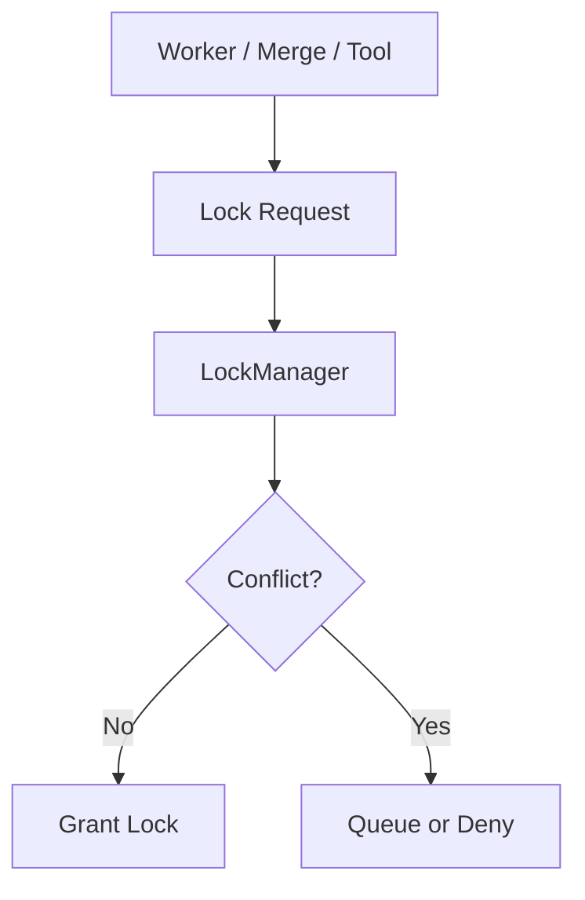

---
title: LockManager Specification - Part 01
status: draft
version: 1.0
tags:
  - runtime
  - lock-manager
  - concurrency
related:
  - "[[MergeManager-Part01]]"
  - "[[Scheduler-Part05]]"
  - "[[PermissionManager-Part01]]"
---

# LockManager Specification (Part 01)

## Document Index

Part 01 - Purpose, Philosophy, and Responsibilities
Part 02 - Lock Types, Ownership, and Scope
Part 03 - Acquisition, Release, Queues, and Timeouts
Part 04 - Deadlocks, Conflict Detection, and Recovery
Part 05 - Events, UI, Metrics, and Replay
Part 06 - Implementation Checklist and Future Expansion

# Purpose

The LockManager prevents unsafe concurrent changes to shared resources.

In Eulinx, many Workers may run at the same time. Without locks, two Workers can edit the same file, two merges can collide, or a terminal can be controlled by the wrong owner.

# Philosophy

Parallel work should be fast, but not chaotic.

The LockManager lets Eulinx run many Workers while keeping shared resources protected.

# Responsibilities

LockManager MUST:

- create locks
- release locks
- track ownership
- queue lock waiters
- detect stale locks
- prevent conflicting writes
- support merge safety
- support terminal ownership
- emit lock events

LockManager MUST NOT:

- grant permissions
- decide task priority
- apply patches
- hide lock conflicts from Scheduler

# Lockable Resources

```text
file
directory
symbol
artifact
workflow_node
workflow_graph
terminal
process
database_scope
git_worktree
memory_scope
```

# Mermaid Diagram



# AI Notes

Do not rely on "the AI will coordinate itself."

Locks are deterministic runtime protections against concurrent damage.

# Related Documents

- [[LockManager-Part02]]
- [[MergeManager-Part01]]
- [[Scheduler-Part05]]

