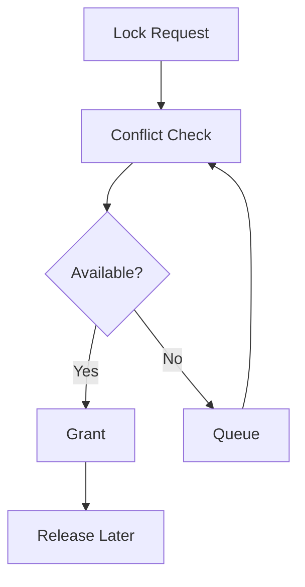

# LockManager Specification (Part 03)

## Document Index

Part 01 - Purpose, Philosophy, and Responsibilities
Part 02 - Lock Types, Ownership, and Scope
Part 03 - Acquisition, Release, Queues, and Timeouts
Part 04 - Deadlocks, Conflict Detection, and Recovery
Part 05 - Events, UI, Metrics, and Replay
Part 06 - Implementation Checklist and Future Expansion

# Acquisition Flow

```text
Lock request
  |
  v
Normalize resource
  |
  v
Check existing locks
  |
  v
Grant or queue
```

# Lock Request

```ts
type LockRequest = {
  workspaceId: string;
  resourceType: string;
  resourceId: string;
  mode: string;
  ownerType: string;
  ownerId: string;
  timeoutMs?: number;
  reason?: string;
};
```

# Release

Locks should release when:

- owner completes
- owner fails
- timeout expires
- Runtime cancels owner
- user forces release
- Workspace closes

# Queues

Lock queues should preserve fairness but may prioritize critical recovery actions.

# Timeouts

Every non-user lock SHOULD have a timeout or lease.

Expired locks must be handled carefully. A lock expiring does not always mean the underlying process stopped.

# Mermaid Diagram



# AI Notes

Do not force-release locks without understanding the owner state.

Expired locks need recovery logic.

# Related Documents

- [[LockManager-Part04]]
- [[Scheduler-Part05]]

