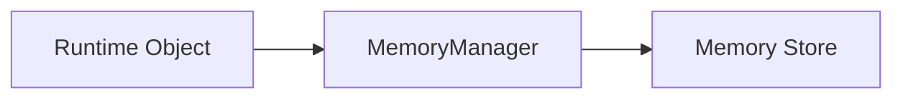
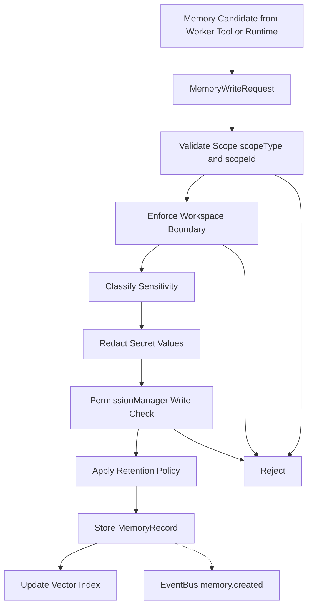
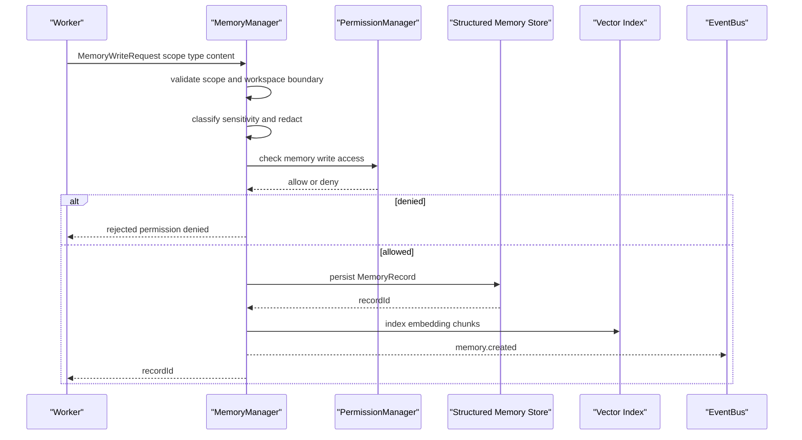
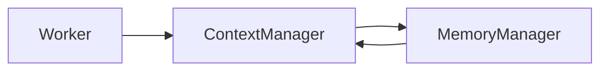
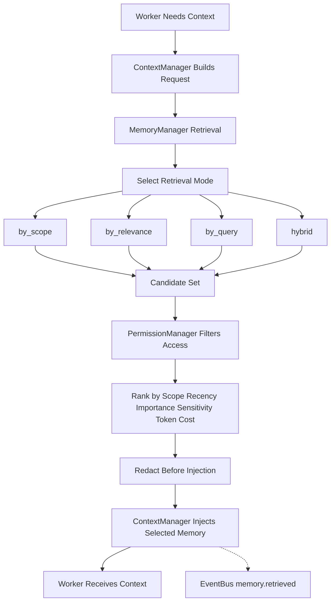
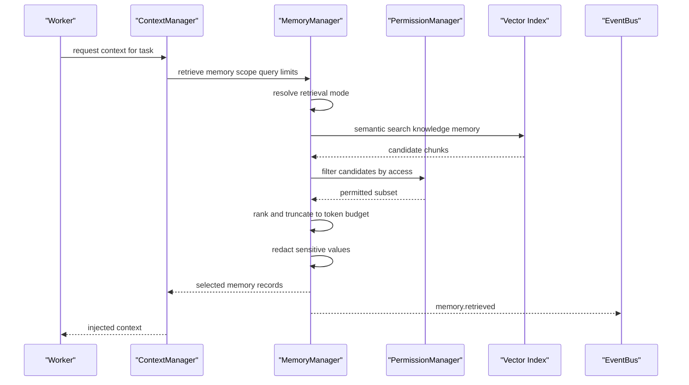
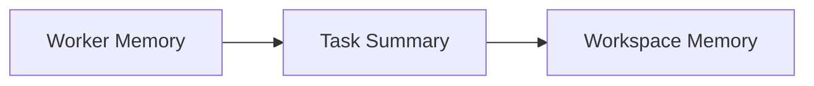
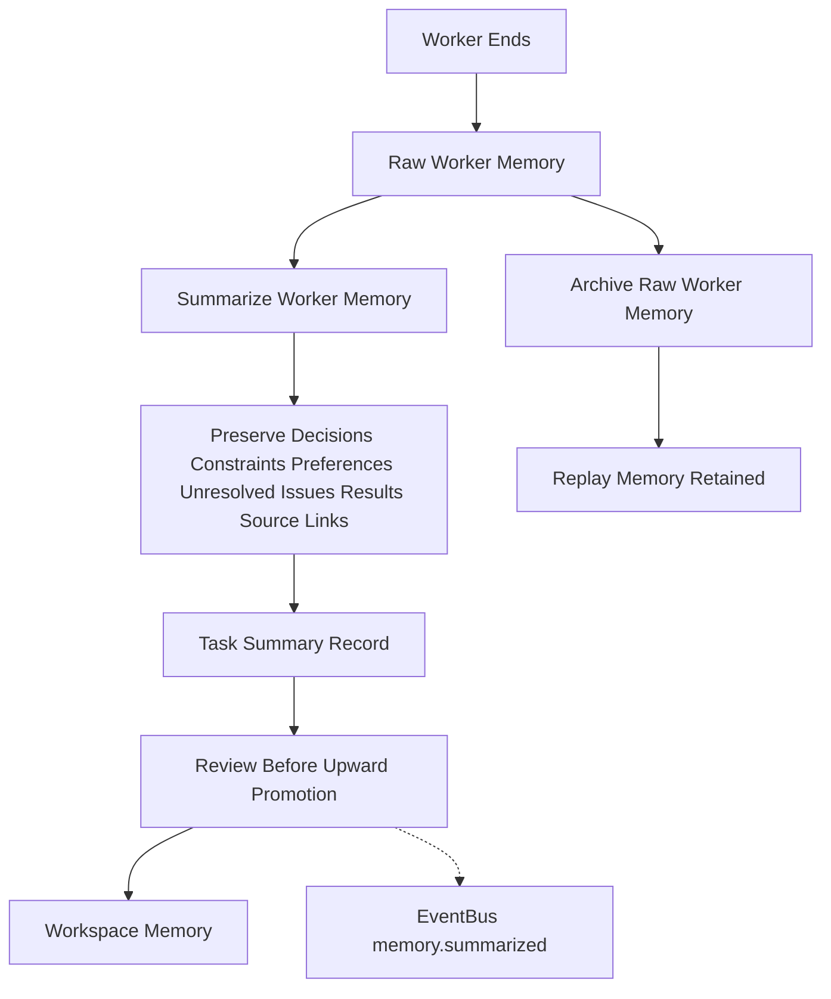
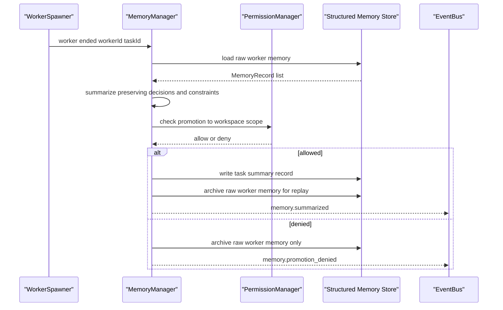

# MemoryManager Diagrams

Each flow below is rendered four ways: high-level overview, detailed Mermaid, ASCII, and sequence.

## Memory Write Flow

### High-Level Overview



### Detailed Mermaid



### ASCII

```text
runtime object produces memory candidate
  |
  v
MemoryManager validates scope ------- bad scope --> reject
  |
  v
enforce Workspace boundary ---------- cross ws ---> reject
  |
  v
classify sensitivity (public|internal|sensitive|secret)
  |
  v
redact secret values (never store raw secrets)
  |
  v
PermissionManager checks write access - denied ---> reject
  |
  v
apply retention policy
  (session_only|execution_only|task_only|
   workspace_persistent|until_revoked|until_date|manual_only)
  |
  v
store MemoryRecord + update vector index
  |
  v
EventBus: memory.created
```

### Sequence



## Memory Read and Injection Flow

### High-Level Overview



### Detailed Mermaid



### ASCII

```text
Worker asks for context
  |
  v
ContextManager builds context request
  |
  v
MemoryManager finds candidates
  (by_scope|by_id|by_time|by_relevance|
   by_artifact|by_task|by_worker|by_query|hybrid)
  |
  v
PermissionManager filters access (fail closed)
  |
  v
MemoryManager ranks relevance
  scope closeness > recency > relevance > importance
  > source reliability > sensitivity > token cost > user pinning
  |
  v
redaction pass before injection
  |
  v
ContextManager injects selected memory
  |
  v
Worker receives context   -.->  EventBus: memory.retrieved

MemoryManager MUST NOT inject memory into a Worker directly.
```

### Sequence



## Scope Summarization Flow

### High-Level Overview



### Detailed Mermaid



### ASCII

```text
scope ladder (lower scope may summarize upward, never leak raw)

Workspace
  Project
    Session
      Execution
        Orchestrator
          Task
            Worker

promotion path:
Worker Memory -> Task Summary -> Workspace Memory

on worker end:
  |
  +-- summarize worker memory
  |     must preserve: decisions, constraints, user preferences,
  |     unresolved issues, final results, links to source records
  |     must NOT discard safety or approval information
  |
  +-- archive raw worker memory (kept for Replay)
  |
  +-- promote summary upward only after review
        |
        v
      EventBus: memory.summarized
```

### Sequence



## Related Documents

- [[MemoryManager-Part01]]
- [[MemoryManager-Part02]]
- [[MemoryManager-Part03]]
- [[MemoryManager-Part04]]
- [[MemoryManager-Part05]]
- [[ContextManager-Part01]]
- [[PermissionManager-Part01]]
- [[EventBus-Part01]]
