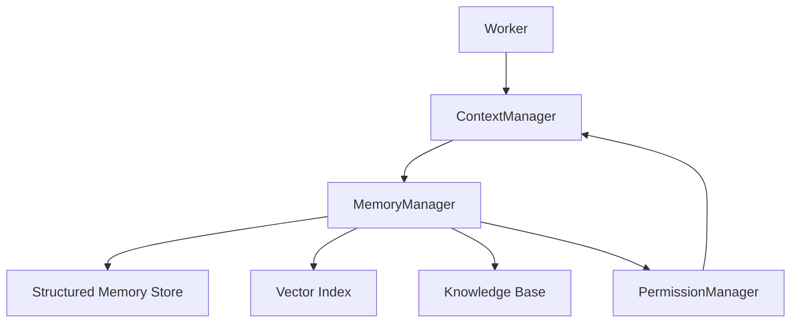

---
title: MemoryManager Specification - Part 01
status: draft
version: 1.0
tags:
  - runtime
  - memory-manager
  - memory
related:
  - "[[Memory-Part01]]"
  - "[[ContextManager-Part01]]"
  - "[[RuntimeManager-Part01]]"
---

# MemoryManager Specification (Part 01)

## Document Index

Part 01 - Purpose, Philosophy, and Responsibilities
Part 02 - Memory Types, Stores, and Scope Boundaries
Part 03 - Read, Write, Summarization, and Retrieval
Part 04 - Vector Memory, Knowledge Base, and Indexing
Part 05 - Safety, Permissions, Retention, and Redaction
Part 06 - Implementation Checklist, Events, and Future Expansion

# Purpose

The MemoryManager is the runtime service responsible for storing, retrieving, summarizing, indexing, and protecting memory used by Workflows, Orchestrators, Workers, Tools, and Sessions.

Memory is not one global chat log. In Eulinx, memory is scoped and structured.

The MemoryManager exists so Workers can receive useful context without being flooded with unrelated history.

# Core Philosophy

Eulinx should treat memory as operational context, not as a magical brain.

Memory should be:

- scoped
- permissioned
- explainable
- versioned where needed
- searchable
- summarized
- safe to inject
- removable
- auditable

Workers should not freely read every memory in the Workspace. The ContextManager requests memory, the MemoryManager retrieves and filters it, and the PermissionManager determines whether access is allowed.

# Responsibilities

The MemoryManager MUST:

- store memory records
- retrieve memory by scope
- retrieve memory by relevance
- support temporary and persistent memory
- support Workspace memory
- support Worker memory
- support Task memory
- support Session memory
- support Knowledge Base memory
- support vector retrieval where available
- redact sensitive memory before injection
- emit memory events
- preserve enough metadata for replay

The MemoryManager MUST NOT:

- bypass PermissionManager
- inject memory directly into Workers without ContextManager
- store raw secrets as ordinary memory
- treat all history as equally relevant
- leak memory across Workspaces

# MemoryManager Object

```ts
type MemoryManager = {
  id: string;
  workspaceId: string;
  state: "starting" | "ready" | "degraded" | "failed";
  stores: MemoryStoreRef[];
  indexes: MemoryIndexRef[];
  retentionPolicy: MemoryRetentionPolicy;
  updatedAt: string;
};
```

# Runtime Relationships

```text
Worker asks for context
  |
  v
ContextManager builds context request
  |
  v
MemoryManager retrieves memory
  |
  v
PermissionManager filters access
  |
  v
ContextManager injects selected memory
```

# Mermaid Diagram



# AI Notes

Do not implement memory as one giant `messages` table.

Eulinx needs multiple memory scopes because a Worker solving one task should not automatically inherit irrelevant or unsafe context from another task.

# Related Documents

- [[MemoryManager-Part02]]
- [[Memory-Part01]]
- [[ContextManager-Part01]]
- [[Permission-Part01]]

