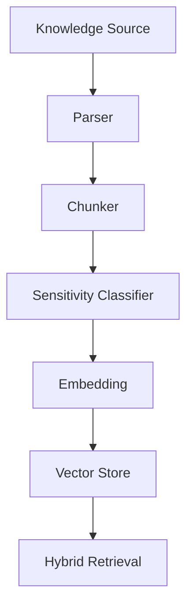

---
title: MemoryManager Specification - Part 04
status: draft
version: 1.0
tags:
  - runtime
  - memory-manager
  - vector-memory
  - knowledge-base
related:
  - "[[MemoryManager-Part03]]"
  - "[[Memory-Part01]]"
---

# MemoryManager Specification (Part 04)

## Document Index

Part 01 - Purpose, Philosophy, and Responsibilities
Part 02 - Memory Types, Stores, and Scope Boundaries
Part 03 - Read, Write, Summarization, and Retrieval
Part 04 - Vector Memory, Knowledge Base, and Indexing
Part 05 - Safety, Permissions, Retention, and Redaction
Part 06 - Implementation Checklist, Events, and Future Expansion

# Purpose

This part defines vector memory and knowledge base integration.

# Knowledge Base

The Knowledge Base stores indexed external and internal knowledge.

Sources may include:

- documentation
- repositories
- notes
- PDFs
- websites
- previous artifacts
- user-written rules

# Indexing Pipeline

```text
Source
  |
  v
Parse
  |
  v
Chunk
  |
  v
Classify sensitivity
  |
  v
Embed
  |
  v
Store vector + metadata
```

# Vector Record

```ts
type VectorMemoryRecord = {
  id: string;
  memoryId: string;
  workspaceId: string;
  embeddingModel: string;
  vectorRef: string;
  chunkText: string;
  sourceRef: string;
  metadata: Record<string, unknown>;
  createdAt: string;
};
```

# Hybrid Retrieval

Eulinx SHOULD combine:

- semantic search
- keyword search
- scope filters
- permission filters
- recency ranking
- source reliability

# Index Freshness

The MemoryManager should track whether indexes are stale.

Examples:

```text
file changed after indexing
artifact superseded by newer version
document deleted
permission revoked
```

# Mermaid Diagram



# AI Notes

Do not inject raw vector search results without checking scope and sensitivity.

Vector search finds candidates. It does not authorize access.

# Related Documents

- [[MemoryManager-Part05]]
- [[Memory-Part01]]
- [[ContextManager-Part01]]

