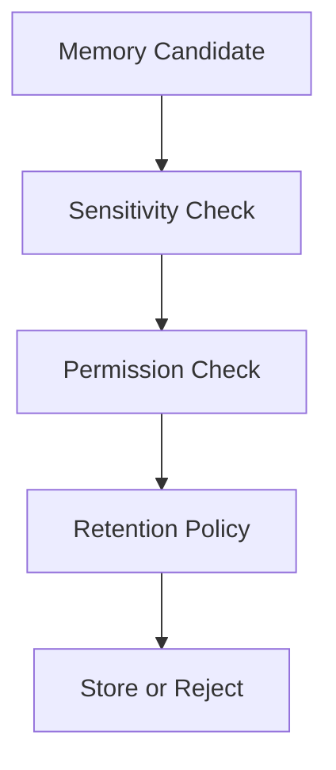

# MemoryManager Specification (Part 05)

## Document Index

Part 01 - Purpose, Philosophy, and Responsibilities
Part 02 - Memory Types, Stores, and Scope Boundaries
Part 03 - Read, Write, Summarization, and Retrieval
Part 04 - Vector Memory, Knowledge Base, and Indexing
Part 05 - Safety, Permissions, Retention, and Redaction
Part 06 - Implementation Checklist, Events, and Future Expansion

# Purpose

Memory safety prevents sensitive or irrelevant information from leaking into Workers.

# Safety Rules

MemoryManager MUST:

- enforce Workspace boundaries
- classify sensitivity
- filter by PermissionManager
- redact sensitive values
- avoid raw secret storage
- support retention policies
- support deletion
- support audit logs for sensitive reads

# Sensitive Memory

Sensitive memory may include:

- API keys
- environment variables
- user identity
- private repository URLs
- customer data
- credentials
- SSH paths
- personal notes

# Redaction

Redaction should happen before context injection.

Examples:

```text
OPENAI_API_KEY=sk-... -> OPENAI_API_KEY=[REDACTED]
C:\Users\Name\.ssh\id_rsa -> [SSH_KEY_PATH_REDACTED]
```

# Retention Policies

Retention may be:

```text
session_only
execution_only
task_only
workspace_persistent
until_revoked
until_date
manual_only
```

# Deletion

Memory deletion should remove or tombstone:

- structured record
- vector chunks
- index references
- derived summaries if required

# Mermaid Diagram



# AI Notes

Never assume memory is safe because it was created by a Worker.

Workers may accidentally store secrets, logs, or private data.

# Related Documents

- [[MemoryManager-Part06]]
- [[Permission-Part01]]
- [[ContextManager-Part01]]

