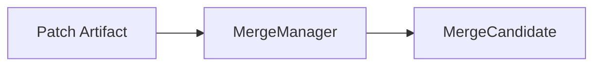
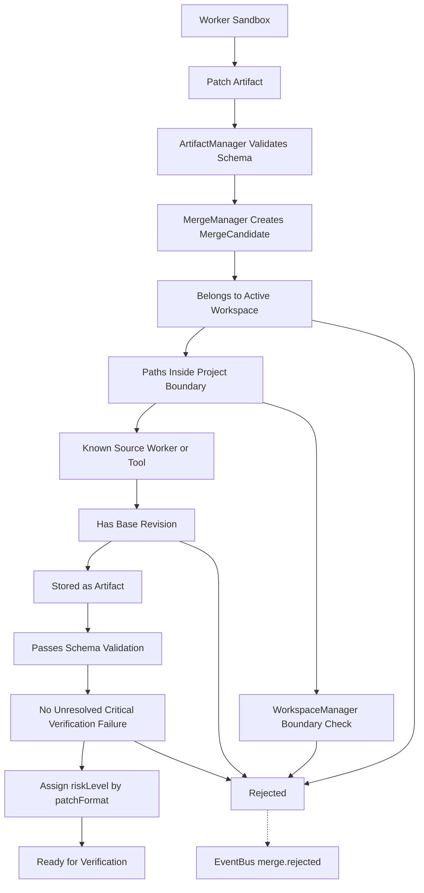
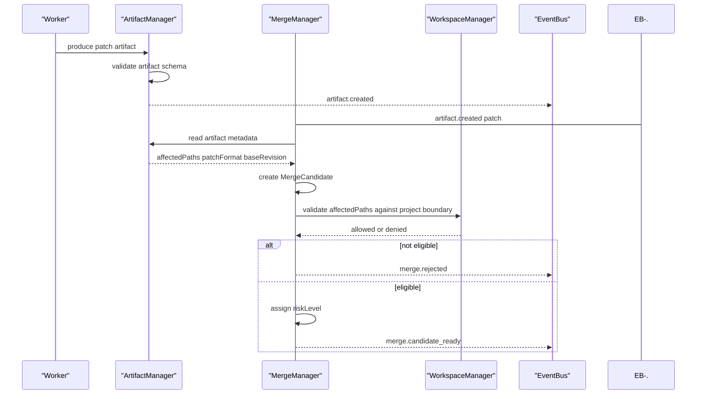
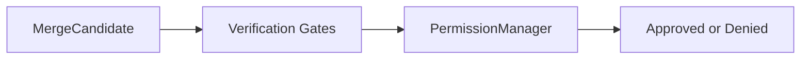
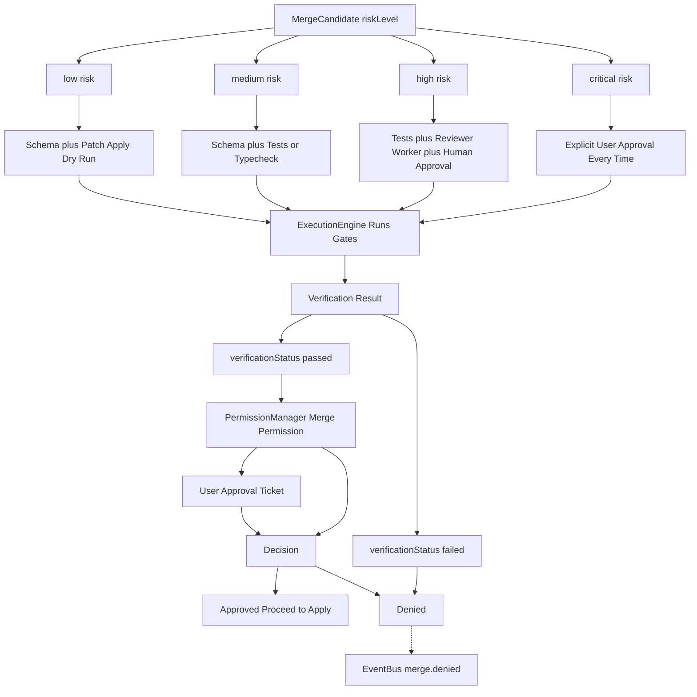
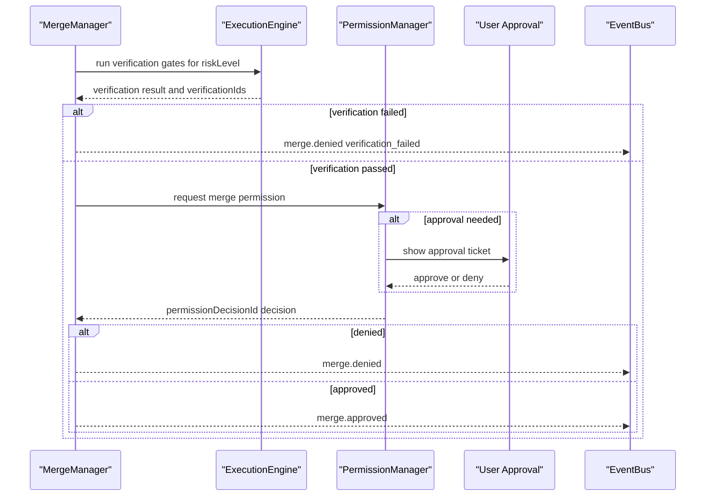
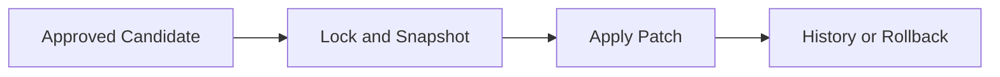
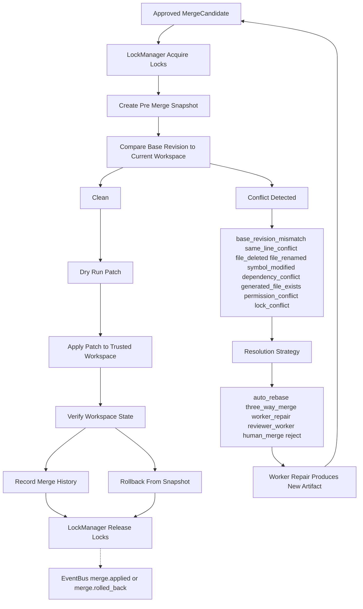
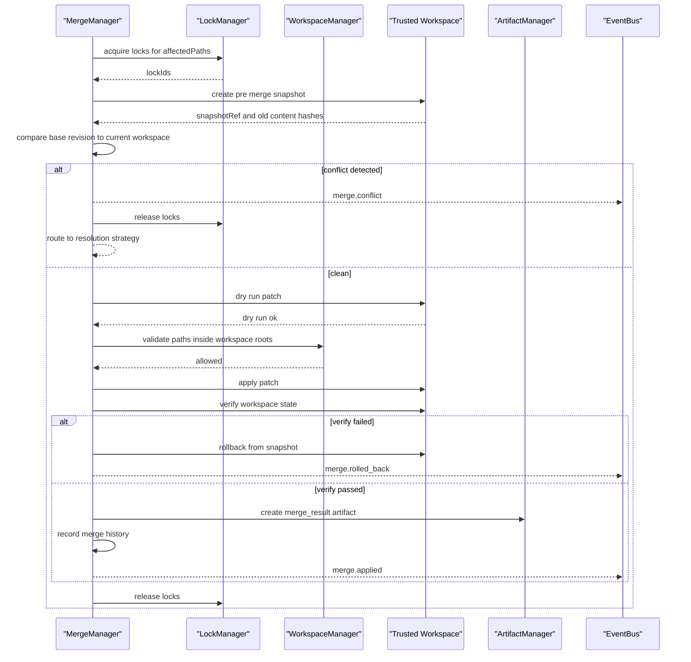

# MergeManager Diagrams

Each flow below is rendered four ways: high-level overview, detailed Mermaid, ASCII, and sequence.

## Patch Intake and Eligibility Flow

### High-Level Overview



### Detailed Mermaid



### ASCII

```text
Artifact created
  |
  v
ArtifactManager validates schema
  |
  v
MergeManager creates MergeCandidate
  id, artifactId, workspaceId, projectId, sourceWorkerId,
  taskId, affectedPaths, patchFormat, baseRevision,
  verificationStatus, riskLevel
  |
  v
eligibility checks (ALL must pass)
  [ ] belongs to the active workspace
  [ ] targets paths inside the project boundary (WorkspaceManager)
  [ ] has a known source Worker or Tool
  [ ] has a base revision
  [ ] is stored as an Artifact
  [ ] passes schema validation
  [ ] no unresolved critical verification failure
  |
  +-- any check fails --> rejected -.-> EventBus: merge.rejected
  |
  v
ready for verification

patch formats by rising risk:
  unified_diff -> structured_patch -> file_replacement
  -> generated_file -> delete_file -> rename_file
```

### Sequence



## Verification and Approval Gate Flow

### High-Level Overview



### Detailed Mermaid



### ASCII

```text
gate strength scales with risk:
  low risk:  schema + patch apply dry run
  medium:    schema + tests or typecheck
  high:      tests + reviewer Worker + human approval
  critical:  explicit user approval every time

available gates:
  schema validation, static check, test run, type check,
  lint check, reviewer Worker approval, human approval,
  policy approval, risk approval

MergeManager -> ExecutionEngine: run verification
ExecutionEngine -> MergeManager: verification result (specific, not "looks good")
  |
  +-- failed -----------------------------> denied
  |
  +-- passed
        |
        v
      MergeManager -> PermissionManager: request merge permission
        |
        +-- approval needed -> UI approval ticket -> approve or deny
        |
        v
      decision (fail closed: no decision means denied)
        |
        +-- approved --> proceed to Apply Flow
        +-- denied ----> merge.denied

If a reviewer Worker repairs the patch, it produces a NEW Artifact.
It does NOT edit trusted files.
```

### Sequence



## Apply, Conflict, and Rollback Flow

### High-Level Overview



### Detailed Mermaid



### ASCII

```text
apply ritual (never skip a step):

  1. acquire locks              (LockManager: file locks, symbol locks)
  2. create pre-merge snapshot  (rollback data: paths, old hashes, old content)
  3. dry-run patch
  4. apply patch                (only MergeManager touches trusted files)
  5. verify workspace state
  6. record history
  7. release locks
  8. emit event

conflict branch at step 3:
  compare base revision to current workspace
    |
    +-- clean ------> continue to apply
    |
    +-- conflict ---> resolve: auto_rebase | three_way_merge |
                      worker_repair | reviewer_worker |
                      human_merge | reject
                      (MUST NOT silently discard another Worker's changes)

failure branch at step 5:
  verify fails -> rollback from snapshot -> release locks
               -> EventBus: merge.rolled_back

merge history record (required for Replay):
  mergeId, candidateId, artifactId, workerId, taskId,
  affectedPaths, verificationIds, permissionDecisionId,
  lockIds, result, createdAt
```

### Sequence



## Related Documents

- [[MergeManager-Part01]]
- [[MergeManager-Part02]]
- [[MergeManager-Part03]]
- [[MergeManager-Part04]]
- [[MergeManager-Part05]]
- [[ArtifactManager-Part01]]
- [[LockManager-Part01]]
- [[PermissionManager-Part01]]
- [[WorkspaceManager-Part01]]
