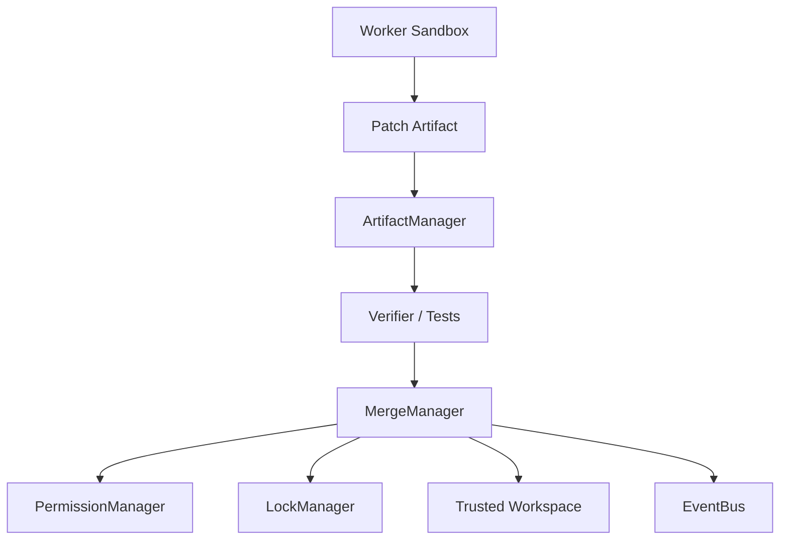

# Merge Manager Part 01 - Purpose and Architecture

## Document Index

```text
MergeManager-Part01 - Purpose and architecture
MergeManager-Part02 - Patch intake and eligibility
MergeManager-Part03 - Verification and approval gates
MergeManager-Part04 - Conflict detection and resolution
MergeManager-Part05 - Apply, rollback, and history
MergeManager-Part06 - Git integration and workspace integrity
MergeManager-Part07 - Events, metrics, UI
MergeManager-Part08 - Database, tests, implementation checklist
```

## Purpose

The MergeManager safely applies verified Artifacts to the trusted project workspace.

Workers should not directly mutate important project state when multiple Workers are active. They should produce Artifacts, especially patch Artifacts, which are validated, verified, locked, approved, and merged.

## Core Rule

```text
AI-generated changes become trusted project changes only through MergeManager.
```

## Architecture



## Responsibilities

MergeManager owns:

- patch intake
- merge eligibility
- verification gate checks
- permission checks
- lock acquisition
- conflict detection
- patch application
- rollback plans
- merge history
- merge events
- user approval gates

## AI Notes

Never let "the Worker already edited the file" become the normal path. The normal path is Artifact -> verify -> merge.

