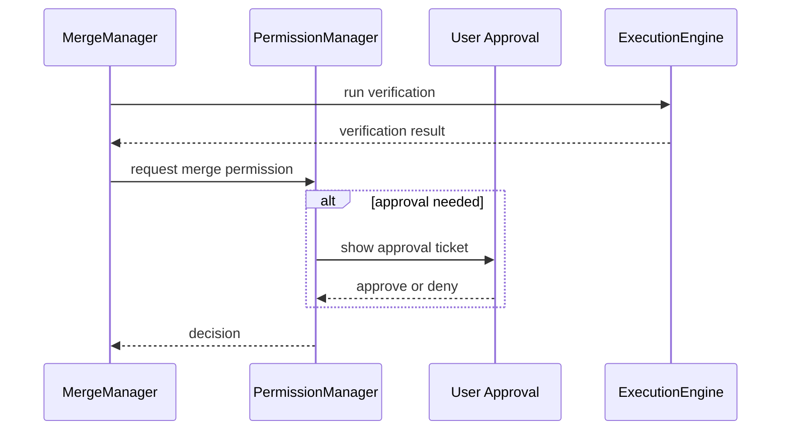

# Merge Manager Part 03 - Verification and Approval Gates

## Purpose

This part defines the checks that must happen before a patch is applied.

## Verification Gates

Potential gates:

- schema validation
- static check
- test run
- type check
- lint check
- reviewer Worker approval
- human approval
- policy approval
- risk approval

## Gate Rule

High-risk changes SHOULD require stronger gates than low-risk changes.

```text
low risk: schema + patch apply dry run
medium risk: schema + tests or typecheck
high risk: tests + reviewer + human approval
critical: explicit user approval every time
```

## Approval Flow



## AI Notes

Verification should be specific. "Looks good" is not a verification result.

