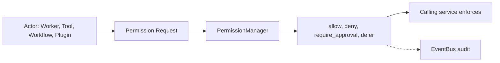
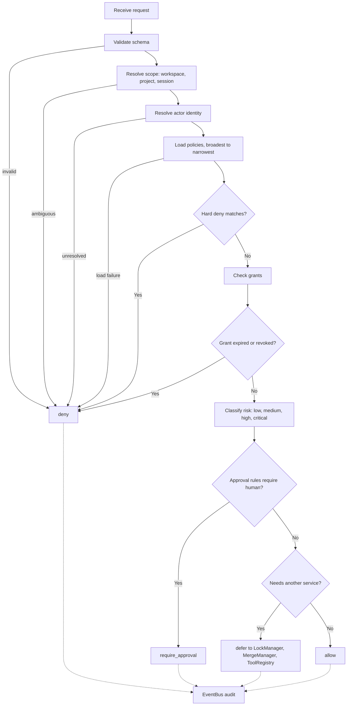
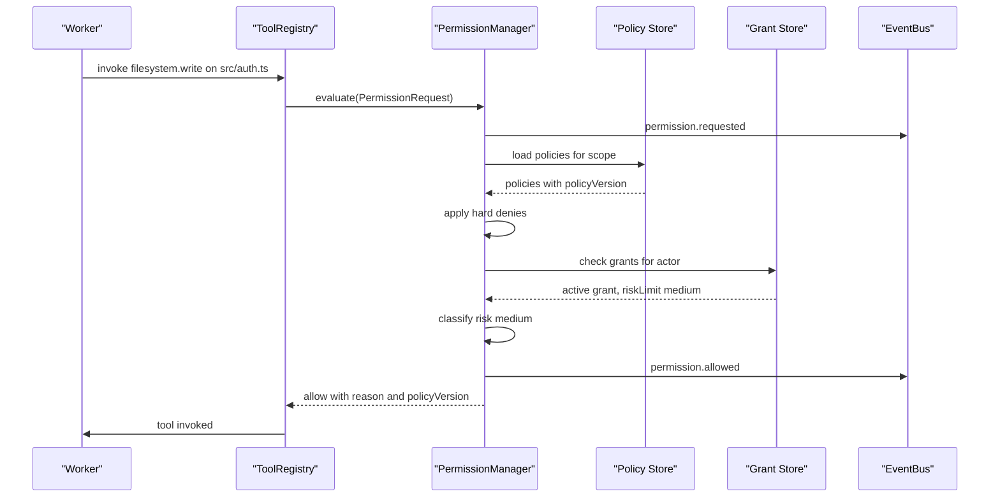
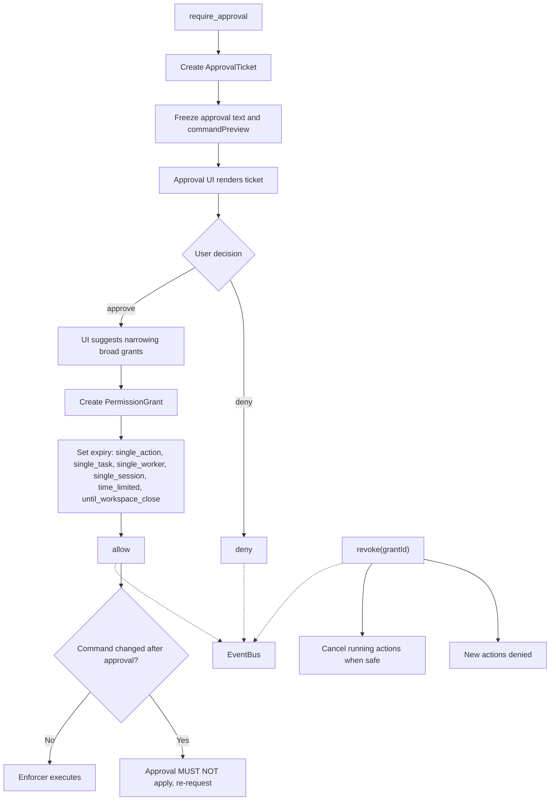
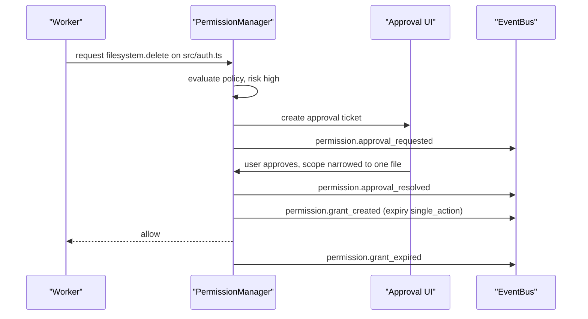
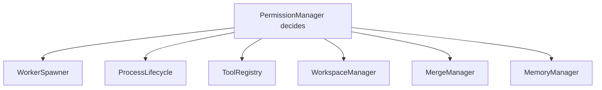
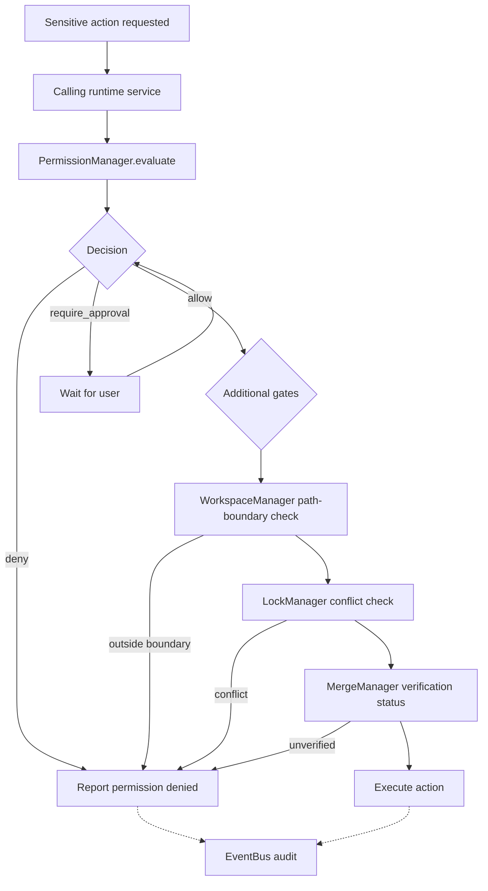
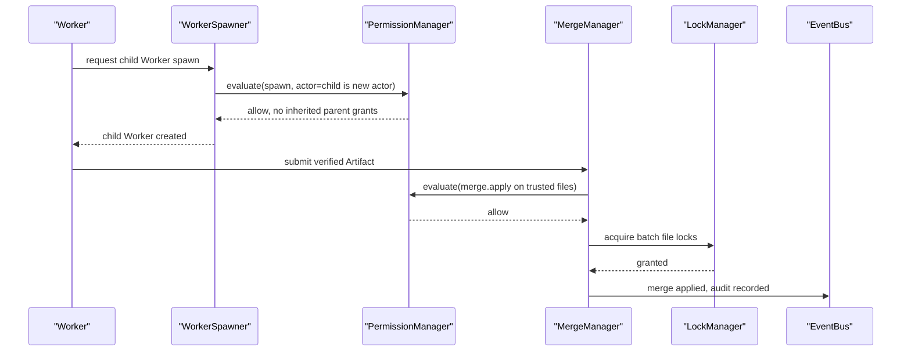

# PermissionManager Diagrams

## Decision Pipeline

### High-Level Overview



### Detailed Mermaid



### ASCII

```text
Policy layers, broadest to narrowest:
  Application > Workspace > Project > Session > Orchestrator
            > Worker > Tool > Temporary Grant > Human Approval

Narrower policies MAY narrow. They MUST NOT expand past a higher-level hard deny.

Request -> validate schema
        -> resolve scope
        -> resolve actor identity
        -> load policies (record policyVersion)
        -> apply hard denies       [override all grants]
        -> check grants            [expiry, revocation, riskLimit]
        -> classify risk           [when unsure, classify higher]
        -> check approval rules
        -> emit decision

Decision: allow | deny | require_approval | defer
          | expired | invalid_scope | conflict

Fail closed. Unknown means deny or wait, never allow.
```

### Sequence



## Human Approval and Grants

### High-Level Overview

```text
Worker requests -> PermissionManager evaluates -> approval ticket
  -> user approves or denies -> scoped grant with expiry -> audit
```

### Detailed Mermaid



### ASCII

```text
Approval modes:
  ask_every_time | ask_for_high_risk | auto_allow_low_risk
  yolo_session | yolo_workspace | deny_by_default | simulation_only

YOLO is not permission absence. It is a named grant profile with
visible risk, expiry, and audit history. Never a skipPermissions boolean.

Grant { id, actorId, actorType, workspaceId, projectId, sessionId,
        actions, resources, riskLimit, createdBy, createdAt,
        expiresAt, revokedAt, reason }

Edge cases:
  command changed after approval  -> approval does not apply
  approval expires while queued   -> Worker must request again
  child Worker                    -> new actor, no inherited grants
  critical permission             -> default to single_action
```

### Sequence



## Runtime Enforcement

### High-Level Overview



### Detailed Mermaid



### ASCII

```text
Permission checks MUST happen before:
  spawn Worker | open terminal | run shell command | invoke Tool
  invoke MCP tool | read or write files | delete files | create patches
  apply patches | access memory | access secrets | browse web
  use Git | install plugins | send network requests

PermissionManager decides. Calling services enforce.

Permission does NOT override workspace isolation.
Permission does NOT override LockManager.
Permission does NOT override merge verification.
If audit logging fails, high-risk actions MUST be blocked.
```

### Sequence



## Related Documents

- [[PermissionManager-Part01]]
- [[PermissionManager-Part02]]
- [[PermissionManager-Part03]]
- [[PermissionManager-Part04]]
- [[PermissionManager-Part05]]
- [[PermissionManager-Part06]]
- [[Permission-Part01]]
- [[ToolRegistry-Part01]]
- [[LockManager-Part01]]
- [[EventBus-Part01]]
- [[02-runtime/README]]
