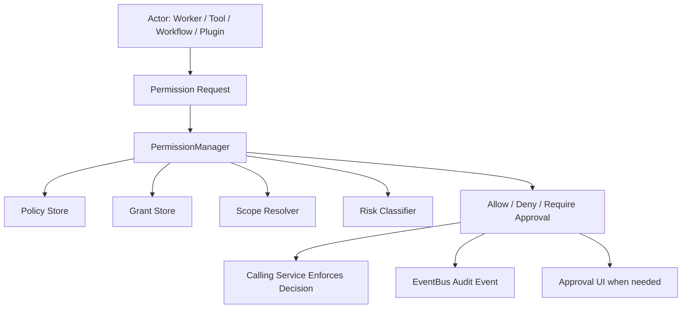

# Permission Manager Part 01 - Purpose and Architecture

## Document Index

```text
PermissionManager-Part01 - Purpose, boundaries, architecture
PermissionManager-Part02 - Policy evaluation and decision pipeline
PermissionManager-Part03 - Grants, approvals, denials, expiry
PermissionManager-Part04 - Worker, Tool, CLI, MCP, and sandbox enforcement
PermissionManager-Part05 - Audit events, security posture, failure handling
PermissionManager-Part06 - Database, UI, tests, implementation checklist
```

## Purpose

The PermissionManager is the deterministic runtime service that decides whether a Worker, Orchestrator, Tool, Workflow node, terminal process, plugin, MCP server, or internal service may perform a requested action.

It exists because Eulinx allows AI-driven terminals to create files, run commands, call tools, spawn Workers, browse the web, access project memory, and request merges. Those capabilities are powerful enough to damage a workspace if permission rules are unclear. The PermissionManager turns every sensitive action into an explicit decision.

In Eulinx, permission is not a suggestion attached to a prompt. Permission is runtime infrastructure.

## Core Rule

```text
No runtime actor may perform a sensitive action unless the PermissionManager has allowed that action for that actor, in that scope, at that time, for that resource.
```

This means the PermissionManager MUST evaluate the full context of a request:

- who is asking
- what action is requested
- which resource is affected
- which workspace owns the resource
- which project owns the task
- which session is active
- which policy applies
- whether approval is required
- whether YOLO mode applies
- whether a grant has expired
- whether the request exceeds budget or risk limits

## What PermissionManager Is Not

The PermissionManager is not an AI judge. It MUST NOT ask an LLM whether an action is safe.

The PermissionManager is not a UI dialog system. It may create approval requests, but UI renders them.

The PermissionManager is not the complete security boundary. OS sandboxing, process isolation, path validation, secret storage, and merge safety must also exist.

The PermissionManager is not the ToolRegistry. The ToolRegistry exposes tools; the PermissionManager authorizes their use.

## Architecture



## ASCII Flow

```text
Actor asks to do something sensitive
  |
  v
PermissionManager receives structured request
  |
  +-- resolve actor identity
  +-- resolve workspace/project/session scope
  +-- classify action risk
  +-- load policies and grants
  +-- evaluate decision
  |
  v
Decision: allow, deny, or require approval
```

## Public API Concept

The runtime should expose a small interface similar to:

```text
evaluate(request) -> PermissionDecision
grant(request) -> PermissionGrant
revoke(grantId) -> RevocationResult
requireApproval(request) -> ApprovalTicket
recordDecision(decision) -> AuditEvent
```

The exact implementation can be TypeScript-facing over Tauri IPC or Rust-internal, but every runtime service should treat PermissionManager as the single authority.

## Required Inputs

A permission request MUST include:

```text
requestId
actorId
actorType
workspaceId
projectId
sessionId
action
resourceType
resourceId
riskLevel
reason
requestedAt
```

It SHOULD include:

```text
taskId
workflowId
nodeId
workerId
toolId
commandPreview
affectedPaths
estimatedCost
estimatedDuration
approvalMode
```

## AI Notes

Do not let Workers self-report that they are allowed to do something. Workers may request permission, but only PermissionManager decides.

Do not encode permission rules only in prompts. Prompts can explain rules to Workers, but runtime enforcement must happen outside the model.

## Related Documents

- [[Permission-Part01]]
- [[Permission-Part02]]
- [[RuntimeManager-Part01]]
- [[ToolRegistry-Part01]]
- [[EventBus-Part01]]

