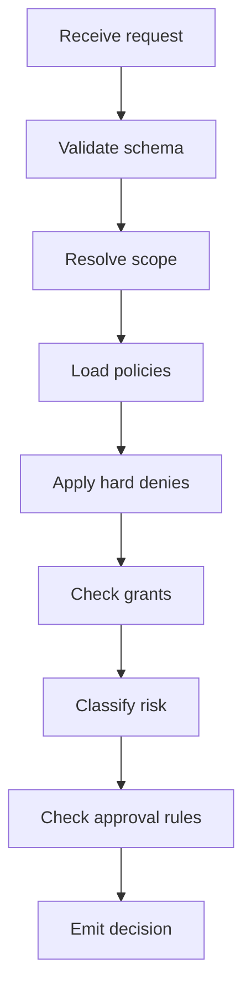

# Permission Manager Part 02 - Policy Evaluation

## Purpose

This part defines how PermissionManager evaluates policies. The goal is deterministic, explainable authorization. Every decision should be reproducible from stored inputs.

## Policy Layers

Policies are evaluated from broadest to narrowest:

```text
Application Policy
Workspace Policy
Project Policy
Session Policy
Orchestrator Policy
Worker Policy
Tool Policy
Temporary Grant
Human Approval
```

More specific policies MAY narrow permissions. They MUST NOT silently expand permissions beyond a higher-level hard deny.

## Decision Types

```text
allow
deny
require_approval
defer
expired
invalid_scope
conflict
```

`defer` means the PermissionManager cannot decide without another service, such as LockManager, MergeManager, or ToolRegistry.

## Evaluation Pipeline



## Hard Denies

A hard deny MUST override all grants and approvals unless the user changes the underlying policy.

Examples:

```text
Workspace forbids network access.
Project forbids writing outside project root.
Application forbids shell command execution from plugins.
User disables YOLO mode globally.
```

## Risk Classification

PermissionManager should classify actions by risk:

```text
low       read-only, local, reversible
medium    write, tool call, bounded process
high      delete, network, secrets, git commit, long-running process
critical  git push, publish, SSH, destructive recursive action, credential access
```

Risk classification MUST be conservative. When unsure, classify higher.

## Determinism

Policy evaluation MUST NOT depend on current UI state except for explicit approval state.

Policy evaluation MUST be logged with policy version identifiers.

Policy evaluation SHOULD produce a human-readable explanation:

```text
Denied because Worker w_123 requested filesystem.delete on src/auth.ts,
but project policy requires human approval for delete actions.
```

## AI Notes

When implementing this, avoid giant nested `if` statements. Use a pipeline where each evaluator returns an intermediate result. Smaller models can maintain this more reliably.

## Implementation Checklist

```text
[ ] Define PermissionRequest type
[ ] Define PermissionDecision type
[ ] Define policy precedence rules
[ ] Implement hard deny evaluator
[ ] Implement grant evaluator
[ ] Implement risk classifier
[ ] Emit audit event for every decision
[ ] Add tests for precedence and hard deny behavior
```

