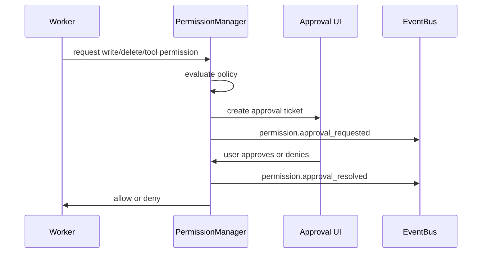

# Permission Manager Part 03 - Grants, Approvals, Expiry

## Purpose

This part defines how temporary permission grants, human approvals, automatic approvals, and expiry work.

## Grant Definition

A grant is a stored authorization allowing a specific actor to perform a specific class of action within a defined scope.

```text
Grant
  id
  actorId
  actorType
  workspaceId
  projectId
  sessionId
  actions
  resources
  riskLimit
  createdBy
  createdAt
  expiresAt
  revokedAt
  reason
```

## Approval Modes

Eulinx should support:

```text
ask_every_time
ask_for_high_risk
auto_allow_low_risk
yolo_session
yolo_workspace
deny_by_default
simulation_only
```

YOLO mode is not permission absence. YOLO mode is a named grant profile with visible risk, expiry, and audit history.

## Human Approval Flow



## Expiry Rules

Temporary grants MUST expire. Good expiry choices:

```text
single_action
single_task
single_worker
single_session
time_limited
until_workspace_close
```

Critical permissions SHOULD default to single action.

## Revocation

When a grant is revoked:

- new actions using that grant MUST be denied
- running actions SHOULD be cancelled if cancellation is safe
- EventBus MUST emit a revocation event
- UI SHOULD show which Workers were affected

## AI Notes

Never implement YOLO as a Boolean named `skipPermissions`. That makes the system unsafe and hard to audit. Use explicit grants with expiry and scope.

## Edge Cases

If a user approves a command and the Worker changes the command before execution, the approval MUST NOT apply.

If a Worker requests broad access but only needs one file, the approval UI SHOULD suggest narrowing the grant.

If approval expires while a Worker is waiting in the Scheduler queue, the Worker must request permission again.

