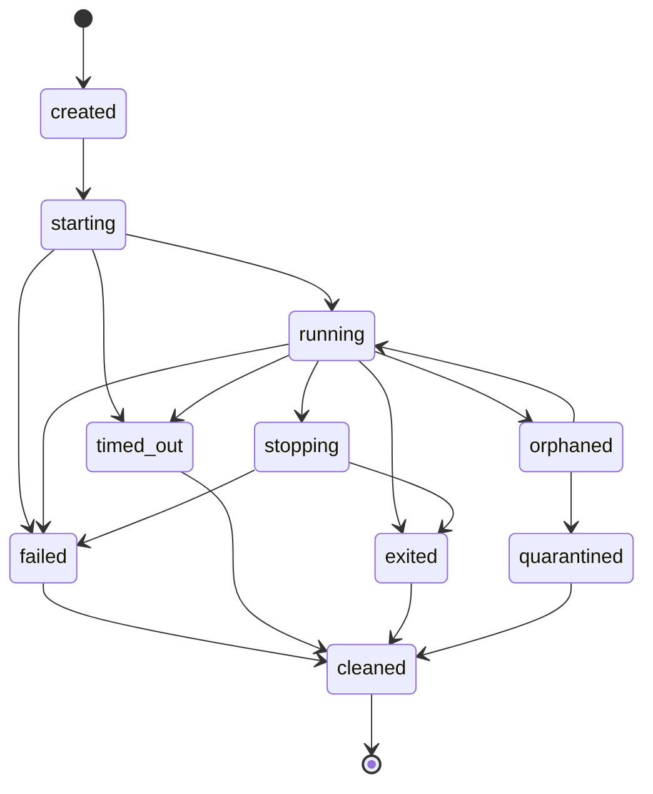
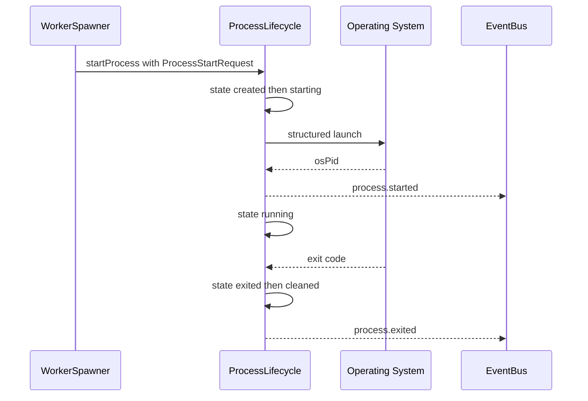
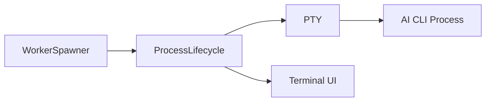
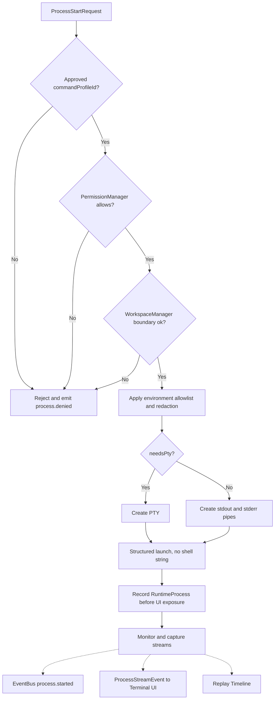
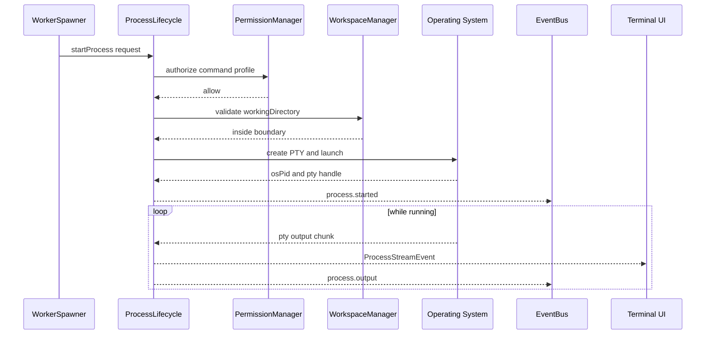
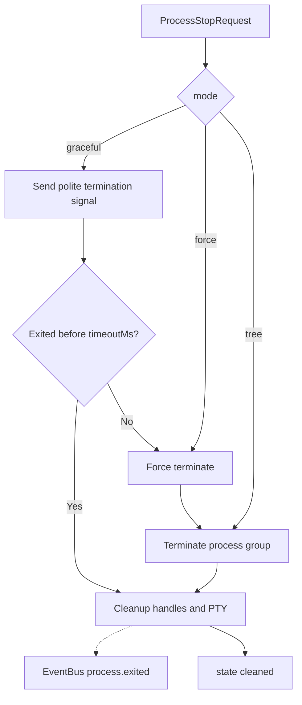
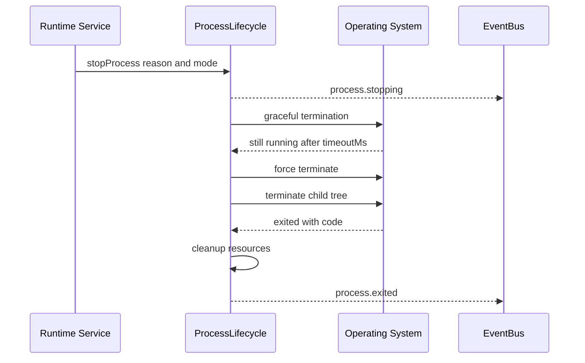
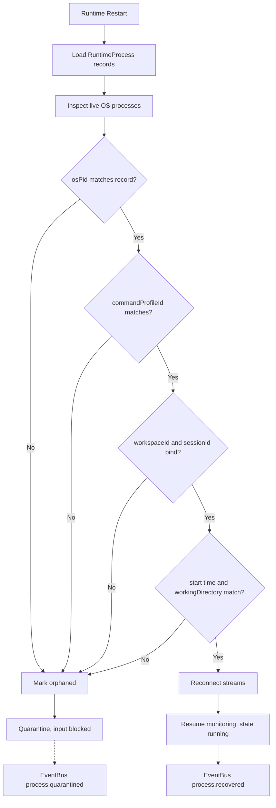
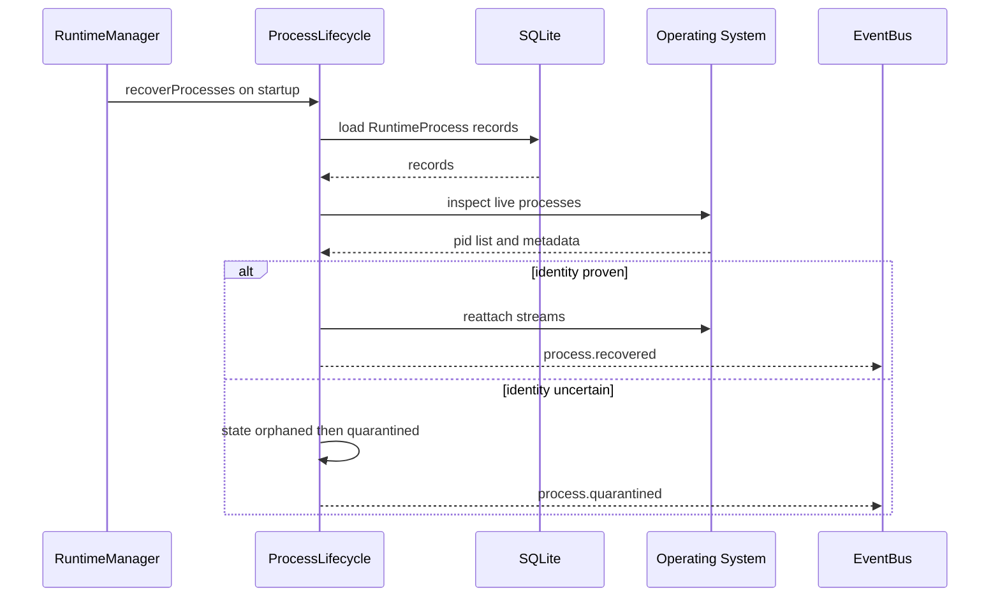

# ProcessLifecycle Diagrams

Same architecture, four renderings, per flow.

## Process State Machine

### 1. High-Level Overview

```text
created -> starting -> running -> stopping -> exited -> cleaned
                          |
                          +-> failed / timed_out / orphaned / quarantined
```

### 2. Detailed Mermaid



### 3. ASCII

```text
+---------+    +----------+    +---------+    +----------+    +--------+
| created |--->| starting |--->| running |--->| stopping |--->| exited |
+---------+    +----------+    +---------+    +----------+    +--------+
                    |               |              |              |
                    v               v              v              v
                 +--------+   +-----------+   +--------+     +---------+
                 | failed |   | timed_out |   | failed |     | cleaned |
                 +--------+   +-----------+   +--------+     +---------+
                                    |
                                    v
                              +----------+     +-------------+
                              | orphaned |---->| quarantined |
                              +----------+     +-------------+
```

### 4. Sequence



## Start and IO Capture Flow

### 1. High-Level Overview



### 2. Detailed Mermaid



### 3. ASCII

```text
ProcessStartRequest
  |
  v
[ commandProfileId approved? ] --no--> reject
  |yes
  v
[ PermissionManager allows? ] --no--> reject
  |yes
  v
[ WorkspaceManager boundary ] --no--> reject
  |yes
  v
[ environment allowlist + redaction ]
  |
  v
[ needsPty ? create PTY : create pipes ]
  |
  v
[ structured launch  (executable + args[]) ]
  |
  v
[ record RuntimeProcess ] -> [ monitor ]
                               |-.-> EventBus
                               |-.-> Terminal UI
                               '-.-> Replay Timeline
```

### 4. Sequence



## Termination Flow

### 1. High-Level Overview

```text
stop request -> graceful signal -> wait timeoutMs -> force -> kill tree -> cleanup
```

### 2. Detailed Mermaid



### 3. ASCII

```text
ProcessStopRequest { mode: graceful | force | tree }
  |
  v
graceful signal ---- exited within timeoutMs? --yes--> cleanup
  |                                     |no
  |                                     v
  |                              force terminate
  |                                     |
  '-------------------------------------+
                                        v
                            terminate child process tree
                                        |
                                        v
                    cleanup: pty handles, process handles,
                    temp env files, stream subscriptions
                                        |
                                     -.-> EventBus process.exited
```

### 4. Sequence



## Recovery and Quarantine Flow

### 1. High-Level Overview

```text
runtime restart -> load records -> inspect OS -> prove identity
  match -> reconnect -> resume monitoring
  no match -> orphaned -> quarantined
```

### 2. Detailed Mermaid



### 3. ASCII

```text
Runtime Restart
  |
  v
load RuntimeProcess records from SQLite
  |
  v
inspect OS processes
  |
  v
identity proof, ALL must match:
  [ ] osPid
  [ ] commandProfileId
  [ ] workspaceId + sessionId binding
  [ ] process start time
  [ ] expected workingDirectory
  |
  +-- all match --> reconnect --> resume monitoring (running)
  |
  '-- any mismatch --> orphaned --> quarantined
                                     (no user input,
                                      no runtime input)
```

### 4. Sequence



## Related Documents

- [[ProcessLifecycle-Part01]]
- [[ProcessLifecycle-Part02]]
- [[ProcessLifecycle-Part03]]
- [[ProcessLifecycle-Part04]]
- [[ProcessLifecycle-Part05]]
- [[WorkerSpawner-Part04]]
- [[RuntimeRules-Part01]]
- [[RuntimeManager-Part01]]
- [[02-runtime/README]]
