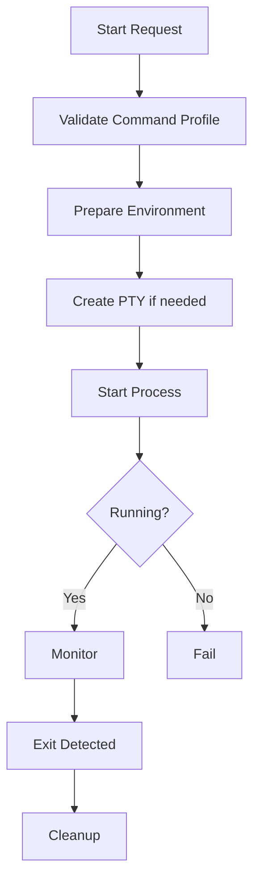

---
title: ProcessLifecycle Specification - Part 01
status: draft
version: 1.0
tags:
  - runtime
  - process-lifecycle
  - pty
related:
  - "[[02-runtime/README]]"
  - "[[WorkerSpawner-Part04]]"
  - "[[RuntimeManager-Part01]]"
---

# ProcessLifecycle Specification (Part 01)

## Document Index

Part 01 - Purpose, Process Model, and Responsibilities
Part 02 - Start, Stop, Signals, and Termination
Part 03 - PTY, Terminal Streams, and IO Capture
Part 04 - Monitoring, Recovery, Quarantine, and Cleanup
Part 05 - Security, Database, Implementation Checklist, and Future Expansion

# Purpose

ProcessLifecycle owns OS process and PTY lifecycle management for Eulinx.

It is the low-level runtime service that starts, monitors, stops, and cleans up external command-line processes. WorkerSpawner decides what Worker should be created. ProcessLifecycle performs the actual process operation under strict rules.

# Philosophy

ProcessLifecycle should be platform-aware but policy-light.

It should know how to start and stop processes on Windows, macOS, and Linux. It should not decide whether a Worker deserves permission, whether a Task is useful, or whether a Project plan is correct.

# Responsibilities

ProcessLifecycle MUST:

- start approved processes
- create PTYs for interactive terminals
- capture stdout and stderr
- route terminal input safely
- support terminal resizing
- track process status
- detect process exit
- terminate process trees
- clean up process resources
- emit process lifecycle events

ProcessLifecycle MUST NOT:

- accept arbitrary AI-generated shell commands
- bypass WorkerSpawner
- bypass PermissionManager
- decide Task success
- parse AI output as trusted data
- write Project files directly

# Process Object

```ts
type RuntimeProcess = {
  id: string;
  workerId?: string;
  workspaceId: string;
  sessionId: string;
  kind: "worker_cli" | "tool" | "background_job" | "system";
  commandProfileId: string;
  osPid?: number;
  state: RuntimeProcessState;
  startedAt?: string;
  exitedAt?: string;
  exitCode?: number;
  signal?: string;
};
```

# Process States

```text
created
starting
running
stopping
exited
failed
timed_out
orphaned
quarantined
cleaned
```

# High-Level Flow



# Platform Concern

ProcessLifecycle must hide platform differences behind one internal API.

```text
Windows:
  process tree termination, ConPTY support, shell quoting rules.

macOS:
  POSIX signals, PTY handling, shell environment.

Linux:
  POSIX signals, process groups, PTY handling, permissions.
```

# AI Notes

Do not let random features call system process APIs directly.

ProcessLifecycle is the one place where Eulinx should touch OS process creation and termination.

# Related Documents

- [[WorkerSpawner-Part04]]
- [[ProcessLifecycle-Part02]]
- [[RuntimeRules-Part01]]

