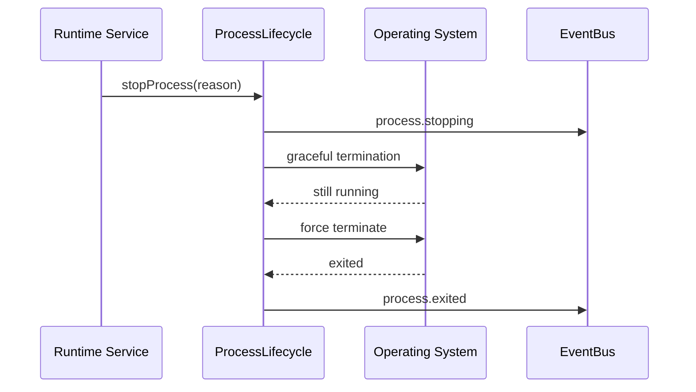

---
title: ProcessLifecycle Specification - Part 02
status: draft
version: 1.0
tags:
  - runtime
  - process-lifecycle
  - termination
related:
  - "[[ProcessLifecycle-Part01]]"
  - "[[WorkerSpawner-Part05]]"
---

# ProcessLifecycle Specification (Part 02)

## Document Index

Part 01 - Purpose, Process Model, and Responsibilities
Part 02 - Start, Stop, Signals, and Termination
Part 03 - PTY, Terminal Streams, and IO Capture
Part 04 - Monitoring, Recovery, Quarantine, and Cleanup
Part 05 - Security, Database, Implementation Checklist, and Future Expansion

# Purpose

This part defines how processes start, stop, receive signals, time out, and terminate.

# Start Request

```ts
type ProcessStartRequest = {
  id: string;
  workspaceId: string;
  sessionId: string;
  workerId?: string;
  commandProfileId: string;
  executable: string;
  args: string[];
  workingDirectory: string;
  environment: Record<string, string>;
  needsPty: boolean;
  timeoutMs?: number;
  createdAt: string;
};
```

# Start Rules

ProcessLifecycle MUST:

- validate executable comes from approved profile
- validate working directory
- validate environment key allowlist
- avoid shell interpretation when possible
- start processes with structured args
- record process metadata before exposing it to UI
- emit start events

ProcessLifecycle SHOULD:

- avoid shell wrappers unless required
- redact sensitive environment values
- use process groups where available
- record platform-specific metadata for debugging

# Stop Request

```ts
type ProcessStopRequest = {
  processId: string;
  requestedBy: RuntimeActorRef;
  reason: string;
  mode: "graceful" | "force" | "tree";
  timeoutMs: number;
};
```

# Termination Flow

```text
graceful stop requested
  |
  v
send polite termination signal / input
  |
  v
wait timeout
  |
  +-- exited -> cleanup
  |
  v
force terminate
  |
  v
terminate child processes
  |
  v
cleanup
```

# Mermaid Sequence



# Process Trees

AI CLIs may spawn child processes.

ProcessLifecycle MUST support process tree cleanup where practical. Killing only the parent can leave child tools running, file locks open, ports occupied, or shell commands continuing after Eulinx thinks work stopped.

# Timeouts

Timeouts should exist for:

- startup
- graceful shutdown
- forced shutdown
- no-output idle period
- maximum runtime

# AI Notes

Always prefer structured process launch over string-built shell commands.

Most command injection bugs begin as convenient string concatenation.

# Related Documents

- [[ProcessLifecycle-Part01]]
- [[RuntimeRules-Part02]]
- [[WorkerSpawner-Part05]]

