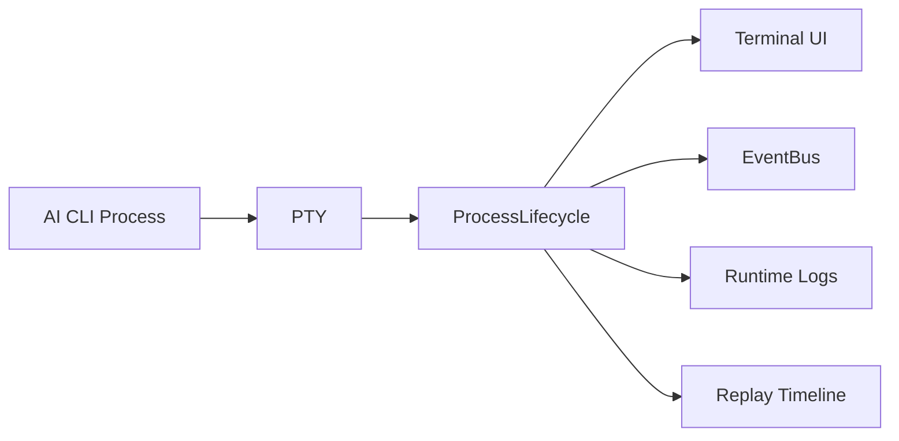

---
title: ProcessLifecycle Specification - Part 03
status: draft
version: 1.0
tags:
  - runtime
  - process-lifecycle
  - streams
related:
  - "[[ProcessLifecycle-Part02]]"
  - "[[TerminalView]]"
---

# ProcessLifecycle Specification (Part 03)

## Document Index

Part 01 - Purpose, Process Model, and Responsibilities
Part 02 - Start, Stop, Signals, and Termination
Part 03 - PTY, Terminal Streams, and IO Capture
Part 04 - Monitoring, Recovery, Quarantine, and Cleanup
Part 05 - Security, Database, Implementation Checklist, and Future Expansion

# Purpose

This part defines PTY handling, terminal streams, input routing, output capture, and replay-safe logs.

# PTY Requirement

Interactive AI CLI Workers SHOULD run through a PTY.

Without a PTY, many CLIs behave differently:

- no interactive prompts
- no colored output
- no line editing
- no approval UI
- broken resize handling
- broken streaming display

# Stream Types

ProcessLifecycle may capture:

```text
stdin
stdout
stderr
pty_output
system_events
terminal_resize
terminal_input
process_exit
```

# Stream Event

```ts
type ProcessStreamEvent = {
  id: string;
  processId: string;
  workerId?: string;
  stream: "stdout" | "stderr" | "pty" | "stdin" | "system";
  chunk: string;
  redacted: boolean;
  sequence: number;
  createdAt: string;
};
```

# Input Rules

ProcessLifecycle MUST:

- accept input only from authorized sources
- record injected input when safe
- distinguish user input from runtime input
- prevent input after process termination
- prevent input to quarantined processes

# Output Capture Rules

ProcessLifecycle SHOULD:

- preserve enough output for debugging
- stream output to UI
- write event records for replay
- allow summarization of long output
- redact sensitive values
- avoid unbounded memory growth

# Scrollback Policy

Terminal scrollback can become huge. Eulinx should support:

```text
keep
  Keep full scrollback for active terminals.

summarize
  Summarize old output into a log artifact.

archive
  Persist output for replay/history.

discard
  Drop low-value output after policy allows it.
```

# Diagram



# Redaction

ProcessLifecycle MUST support redaction hooks before broad output persistence.

Potential secrets:

- API keys
- tokens
- passwords
- private paths
- SSH keys
- OAuth codes
- environment variables

# AI Notes

Terminal output is not the same as an Artifact.

Use terminal output for visibility and debugging. Use Artifacts for structured handoff between Workers.

# Related Documents

- [[ProcessLifecycle-Part04]]
- [[TerminalView]]
- [[Replay]]
- [[Artifact-Part01]]

