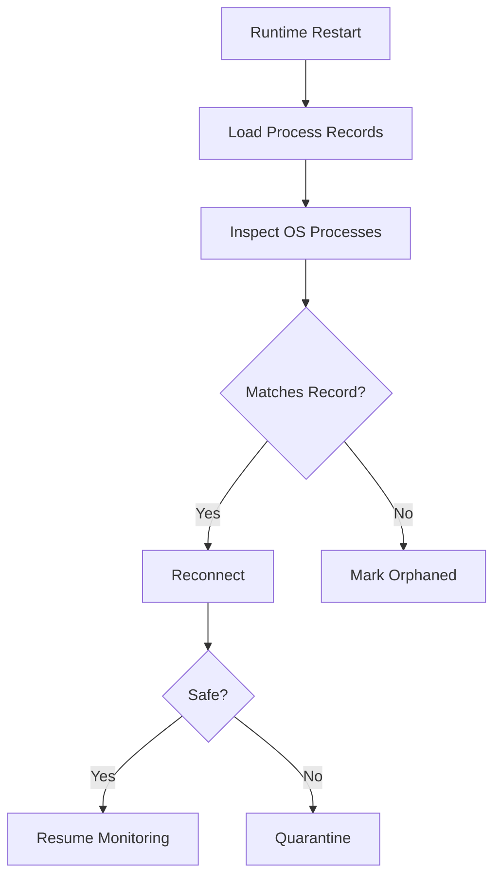

---
title: ProcessLifecycle Specification - Part 04
status: draft
version: 1.0
tags:
  - runtime
  - process-lifecycle
  - recovery
related:
  - "[[ProcessLifecycle-Part03]]"
  - "[[RuntimeManager-Part05]]"
---

# ProcessLifecycle Specification (Part 04)

## Document Index

Part 01 - Purpose, Process Model, and Responsibilities
Part 02 - Start, Stop, Signals, and Termination
Part 03 - PTY, Terminal Streams, and IO Capture
Part 04 - Monitoring, Recovery, Quarantine, and Cleanup
Part 05 - Security, Database, Implementation Checklist, and Future Expansion

# Purpose

This part defines monitoring, recovery, quarantine, orphan handling, and cleanup.

# Monitoring

ProcessLifecycle MUST monitor:

- process running state
- exit code
- unexpected exit
- startup timeout
- shutdown timeout
- PTY errors
- output stream health
- child process behavior where supported

# Health Snapshot

```ts
type ProcessHealthSnapshot = {
  processId: string;
  state: RuntimeProcessState;
  alive: boolean;
  responsive?: boolean;
  lastOutputAt?: string;
  cpuHint?: number;
  memoryHint?: number;
  childCount?: number;
  warnings: string[];
  updatedAt: string;
};
```

# Recovery Cases

Recovery is needed when:

- Eulinx restarts
- the desktop window crashes
- runtime service restarts
- a Worker record exists without a process
- a process exists without a valid binding
- a terminal stream reconnects

# Recovery Rules

ProcessLifecycle MUST NOT trust unknown running processes.

It may reconnect only when identity can be proven through:

- stored runtime metadata
- matching process ID
- matching command profile
- matching Workspace/session binding
- valid process start time
- expected working directory

# Quarantine

A process should be quarantined when:

- identity is uncertain
- Workspace boundary is unclear
- process appears to be running unexpected command
- process survives failed termination
- stream binding is corrupted
- security policy requires review

Quarantined processes MUST NOT receive user or runtime input.

# Cleanup

Cleanup should remove:

- closed PTY handles
- process handles
- temporary environment files
- temporary startup prompt files
- dead terminal bindings
- abandoned stream subscriptions
- temporary sandbox mounts when owned by process

# Recovery Diagram



# AI Notes

Never "recover" a process merely because a PID exists.

PIDs can be reused. Recovery needs identity checks.

# Related Documents

- [[RuntimeManager-Part05]]
- [[WorkerSpawner-Part05]]
- [[Replay]]

