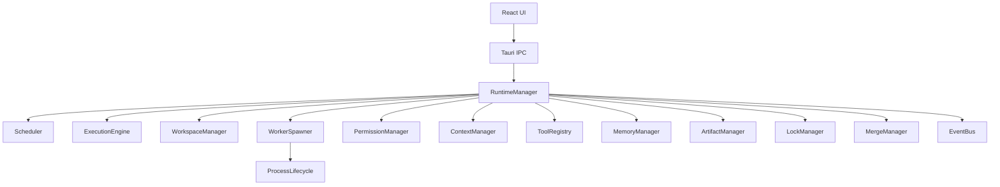

---
title: 02 Runtime
status: draft
version: 1.0
tags:
  - runtime
  - architecture
  - Eulinx
  - flow:P01-CORE-LOGGER
  - flow:P01-CORE-CONFIG
  - flow:P01-CORE-ENV
  - flow:P01-CORE-ASYNC
  - flow:P02-RUNTIME-MANAGER
  - flow:P02-RUNTIME-LIFECYCLE
  - flow:P02-RUNTIME-BOOTSTRAP
  - flow:P02-RUNTIME-SHUTDOWN
  - flow:P02-RUNTIME-REGISTRY
  - flow:P02-RUNTIME-CONFIG
  - flow:P02-RUNTIME-CONTEXT
  - flow:P02-RUNTIME-DIAG
  - flow:P02-RUNTIME-HEALTH
  - flow:P02-RUNTIME-RECOVERY
  - flow:P03-EVENT-BUS
  - flow:P03-EVENT-DISPATCH
  - flow:P03-EVENT-QUEUE
  - flow:P03-EVENT-REPLAY
  - flow:P03-EVENT-DLQ
  - flow:P03-EVENT-MIDDLEWARE
  - flow:P03-EVENT-PRIORITY
  - flow:P03-EVENT-ASYNC
  - flow:P04-STATE-RECOVERY
  - flow:P05-SCHED-QUEUE
  - flow:P05-SCH-PQUEUE
  - flow:P05-SCH-FIFO
  - flow:P05-SCH-PARALLEL
  - flow:P05-SCH-DELAYED
  - flow:P05-SCH-CRON
  - flow:P05-SCH-DEAD
  - flow:P05-SCH-POLICIES
  - flow:P05-SCH-CONCUR
  - flow:P05-SCH-FAIR
  - flow:P05-SCH-BACKPRESS
  - flow:P05-SCH-CANCEL
  - flow:P06-SPAWN-MANAGER
  - flow:P06-SPAWN-QUEUE
  - flow:P06-SPAWN-POLICIES
  - flow:P06-SPAWN-BOOT
  - flow:P07-SESSION-REPLAY
  - flow:P10-ART-MANAGER
  - flow:P10-ART-MERGE
  - flow:P13-TOOL-REGISTRY
  - flow:P14-SEC-PERMISSION
  - flow:P14-SEC-APPROVAL
  - flow:P14-SEC-SECRET
  - flow:P14-SEC-POLICY
  - flow:P14-SEC-AUDIT
  - flow:P14-SEC-AUTHN
  - flow:P14-SEC-AUTHZ
  - flow:P17-CLI-RUNTIME
  - flow:P17-CLI-SCHED
  - flow:P17-CLI-SPAWN
  - flow:P17-CLI-ARTIFACT
  - flow:P17-CLI-CONFIG
  - flow:P18-UI-RUNTIMEMON
  - flow:P18-UI-LOGS
  - flow:P19-OBS-METRICS
  - flow:P19-OBS-TRACING
  - flow:P19-OBS-PROFILE
  - flow:P19-OBS-HEALTH
  - flow:P19-OBS-ALERTS
  - flow:P19-OBS-PERF
  - flow:P20-REL-SEC
  - flow:P20-REL-CRASH
related:
  - "[[Runtime-Part01]]"
  - "[[Execution-Part01]]"
  - "[[Worker-Part01]]"
  - "[[Workflow-Part01]]"
  - "[[Permission-Part01]]"
---

# 02 Runtime

## Purpose

The `02-runtime` folder defines Eulinx's execution infrastructure.

If `01-core-concepts` defines the nouns of Eulinx, this folder defines the machinery that makes those nouns move safely.

The Runtime is the deterministic operating layer beneath Workers, Orchestrators, Workflows, Tools, Artifacts, Permissions, Memory, and Sessions.

In simple terms:

```text
Workers reason.
Orchestrators plan.
Workflows map work.
Runtime services make it actually happen.
```

The Runtime is not an AI. It is infrastructure.

## Runtime Folder Structure

This folder is organized as service specifications. Each folder describes one runtime service or one cross-cutting runtime concern.

```text
02-runtime/
  README.md

  RuntimeManager/
    RuntimeManager-Part01.md ... RuntimeManager-Part06.md
    RuntimeManager-Diagrams.md

  Scheduler/
    Scheduler-Part01.md ... Scheduler-Part08.md
    Scheduler-Diagrams.md

  WorkerSpawner/
    WorkerSpawner-Part01.md ... WorkerSpawner-Part06.md
    WorkerSpawner-Diagrams.md

  ExecutionEngine/
    ExecutionEngine-Part01.md ... ExecutionEngine-Part08.md
    ExecutionEngine-Diagrams.md

  WorkspaceManager/
    WorkspaceManager-Part01.md ... WorkspaceManager-Part06.md
    WorkspaceManager-Diagrams.md

  MemoryManager/
    MemoryManager-Part01.md ... MemoryManager-Part06.md
    MemoryManager-Diagrams.md

  ArtifactManager/
    ArtifactManager-Part01.md ... ArtifactManager-Part06.md
    ArtifactManager-Diagrams.md

  MergeManager/
    MergeManager-Part01.md ... MergeManager-Part08.md
    MergeManager-Diagrams.md

  LockManager/
    LockManager-Part01.md ... LockManager-Part06.md
    LockManager-Diagrams.md

  PermissionManager/
    PermissionManager-Part01.md ... PermissionManager-Part06.md
    PermissionManager-Diagrams.md

  ContextManager/
    ContextManager-Part01.md ... ContextManager-Part06.md
    ContextManager-Diagrams.md

  ToolRegistry/
    ToolRegistry-Part01.md ... ToolRegistry-Part06.md
    ToolRegistry-Diagrams.md

  EventBus/
    EventBus-Part01.md ... EventBus-Part06.md
    EventBus-Diagrams.md

  ProcessLifecycle/
    ProcessLifecycle-Part01.md ... ProcessLifecycle-Part05.md
    ProcessLifecycle-Diagrams.md

  RuntimeRules/
    RuntimeRules-Part01.md ... RuntimeRules-Part04.md
    RuntimeRules-Diagrams.md
```

## Total Runtime Specification Size

The initial runtime plan contains:

```text
15 runtime service folders
1 root README
93 Markdown specification parts
15 Markdown diagram files
109 Markdown files in total
```

This may grow later if implementation reveals that a service needs deeper treatment.

## Runtime Service Responsibilities

## RuntimeManager

The RuntimeManager is the top-level coordinator. It owns runtime startup, shutdown, service wiring, health, state aggregation, and runtime-wide invariants.

Parts: 6

## Scheduler

The Scheduler decides what can run, when it can run, and under which constraints.

Parts: 8

## WorkerSpawner

The WorkerSpawner creates Worker processes, terminals, sandboxes, context packages, permission profiles, and lifecycle bindings.

Parts: 6

## ExecutionEngine

The ExecutionEngine drives actual work runs, including Workflow execution, node execution, task execution, retries, cancellation, and completion.

Parts: 8

## WorkspaceManager

The WorkspaceManager owns workspace loading, isolation, path boundaries, workspace state, and workspace-level runtime lifecycle.

Parts: 6

## MemoryManager

The MemoryManager owns memory reads, writes, summaries, vector memory integration, context retrieval, and memory safety.

Parts: 6

## ArtifactManager

The ArtifactManager stores, validates, routes, versions, indexes, and exposes Artifacts created by Workers and Tools.

Parts: 6

## MergeManager

The MergeManager safely applies verified Artifacts to the Project while handling locks, conflicts, approvals, rollback, and history.

Parts: 8

## LockManager

The LockManager prevents unsafe concurrent modifications to files, symbols, artifacts, resources, terminals, and runtime objects.

Parts: 6

## PermissionManager

The PermissionManager evaluates permission requests and ensures runtime services cannot perform unsafe actions without authorization.

Parts: 6

## ContextManager

The ContextManager assembles the smallest useful context package for Workers, Orchestrators, Tools, and Workflow nodes.

Parts: 6

## ToolRegistry

The ToolRegistry registers, validates, exposes, invokes, and monitors Tools, MCP tools, plugin tools, CLI tools, and internal runtime tools.

Parts: 6

## EventBus

The EventBus carries runtime events between services and allows UI, logs, replay, metrics, and plugins to observe activity.

Parts: 6

## ProcessLifecycle

ProcessLifecycle defines how OS processes, PTYs, child processes, terminals, and external CLIs are started, monitored, stopped, and recovered.

Parts: 5

## RuntimeRules

RuntimeRules defines non-negotiable runtime invariants and implementation rules that every runtime service must follow.

Parts: 4

## Global Runtime Principles

The Runtime MUST be deterministic wherever possible.

The Runtime MUST separate reasoning from authorization.

The Runtime MUST enforce workspace isolation.

The Runtime MUST prefer Artifacts over direct mutation.

The Runtime MUST log important decisions.

The Runtime MUST fail closed for unsafe actions.

The Runtime MUST preserve enough history for Replay.

The Runtime MUST keep Workers, Tools, and plugins behind service boundaries.

The Runtime MUST NOT allow AI output to directly mutate trusted state.

## Runtime Architecture Overview



## ASCII Overview

```text
User Interface
  |
  v
Tauri IPC
  |
  v
RuntimeManager
  |
  +-- Scheduler
  +-- ExecutionEngine
  +-- WorkerSpawner
  +-- WorkspaceManager
  +-- PermissionManager
  +-- ContextManager
  +-- ToolRegistry
  +-- MemoryManager
  +-- ArtifactManager
  +-- MergeManager
  +-- LockManager
  +-- EventBus
  +-- ProcessLifecycle
```

## AI Notes

When implementing Eulinx, do not put all runtime logic into one giant backend file.

Each runtime service should have a clear boundary and a small public API.

The Runtime is not a place for random business logic. It is the operating system layer for Eulinx's AI worker environment.

## Related Documents

- [[Runtime-Part01]]
- [[Execution-Part01]]
- [[Worker-Part01]]
- [[Workflow-Part01]]
- [[Permission-Part01]]
- [[Artifact-Part01]]
- [[Memory-Part01]]
- [[01-core-concepts/README]]
- [[03-worker-system/README]]
- [[04-memory/README]]
- [[06-workflow-engine/README]]
- [[09-plugin-system/README]]
- [[15-api/README]]

