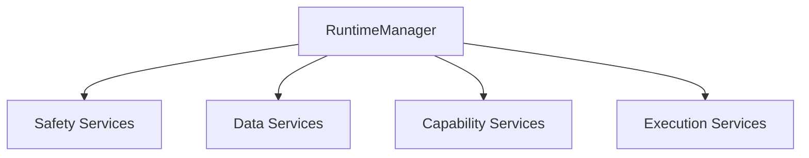
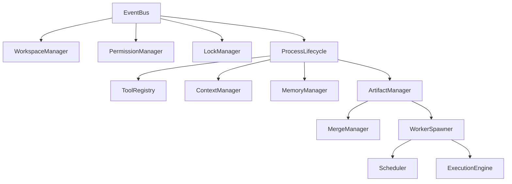
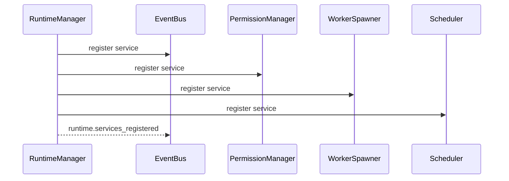
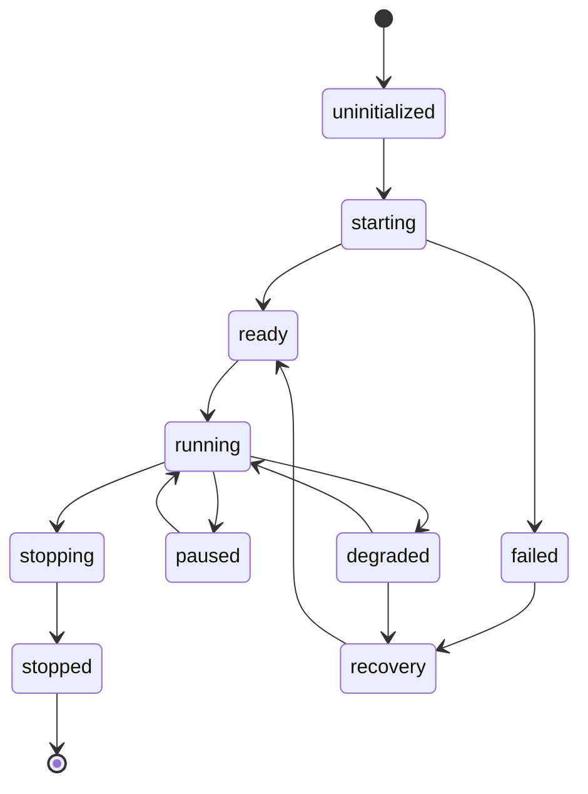
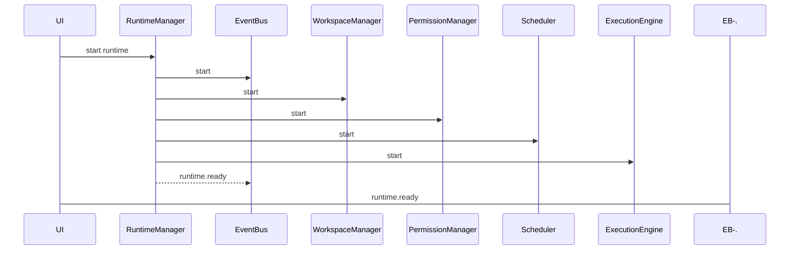
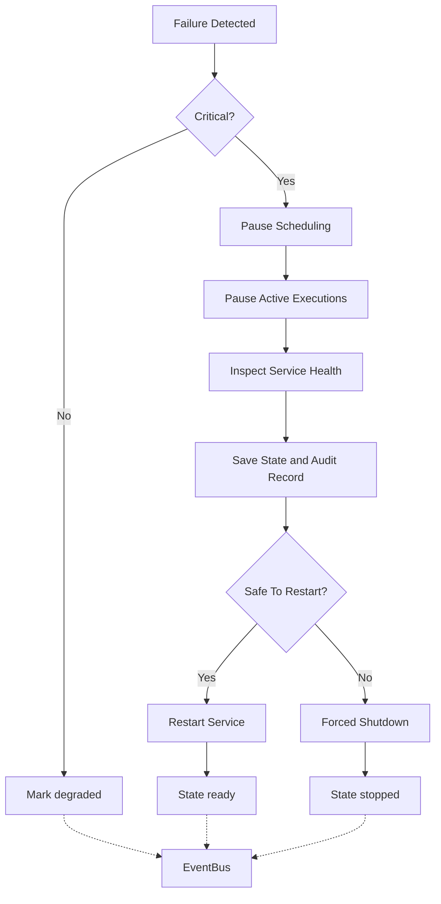
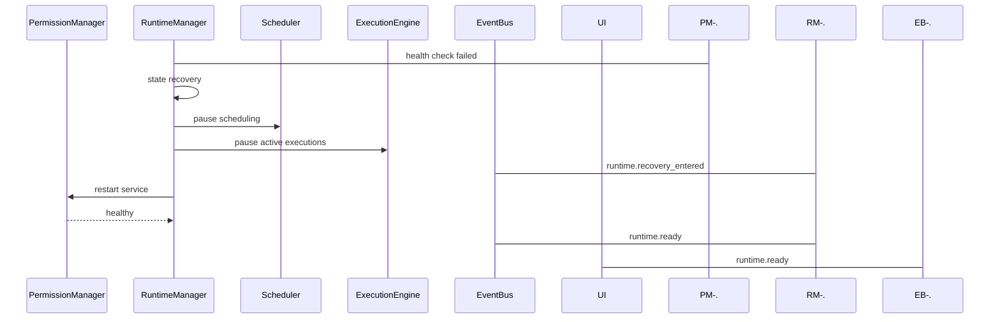

# RuntimeManager Diagrams

Every flow below is rendered four ways: overview, detailed mermaid, ASCII, and sequence.

## Service Graph

### Overview



### Detailed



### ASCII

```text
EventBus
  |
  +-- WorkspaceManager
  +-- PermissionManager
  +-- LockManager
  +-- ProcessLifecycle
        |
        +-- ToolRegistry
        +-- ContextManager
        +-- MemoryManager
        +-- ArtifactManager
              |
              +-- MergeManager
              +-- WorkerSpawner
                    |
                    +-- Scheduler
                    +-- ExecutionEngine
```

### Sequence



## Startup Flow

### Overview

```text
uninitialized -> starting -> ready
```

### Detailed



### ASCII

```text
RuntimeManager.start()
  |
  v
load config -> open database
  |
  v
Phase 1  start EventBus, logging
  |
  v
Phase 2  start WorkspaceManager, PermissionManager, LockManager
  |
  v
Phase 3  start MemoryManager, ArtifactManager, ContextManager
  |
  v
Phase 4  start ToolRegistry, ProcessLifecycle, WorkerSpawner
  |
  v
Phase 5  start Scheduler, ExecutionEngine, MergeManager
  |
  +-- required service failed --> failed  (fail closed)
  +-- optional service failed --> degraded
  |
  v
emit runtime.ready
```

### Sequence



## Failure and Recovery Flow

### Overview

```text
failure detected -> pause scheduling -> inspect health -> restart or stop
```

### Detailed



### ASCII

```text
Critical failures (pause or stop immediately):
  PermissionManager unavailable
  WorkspaceManager cannot verify paths
  LockManager cannot enforce locks
  EventBus cannot record critical events
  database cannot persist audit records
  ProcessLifecycle cannot stop dangerous process

Recovery mode:
  stop scheduling new work
  pause active executions
  inspect service health
  save state
  attempt restart of safe services
  notify UI
  require user action if needed
```

### Sequence



## Related Documents

- [[RuntimeManager-Part01]]
- [[RuntimeManager-Part02]]
- [[RuntimeManager-Part03]]
- [[RuntimeManager-Part05]]
- [[Scheduler-Part01]]
- [[ExecutionEngine-Part01]]
- [[02-runtime/README]]
