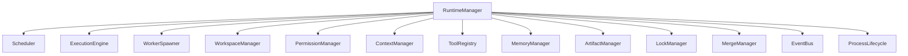

---
title: RuntimeManager Specification - Part 01
status: draft
version: 1.0
tags:
  - runtime
  - runtime-manager
  - architecture
related:
  - "[[02-runtime/README]]"
  - "[[Runtime-Part01]]"
  - "[[Execution-Part01]]"
---

# RuntimeManager Specification (Part 01)

## Document Index

Part 01 - Purpose, Philosophy, and Responsibilities
Part 02 - Service Graph, Startup, and Shutdown
Part 03 - Runtime State, Health, and Supervision
Part 04 - Runtime API, Commands, and IPC Boundary
Part 05 - Failure Handling, Recovery, and Safety Invariants
Part 06 - Implementation Checklist, Examples, and Future Expansion

# Purpose

The RuntimeManager is the top-level coordinator for all deterministic runtime services in Eulinx.

It does not perform every job itself. Instead, it owns the runtime service graph, initializes services, supervises health, coordinates shutdown, exposes high-level runtime APIs, and enforces global runtime invariants.

The RuntimeManager is the closest thing Eulinx has to an operating system kernel supervisor.

# Core Philosophy

The RuntimeManager should be small, strict, and boring in the best way.

It should not become a dumping ground for Worker logic, UI logic, Tool logic, graph logic, permission logic, or database logic.

Its job is coordination.

```text
RuntimeManager coordinates.
Scheduler schedules.
ExecutionEngine executes.
WorkerSpawner spawns.
PermissionManager authorizes.
ArtifactManager stores artifacts.
MergeManager applies changes.
EventBus distributes events.
```

# Definition

The RuntimeManager is a deterministic runtime service that owns:

- runtime startup
- runtime shutdown
- service registration
- service dependency order
- global runtime state
- service health checks
- runtime-wide event wiring
- top-level IPC command routing
- emergency pause and stop controls
- workspace runtime binding
- runtime invariant enforcement

# Responsibilities

The RuntimeManager MUST:

- start runtime services in a valid order
- stop runtime services safely
- expose runtime health
- route top-level UI requests to service APIs
- prevent actions when runtime state does not allow them
- ensure required services are available before execution
- coordinate emergency shutdown
- track active Workspace runtime state
- emit runtime lifecycle events
- enforce global runtime invariants

The RuntimeManager SHOULD:

- keep service APIs narrow
- use typed command objects
- expose clear error responses
- aggregate service health
- provide runtime diagnostics
- support safe restart of failed services where possible

The RuntimeManager MUST NOT:

- bypass the PermissionManager
- execute Worker tasks directly
- mutate Project files directly
- invoke Tools directly except through ToolRegistry
- merge Artifacts directly
- own UI layout state
- contain AI reasoning
- trust AI-generated runtime commands without validation

# RuntimeManager Object Model

```ts
type RuntimeManager = {
  id: string;
  state: RuntimeState;
  activeWorkspaceId?: string;
  activeSessionId?: string;
  services: RuntimeServiceRegistry;
  health: RuntimeHealthSnapshot;
  config: RuntimeConfig;
  startedAt?: string;
  updatedAt: string;
};
```

# Runtime State

```text
uninitialized
starting
ready
running
paused
degraded
stopping
stopped
failed
recovery
```

# Global Runtime Invariants

The RuntimeManager MUST enforce:

```text
No execution without active Workspace.
No Worker spawn without WorkerSpawner.
No Tool invocation without ToolRegistry.
No unsafe action without PermissionManager.
No file mutation without WorkspaceManager boundary check.
No merge without MergeManager.
No concurrent mutation without LockManager.
No important action without EventBus event.
No context injection without ContextManager.
```

# Runtime Service List

The RuntimeManager coordinates:

```text
Scheduler
WorkerSpawner
ExecutionEngine
WorkspaceManager
MemoryManager
ArtifactManager
MergeManager
LockManager
PermissionManager
ContextManager
ToolRegistry
EventBus
ProcessLifecycle
```

# Mermaid Diagram



# AI Notes

Do not implement RuntimeManager as a giant class with every method in the system.

It should coordinate service boundaries, not erase them.

If a method sounds like `writeFile`, `invokeTool`, `mergePatch`, `spawnTerminal`, or `searchMemory`, it probably belongs to another service.

# Related Documents

- [[02-runtime/README]]
- [[RuntimeManager-Part02]]
- [[Runtime-Part01]]
- [[Execution-Part01]]

