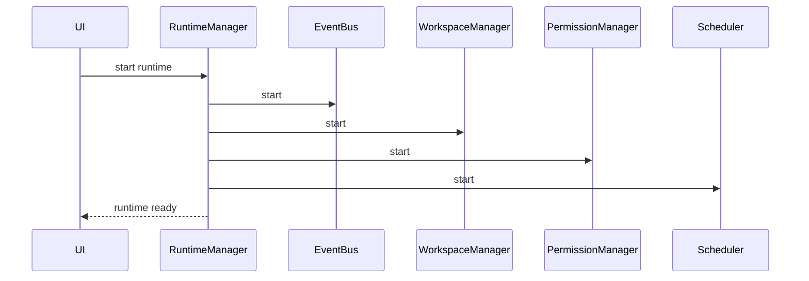

---
title: RuntimeManager Specification - Part 02
status: draft
version: 1.0
tags:
  - runtime
  - runtime-manager
  - startup
  - shutdown
related:
  - "[[RuntimeManager-Part01]]"
  - "[[EventBus-Part01]]"
  - "[[WorkspaceManager-Part01]]"
---

# RuntimeManager Specification (Part 02)

## Document Index

Part 01 - Purpose, Philosophy, and Responsibilities
Part 02 - Service Graph, Startup, and Shutdown
Part 03 - Runtime State, Health, and Supervision
Part 04 - Runtime API, Commands, and IPC Boundary
Part 05 - Failure Handling, Recovery, and Safety Invariants
Part 06 - Implementation Checklist, Examples, and Future Expansion

# Purpose

This part defines how the RuntimeManager starts, wires, supervises, and shuts down runtime services.

Runtime services depend on each other. Starting them randomly will create fragile behavior.

# Service Dependency Principle

Services must start in dependency order and stop in reverse dependency order.

Example:

```text
EventBus should exist before services emit events.
WorkspaceManager should exist before services access workspace paths.
PermissionManager should exist before unsafe actions are allowed.
ProcessLifecycle should exist before WorkerSpawner starts terminals.
```

# Service Graph

```text
EventBus
  |
  +-- WorkspaceManager
  +-- PermissionManager
  +-- LockManager
  +-- ProcessLifecycle
        |
        +-- ToolRegistry
        +-- ContextManager
        +-- MemoryManager
        +-- ArtifactManager
              |
              +-- MergeManager
              +-- WorkerSpawner
                    |
                    +-- Scheduler
                    +-- ExecutionEngine
```

This is a conceptual graph. The implementation may choose a slightly different order, but dependencies must remain explicit.

# Startup Phases

The RuntimeManager SHOULD start in phases.

## Phase 1 - Core Infrastructure

Start:

- EventBus
- configuration loader
- database connection
- logging/tracing

## Phase 2 - Safety Services

Start:

- WorkspaceManager
- PermissionManager
- LockManager

## Phase 3 - Data Services

Start:

- MemoryManager
- ArtifactManager
- ContextManager

## Phase 4 - Capability Services

Start:

- ToolRegistry
- ProcessLifecycle
- WorkerSpawner

## Phase 5 - Execution Services

Start:

- Scheduler
- ExecutionEngine
- MergeManager

# Startup Flow

```text
RuntimeManager.start()
  |
  v
load config
  |
  v
open database
  |
  v
start EventBus
  |
  v
start safety services
  |
  v
start data services
  |
  v
start capability services
  |
  v
start execution services
  |
  v
emit runtime.ready
```

# Startup Rules

The RuntimeManager MUST NOT enter `ready` state unless required services started successfully.

The RuntimeManager MAY enter `degraded` state if optional services failed.

The RuntimeManager MUST emit startup events.

The RuntimeManager MUST record startup failures.

The RuntimeManager MUST fail closed for safety service failures.

# Optional vs Required Services

Required services:

```text
EventBus
WorkspaceManager
PermissionManager
LockManager
ArtifactManager
ToolRegistry
ProcessLifecycle
WorkerSpawner
Scheduler
ExecutionEngine
```

Optional or degradable services may include:

```text
Vector Memory
Plugin Marketplace
Remote Provider Discovery
Advanced Metrics
Replay Renderer
```

# Shutdown Phases

Shutdown should happen in reverse operational order.

```text
pause scheduling
stop accepting new executions
cancel or drain active executions
stop Workers
stop Tools
flush artifacts
flush memory writes
release locks
write final events
close database
stop EventBus
```

# Graceful Shutdown

During graceful shutdown, Eulinx SHOULD:

- stop scheduling new work
- allow safe tasks to finish if configured
- pause Workers if possible
- terminate Workers if required
- save terminal logs
- persist workflow state
- persist active grants
- release locks
- emit runtime.stopped

# Forced Shutdown

Forced shutdown may be needed when:

- Worker processes hang
- dangerous action detected
- user requests immediate stop
- system is corrupted

Forced shutdown MUST still attempt to:

- record audit event
- terminate child processes
- prevent new actions
- mark incomplete executions as interrupted

# Mermaid Diagram



# AI Notes

Do not start WorkerSpawner before ProcessLifecycle exists.

Do not start ExecutionEngine before Scheduler and PermissionManager are ready.

Do not allow execution when RuntimeManager is still in `starting`, `failed`, or `stopping`.

# Related Documents

- [[RuntimeManager-Part01]]
- [[RuntimeManager-Part03]]
- [[EventBus-Part01]]
- [[WorkspaceManager-Part01]]

