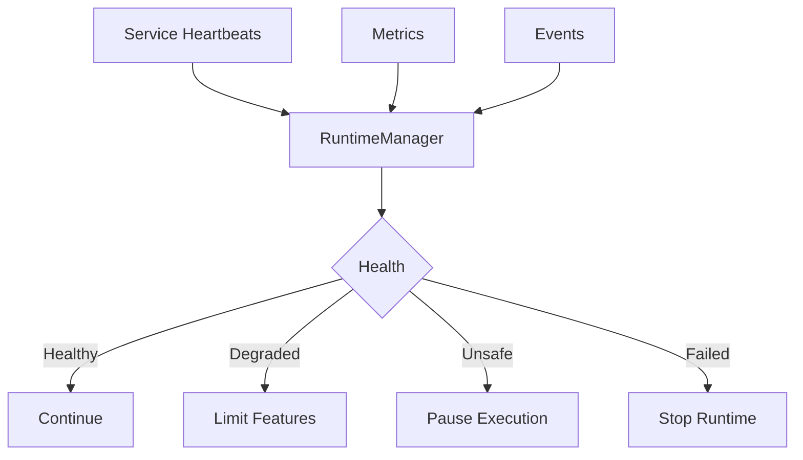

# RuntimeManager Specification (Part 03)

## Document Index

Part 01 - Purpose, Philosophy, and Responsibilities
Part 02 - Service Graph, Startup, and Shutdown
Part 03 - Runtime State, Health, and Supervision
Part 04 - Runtime API, Commands, and IPC Boundary
Part 05 - Failure Handling, Recovery, and Safety Invariants
Part 06 - Implementation Checklist, Examples, and Future Expansion

# Purpose

The RuntimeManager must know whether the Runtime is healthy enough to continue execution.

Health is not only "the app has not crashed." A degraded PermissionManager, stuck Scheduler, unavailable ToolRegistry, or broken WorkspaceManager can make execution unsafe.

# Runtime Health Snapshot

```ts
type RuntimeHealthSnapshot = {
  runtimeState: RuntimeState;
  overallStatus: "healthy" | "degraded" | "unsafe" | "failed";
  services: RuntimeServiceHealth[];
  activeWorkspaceId?: string;
  activeSessionId?: string;
  activeExecutionCount: number;
  activeWorkerCount: number;
  pendingApprovalCount: number;
  blockedTaskCount: number;
  updatedAt: string;
};
```

# Service Health

```ts
type RuntimeServiceHealth = {
  serviceId: string;
  serviceName: string;
  state: "starting" | "ready" | "running" | "degraded" | "stopped" | "failed";
  required: boolean;
  lastHeartbeatAt?: string;
  lastError?: string;
  metrics?: Record<string, number>;
};
```

# Health States

## Healthy

All required services are ready or running.

Execution may continue.

## Degraded

Optional services may be unavailable, or non-critical features may be limited.

Example:

```text
Vector memory unavailable, but basic execution can continue.
```

## Unsafe

A safety-critical service is unavailable.

Example:

```text
PermissionManager failed.
LockManager unavailable.
WorkspaceManager cannot verify paths.
```

Execution MUST pause or stop.

## Failed

Runtime cannot continue.

# Supervision Responsibilities

RuntimeManager SHOULD supervise:

- service health
- Worker counts
- active executions
- stalled executions
- event bus backlog
- pending approvals
- lock starvation
- process leaks
- memory pressure
- repeated service failures

# Heartbeats

Runtime services SHOULD emit heartbeats or expose health checks.

Heartbeat checks SHOULD be lightweight.

Missing heartbeat from a required service should mark the Runtime degraded or unsafe depending on service criticality.

# Health Events

Recommended events:

```text
runtime.health.updated
runtime.service.ready
runtime.service.degraded
runtime.service.failed
runtime.service.recovered
runtime.unsafe
runtime.recovery.started
runtime.recovery.completed
```

# Supervision Actions

The RuntimeManager MAY:

- pause scheduling
- stop new Worker spawning
- request service restart
- cancel unsafe execution
- notify UI
- request user decision
- enter recovery mode
- force shutdown

# Stalled Runtime Detection

The RuntimeManager SHOULD detect stalls:

- Scheduler has ready tasks but schedules none
- EventBus queue grows without processing
- WorkerSpawner reports active spawn but no process appears
- MergeManager holds lock too long
- ExecutionEngine remains running with no events
- approval is pending beyond timeout

# Mermaid Diagram



# AI Notes

Do not rely only on process existence for health.

A running service can still be unsafe if it cannot enforce its responsibilities.

The PermissionManager, WorkspaceManager, LockManager, and EventBus are safety-critical.

# Related Documents

- [[RuntimeManager-Part04]]
- [[Runtime-Part04]]
- [[EventBus-Part01]]

