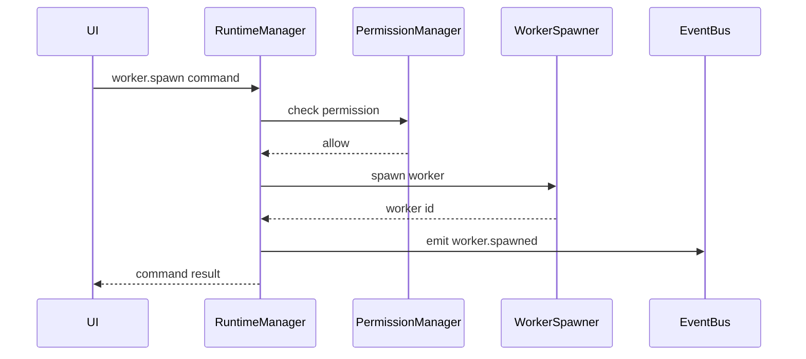

# RuntimeManager Specification (Part 04)

## Document Index

Part 01 - Purpose, Philosophy, and Responsibilities
Part 02 - Service Graph, Startup, and Shutdown
Part 03 - Runtime State, Health, and Supervision
Part 04 - Runtime API, Commands, and IPC Boundary
Part 05 - Failure Handling, Recovery, and Safety Invariants
Part 06 - Implementation Checklist, Examples, and Future Expansion

# Purpose

The RuntimeManager exposes a safe top-level API between the UI and Runtime services.

In a Tauri app, this usually means the frontend sends IPC commands to Rust, and Rust routes those commands into runtime services.

# IPC Principle

The UI may request actions.

The Runtime decides whether and how those actions happen.

The UI MUST NOT directly mutate trusted runtime state.

# Runtime Command Object

```ts
type RuntimeCommand = {
  id: string;
  type: string;
  workspaceId?: string;
  sessionId?: string;
  executionId?: string;
  payload: Record<string, unknown>;
  requestedBy: "user" | "ui" | "worker" | "plugin";
  requestedAt: string;
};
```

# Runtime Response Object

```ts
type RuntimeCommandResult = {
  commandId: string;
  ok: boolean;
  data?: unknown;
  error?: RuntimeError;
  events?: string[];
};
```

# Command Categories

The RuntimeManager should route:

```text
workspace commands
session commands
workflow commands
execution commands
worker commands
tool commands
artifact commands
memory commands
permission commands
settings commands
diagnostic commands
```

# API Routing Rules

RuntimeManager SHOULD:

- validate command shape
- check runtime state
- identify target service
- request permission check if needed
- route command
- return structured response
- emit events
- record errors

RuntimeManager SHOULD NOT:

- implement service logic inline
- accept untyped payloads without validation
- expose raw database access
- expose unrestricted filesystem APIs
- expose unrestricted process APIs

# Example Command Flow

```text
UI requests: spawn Worker
  |
  v
RuntimeManager validates command
  |
  v
PermissionManager checks worker.spawn.child
  |
  v
ContextManager builds context package
  |
  v
WorkerSpawner starts Worker
  |
  v
EventBus emits worker.started
```

# Important IPC Commands

Initial commands may include:

```text
runtime.start
runtime.stop
runtime.pause
runtime.resume
runtime.health.get
workspace.open
workspace.close
session.start
session.end
workflow.create
workflow.run
workflow.pause
workflow.resume
worker.spawn
worker.terminate
tool.invoke
artifact.get
artifact.merge
permission.approve
permission.reject
```

# Error Model

```ts
type RuntimeError = {
  code: string;
  message: string;
  recoverable: boolean;
  service?: string;
  details?: Record<string, unknown>;
};
```

Errors should be human-readable enough for UI display and structured enough for debugging.

# Mermaid Diagram



# AI Notes

Do not expose individual service internals directly to React.

Use typed Runtime commands and responses.

Every command that can change state should be auditable.

# Related Documents

- [[RuntimeManager-Part05]]
- [[Permission-Part04]]
- [[Tool-Part03]]
- [[Workflow-Part11]]

