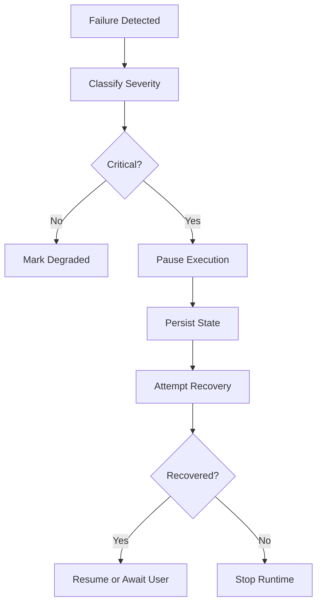

# RuntimeManager Specification (Part 05)

## Document Index

Part 01 - Purpose, Philosophy, and Responsibilities
Part 02 - Service Graph, Startup, and Shutdown
Part 03 - Runtime State, Health, and Supervision
Part 04 - Runtime API, Commands, and IPC Boundary
Part 05 - Failure Handling, Recovery, and Safety Invariants
Part 06 - Implementation Checklist, Examples, and Future Expansion

# Purpose

This part defines how RuntimeManager handles failures and protects user work when runtime services become unhealthy.

# Failure Principle

Runtime failures should be contained.

The system should preserve:

- project files
- artifacts
- audit logs
- workflow state
- user understanding

The Runtime must not keep executing blindly when safety services fail.

# Failure Categories

```text
service_start_failure
service_runtime_failure
database_failure
workspace_unavailable
permission_failure
lock_failure
process_failure
event_bus_failure
worker_leak
execution_stall
unknown_runtime_error
```

# Critical Failures

Critical failures require immediate pause or stop:

- PermissionManager unavailable
- WorkspaceManager cannot verify paths
- LockManager cannot enforce locks
- EventBus cannot record critical events
- database cannot persist audit records
- ProcessLifecycle cannot stop dangerous process

# Recovery Mode

RuntimeManager may enter `recovery` state.

Recovery mode should:

- stop scheduling new work
- pause active executions
- inspect service health
- save state
- attempt restart of safe services
- notify UI
- require user action if needed

# Recovery Flow

```text
Failure detected
  |
  v
classify severity
  |
  v
pause unsafe execution
  |
  v
persist state
  |
  v
attempt recovery
  |
  +-- success --> resume or wait for user
  |
  +-- failure --> stop runtime safely
```

# Worker Process Failure

If a Worker process fails, RuntimeManager should delegate details to WorkerSpawner and ProcessLifecycle, but it must aggregate the result.

Possible outcomes:

- mark Worker failed
- retry Worker
- ask Orchestrator to replan
- preserve logs
- preserve partial artifacts
- release locks

# EventBus Failure

EventBus failure is serious because Runtime history and UI updates depend on it.

If EventBus cannot emit critical events, RuntimeManager SHOULD pause execution until event delivery or persistence is restored.

# Database Failure

If database writes fail during high-risk execution, RuntimeManager SHOULD pause or stop.

The Runtime should avoid continuing if it cannot record what it did.

# Safety Invariants

RuntimeManager MUST enforce:

```text
Unsafe actions fail closed.
Unknown command types are rejected.
Unknown service state blocks execution.
Missing permission result blocks action.
Unrecordable critical action does not run.
Workspace boundary failure blocks file access.
Lock acquisition failure blocks mutation.
```

# Mermaid Diagram



# AI Notes

Do not continue execution when safety-critical services are down.

Do not hide recovery from the user. The UI should show when Runtime is degraded, unsafe, or recovering.

Recovery should prioritize preserving user data over completing automation.

# Related Documents

- [[RuntimeManager-Part06]]
- [[Execution-Part06]]
- [[Permission-Part07]]
- [[ProcessLifecycle-Part01]]

