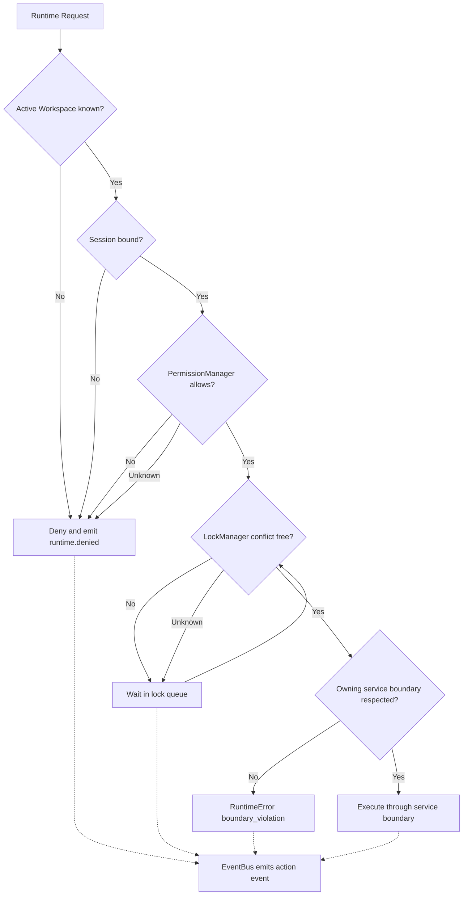
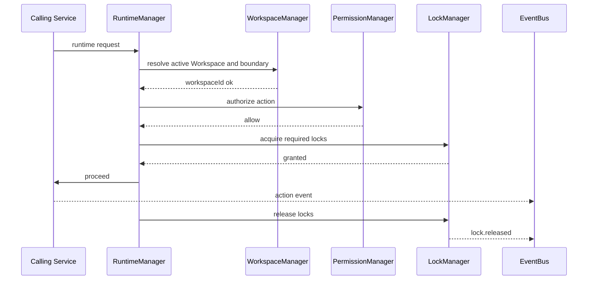
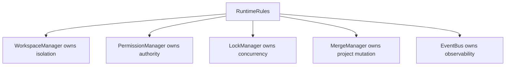
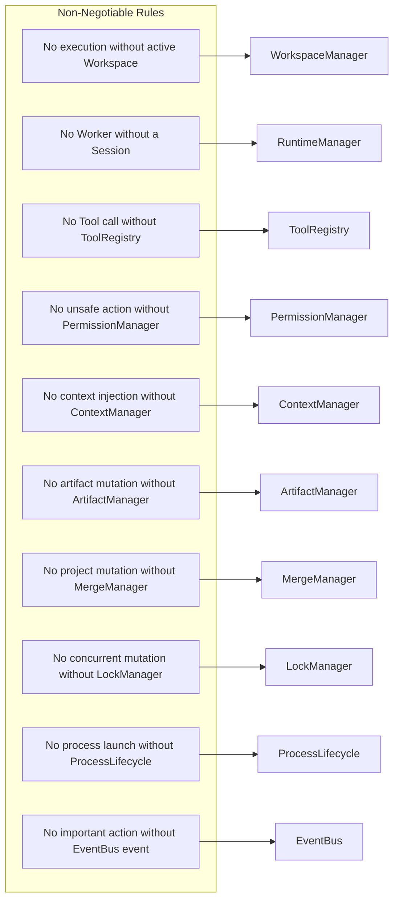
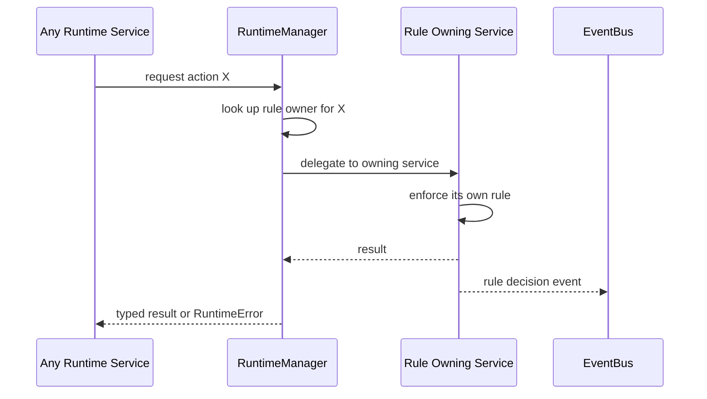
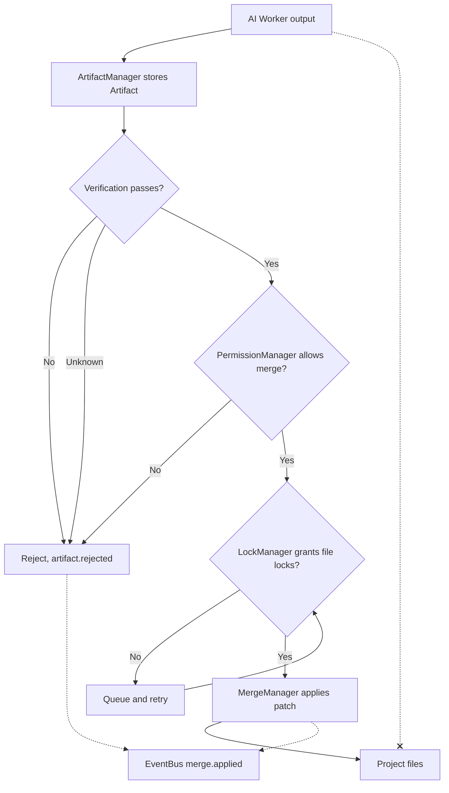
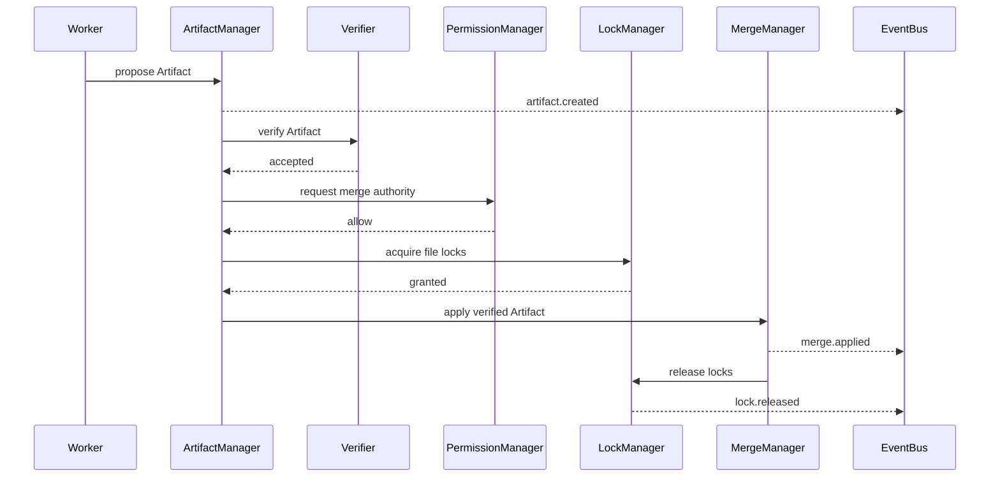
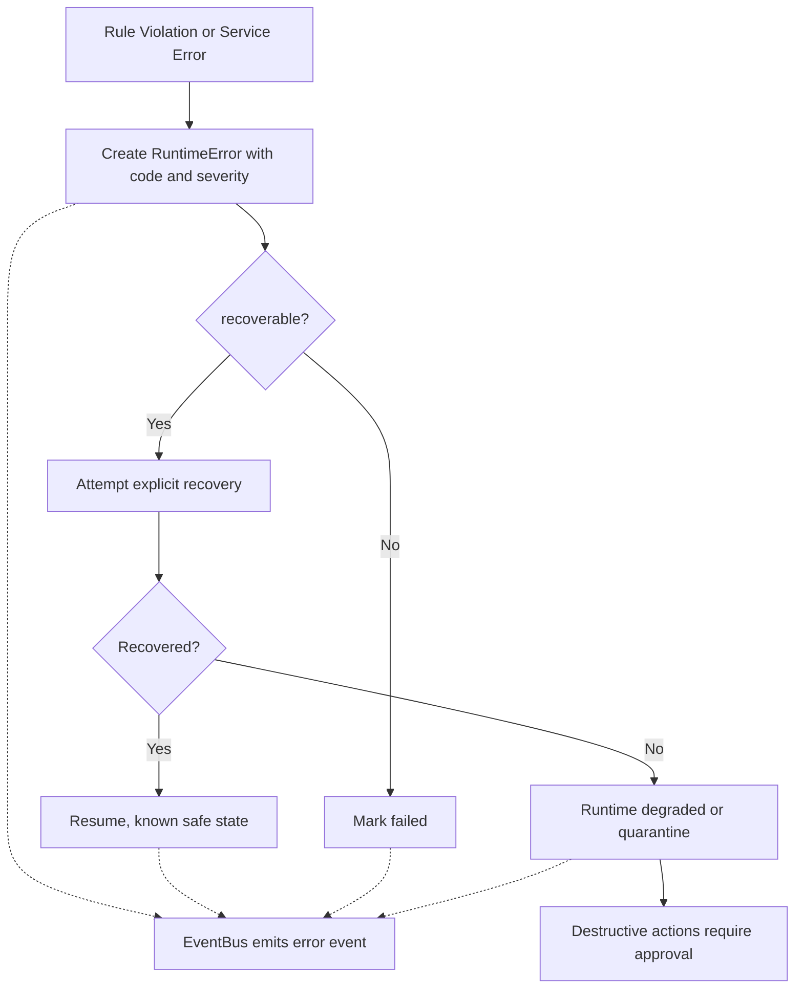
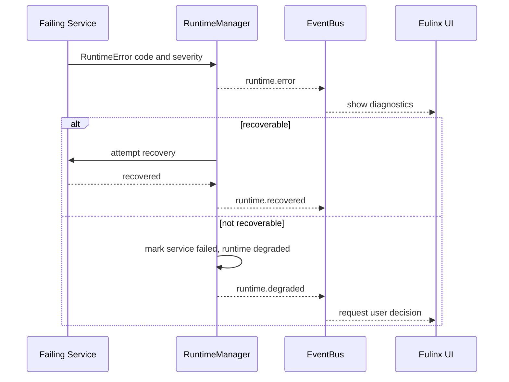

---
title: RuntimeRules Diagrams
status: draft
version: 1.0
tags:
  - runtime
  - rules
  - invariants
  - diagrams
related:
  - "[[02-runtime/README]]"
  - "[[RuntimeRules-Part01]]"
  - "[[RuntimeManager-Part01]]"
  - "[[MergeManager-Part01]]"
---

# RuntimeRules Diagrams

The enforcement structure, four renderings, per flow.

## Invariant Gate Chain

### 1. High-Level Overview

```text
Runtime Request
  -> Workspace gate    (WorkspaceManager)
  -> Session gate      (RuntimeManager)
  -> Permission gate   (PermissionManager)
  -> Lock gate         (LockManager)
  -> Boundary gate     (owning service only)
  -> Event gate        (EventBus)
  -> Action executes
Any gate unsure -> deny, wait, or quarantine. Fail closed.
```

### 2. Detailed Mermaid



### 3. ASCII

```text
Runtime Request
  |
  v
[ gate 1 ] Workspace known?        no/unknown --> DENY
  |yes
  v
[ gate 2 ] Session bound?          no         --> DENY
  |yes
  v
[ gate 3 ] Permission allowed?     no/unknown --> DENY   (fail closed)
  |yes
  v
[ gate 4 ] Locks safe?             no/unknown --> WAIT   (queue, retry)
  |yes
  v
[ gate 5 ] Boundary owner is caller?  no      --> RuntimeError
  |yes
  v
[ execute through service boundary ]
  |
  '-.-> [ gate 6 ] EventBus event MUST be emitted
```

### 4. Sequence



## Rule Ownership Map

### 1. High-Level Overview



### 2. Detailed Mermaid



### 3. ASCII

```text
RULE                                             OWNING SERVICE
-------------------------------------------------------------------
No execution without active Workspace         -> WorkspaceManager
No Worker without a Session                   -> RuntimeManager
No Tool call without ToolRegistry             -> ToolRegistry
No unsafe action without PermissionManager    -> PermissionManager
No context injection without ContextManager   -> ContextManager
No artifact mutation without ArtifactManager  -> ArtifactManager
No project mutation without MergeManager      -> MergeManager
No concurrent mutation without LockManager    -> LockManager
No process launch without ProcessLifecycle    -> ProcessLifecycle
No important action without EventBus event    -> EventBus

Boundary rule: services MUST NOT reach around each other.
  WorkerSpawner starts Workers, ProcessLifecycle starts OS processes.
  ExecutionEngine runs work, Scheduler decides readiness.
  ToolRegistry invokes Tools, PermissionManager authorizes use.
  MergeManager applies changes, LockManager prevents conflicts.
  ArtifactManager stores Artifacts, Verifier decides acceptance.
```

### 4. Sequence



## Artifact Mutation Gate

### 1. High-Level Overview

```text
Worker output -> Artifact -> Verification -> Permission -> Lock -> MergeManager -> Project files
AI output NEVER writes trusted state directly. This is the single most important rule in Eulinx.
```

### 2. Detailed Mermaid



### 3. ASCII

```text
  Worker output  (UNTRUSTED)
        |
        v
   [ Artifact ]                         ArtifactManager
        |
        v
   [ Verification ] --fail/unknown--> reject, do not merge
        |pass
        v
   [ PermissionManager ] --deny--> reject
        |allow
        v
   [ LockManager ] --conflict--> queue and wait
        |granted
        v
   [ MergeManager ]                     the ONLY writer
        |
        v
   [ Project files ]  (TRUSTED)

  Worker output ---X---> Project files    FORBIDDEN, always
```

### 4. Sequence



## Rule Violation Flow

### 1. High-Level Overview

```text
violation -> structured RuntimeError -> EventBus -> recoverable?
  yes -> attempt recovery -> recovered? resume : degraded or quarantine
  no  -> mark failed
```

### 2. Detailed Mermaid



### 3. ASCII

```text
Rule Violation
  |
  v
RuntimeError {
  code, message, severity: info|warning|error|critical,
  workspaceId?, sessionId?, service, recoverable, userVisible, createdAt
}
  |
  '-.-> EventBus  (MUST emit, never swallow silently)
  |
  v
recoverable?
  |no  --> mark failed
  |yes --> attempt explicit recovery
             |
             +-- known safe state   --> resume
             +-- known failed state --> mark failed
             '-- unknown state      --> quarantine or pause (degraded)
                                          |
                                          v
                              new risky work paused,
                              running safe work continues,
                              destructive actions need approval
```

### 4. Sequence



## Related Documents

- [[RuntimeRules-Part01]]
- [[RuntimeRules-Part02]]
- [[RuntimeRules-Part03]]
- [[RuntimeRules-Part04]]
- [[RuntimeManager-Part01]]
- [[PermissionManager-Part01]]
- [[LockManager-Part01]]
- [[MergeManager-Part01]]
- [[EventBus-Part01]]
- [[02-runtime/README]]
