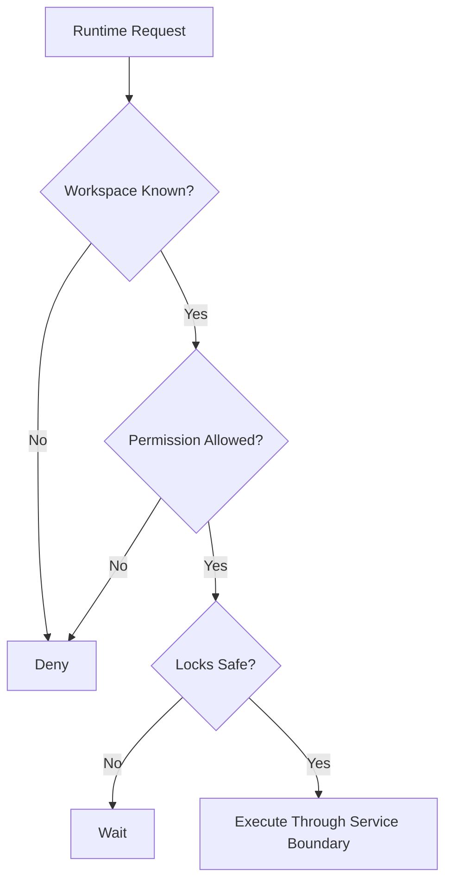

---
title: RuntimeRules Specification - Part 01
status: draft
version: 1.0
tags:
  - runtime
  - rules
  - invariants
related:
  - "[[02-runtime/README]]"
  - "[[RuntimeManager-Part01]]"
---

# RuntimeRules Specification (Part 01)

## Document Index

Part 01 - Runtime Invariants and Non-Negotiable Rules
Part 02 - Service Boundaries, Mutation Rules, and Safety Gates
Part 03 - Error Handling, Observability, and Recovery Rules
Part 04 - Implementation Checklist, Anti-Patterns, and Future Expansion

# Purpose

RuntimeRules defines the non-negotiable rules every Eulinx runtime service must follow.

These rules exist so Eulinx remains safe as the system grows. Workers, Orchestrators, Workflows, Tools, plugins, and future extensions may become complex, but runtime invariants should remain simple and stable.

# Core Runtime Invariants

The Runtime MUST enforce:

```text
No execution without active Workspace.
No Worker without a Session.
No Tool call without ToolRegistry.
No unsafe action without PermissionManager.
No context injection without ContextManager.
No artifact mutation without ArtifactManager.
No project mutation without MergeManager.
No concurrent mutation without LockManager.
No process launch without ProcessLifecycle.
No important action without EventBus event.
```

# Reasoning vs Authority

Eulinx MUST separate reasoning from authority.

AI Workers and Orchestrators may recommend actions. Runtime services decide whether actions are allowed.

```text
Worker says: I need to edit auth.ts.
Runtime asks: Is this allowed?
PermissionManager checks policy.
LockManager checks conflict.
MergeManager applies verified patch.
```

# Workspace Isolation

Every runtime object MUST belong to exactly one Workspace unless explicitly designed as global metadata.

Workspace-scoped objects include:

- Workers
- Tasks
- Sessions
- Artifacts
- Memories
- Workflow executions
- Tool grants
- permissions
- process records
- event streams

# Fail Closed

If Runtime cannot determine whether an action is safe, it MUST deny or pause the action.

Examples:

```text
Permission unknown -> deny
Workspace unknown -> deny
Lock state unknown -> wait
Artifact validity unknown -> do not merge
Process identity unknown -> quarantine
```

# Mermaid Overview



# AI Notes

When in doubt, deny, pause, or ask for approval.

Never invent a shortcut around a runtime rule because a feature seems easier to implement that way.

# Related Documents

- [[RuntimeRules-Part02]]
- [[RuntimeManager-Part01]]
- [[Permission-Part01]]
- [[LockManager-Part01]]

