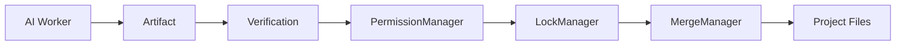

---
title: RuntimeRules Specification - Part 02
status: draft
version: 1.0
tags:
  - runtime
  - service-boundaries
  - mutation
related:
  - "[[RuntimeRules-Part01]]"
  - "[[MergeManager-Part01]]"
---

# RuntimeRules Specification (Part 02)

## Document Index

Part 01 - Runtime Invariants and Non-Negotiable Rules
Part 02 - Service Boundaries, Mutation Rules, and Safety Gates
Part 03 - Error Handling, Observability, and Recovery Rules
Part 04 - Implementation Checklist, Anti-Patterns, and Future Expansion

# Purpose

This part defines service boundary rules, mutation rules, and safety gates.

# Service Boundary Rule

Every runtime service MUST own a clear responsibility.

Services MUST NOT reach around each other to perform actions.

Examples:

```text
WorkerSpawner starts Workers, but ProcessLifecycle starts OS processes.
ExecutionEngine runs work, but Scheduler decides readiness.
ToolRegistry invokes Tools, but PermissionManager authorizes use.
MergeManager applies changes, but LockManager prevents conflicts.
ArtifactManager stores Artifacts, but Verifier decides acceptance.
```

# Mutation Rule

AI output MUST NOT directly mutate trusted state.

Trusted state includes:

- project files
- database records
- permission grants
- memory indexes
- runtime state
- tool registry
- plugin registry
- workflow definitions

AI output may propose changes through Artifacts.

# Project Mutation Flow

```text
Worker output
  |
  v
Artifact
  |
  v
Verification
  |
  v
Lock acquisition
  |
  v
MergeManager
  |
  v
Project files
```

# Safety Gates

Eulinx should use safety gates before:

- spawning Workers
- invoking Tools
- accessing filesystem
- writing files
- deleting files
- running shell commands
- using network
- exposing secrets
- merging patches
- installing plugins
- entering YOLO mode

# Boundary Diagram



# Anti-Bypass Rules

Runtime services MUST NOT:

- call filesystem mutation APIs directly unless they own that boundary
- mutate database records owned by another service
- invoke tools by bypassing ToolRegistry
- create Workers without WorkerSpawner
- start processes without ProcessLifecycle
- ignore EventBus emission for important state changes

# AI Notes

If generated code imports a low-level API from a random UI component, that is probably a boundary violation.

Prefer narrow service methods and typed commands.

# Related Documents

- [[RuntimeRules-Part01]]
- [[Artifact-Part01]]
- [[MergeManager-Part01]]
- [[PermissionManager-Part01]]

