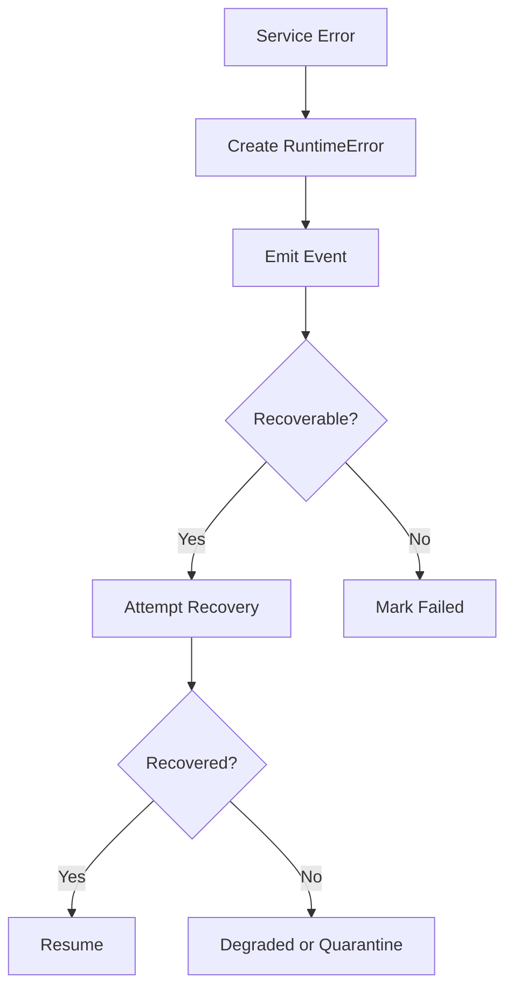

---
title: RuntimeRules Specification - Part 03
status: draft
version: 1.0
tags:
  - runtime
  - observability
  - recovery
related:
  - "[[RuntimeRules-Part02]]"
  - "[[EventBus-Part01]]"
---

# RuntimeRules Specification (Part 03)

## Document Index

Part 01 - Runtime Invariants and Non-Negotiable Rules
Part 02 - Service Boundaries, Mutation Rules, and Safety Gates
Part 03 - Error Handling, Observability, and Recovery Rules
Part 04 - Implementation Checklist, Anti-Patterns, and Future Expansion

# Purpose

This part defines error handling, observability, and recovery rules that every runtime service should follow.

# Error Handling Rules

Runtime errors MUST be structured.

```ts
type RuntimeError = {
  code: string;
  message: string;
  severity: "info" | "warning" | "error" | "critical";
  workspaceId?: string;
  sessionId?: string;
  service: string;
  recoverable: boolean;
  userVisible: boolean;
  createdAt: string;
};
```

Runtime services MUST NOT throw vague string errors across service boundaries.

# Observability Rules

Important runtime actions MUST emit events.

Examples:

- Worker spawned
- process started
- process exited
- permission denied
- approval requested
- artifact created
- merge started
- merge failed
- lock acquired
- lock released
- workflow paused
- runtime degraded

# Recovery Rules

Runtime services SHOULD support recovery when practical.

Recovery MUST be explicit and safe. It must not hide corruption or unknown state.

```text
Known safe state -> resume
Known failed state -> mark failed
Unknown state -> quarantine or pause
```

# Event Requirement

Every recovery action MUST emit an event explaining what happened.

# Degraded Runtime

RuntimeManager may mark Eulinx as degraded when one service is failing but the entire app does not need to stop.

In degraded state:

- new risky work may be paused
- running safe work may continue
- UI should show diagnostics
- recovery may be attempted
- destructive actions should require approval

# Diagram



# AI Notes

Do not swallow errors silently.

Eulinx is a visible AI work operating environment. Users need to know what failed, what is paused, and what needs their decision.

# Related Documents

- [[EventBus-Part01]]
- [[RuntimeManager-Part05]]
- [[ProcessLifecycle-Part04]]
- [[Replay]]

