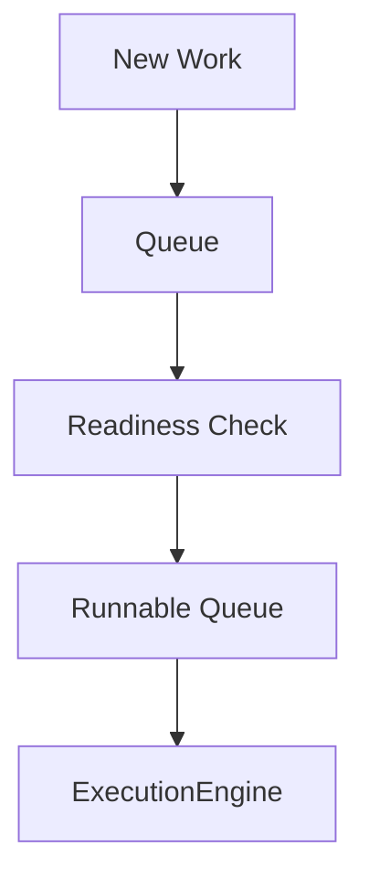
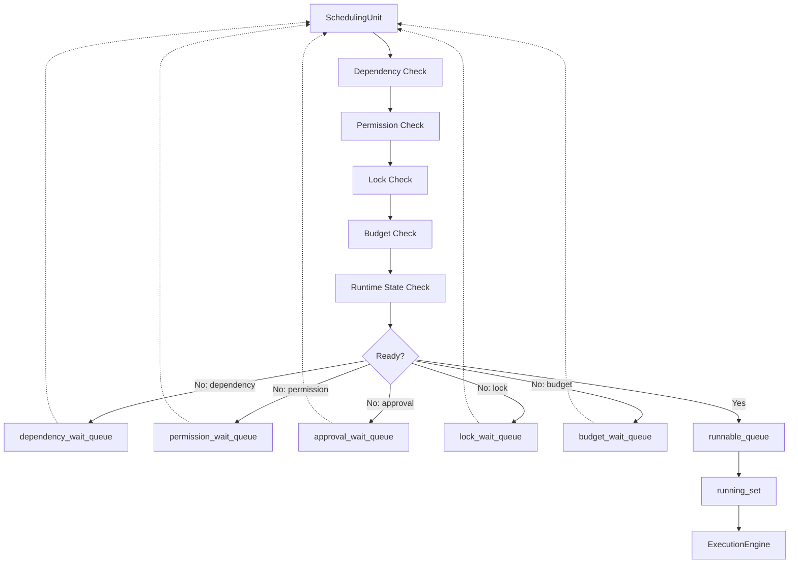
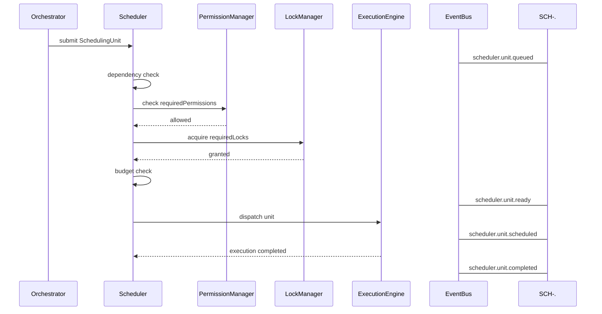
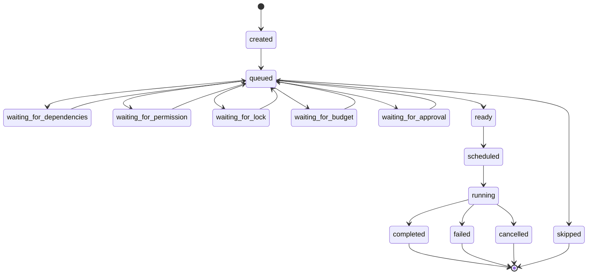
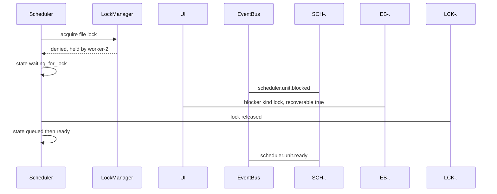
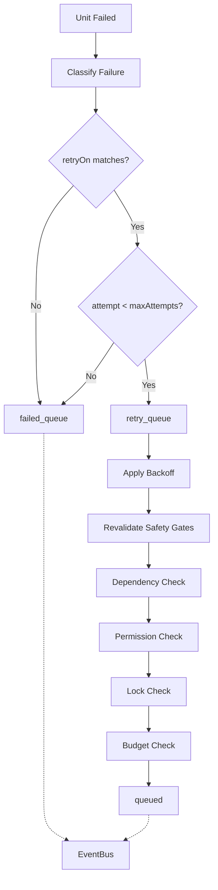
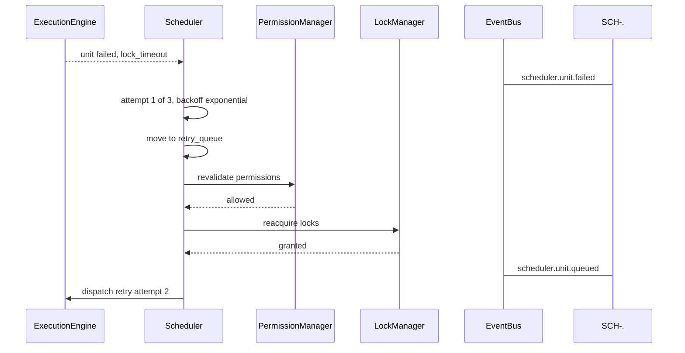

# Scheduler Diagrams

Every flow below is rendered four ways: overview, detailed mermaid, ASCII, and sequence.

## Readiness and Dispatch Flow

### Overview



### Detailed



### ASCII

```text
Scheduler queues:
  incoming_queue
  dependency_wait_queue
  permission_wait_queue
  approval_wait_queue
  lock_wait_queue
  budget_wait_queue
  runnable_queue
  running_set
  retry_queue
  cancelled_queue / completed_queue / failed_queue

Runnable ordering:
  1. safety requirements already satisfied
  2. priority   critical > high > normal > low > background
  3. dependency depth
  4. age        (priority aging prevents starvation)
  5. fairness
  6. resource fit

Rule: critical priority MUST NOT bypass permissions, locks,
approvals, or hard budgets. Priority affects ordering, not safety.
```

### Sequence



## Scheduling State Flow

### Overview

```text
created -> queued -> waiting_* -> ready -> scheduled -> running -> completed
```

### Detailed



### ASCII

```text
created
queued
waiting_for_dependencies
waiting_for_permission
waiting_for_lock
waiting_for_budget
waiting_for_approval
ready
scheduled
running
completed
failed
cancelled
skipped

Every blocked unit MUST carry a ReadinessBlocker so the UI can answer
"Why is this not running?" with a concrete reason.
```

### Sequence



## Failure and Retry Flow

### Overview

```text
failure -> classify -> retry queue or terminal failure
```

### Detailed



### ASCII

```text
Failure categories:
  dependency_failed   permission_denied   approval_rejected
  lock_timeout        budget_exhausted    tool_unavailable
  worker_failed       runtime_unsafe      timeout
  unknown_error

Retry rule: retries MUST re-run every safety gate.
Permissions, locks, and budgets may have changed since attempt 1.

Cancellation sources:
  user, RuntimeManager, Orchestrator, failed dependency,
  policy change, budget exhaustion, emergency stop
```

### Sequence



## Related Documents

- [[Scheduler-Part01]]
- [[Scheduler-Part02]]
- [[Scheduler-Part03]]
- [[Scheduler-Part05]]
- [[Scheduler-Part06]]
- [[RuntimeManager-Part01]]
- [[ExecutionEngine-Part01]]
- [[LockManager-Part01]]
- [[02-runtime/README]]
