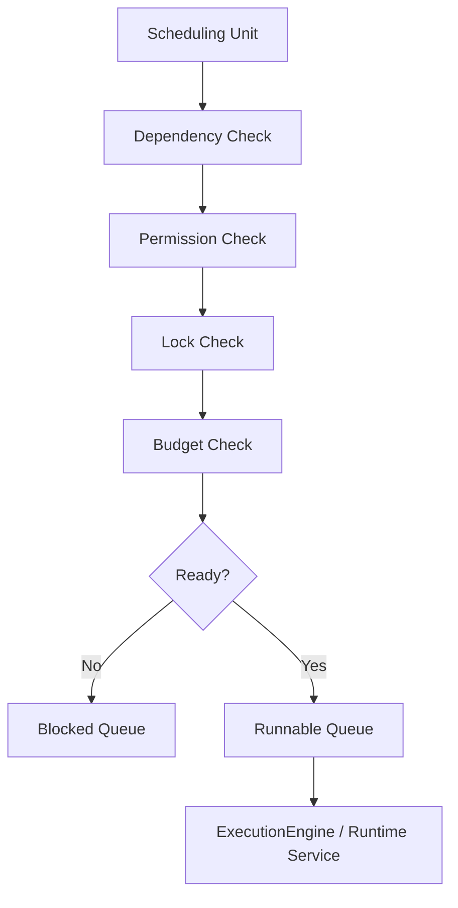

---
title: Scheduler Specification - Part 01
status: draft
version: 1.0
tags:
  - runtime
  - scheduler
  - execution
related:
  - "[[RuntimeManager-Part01]]"
  - "[[Execution-Part03]]"
  - "[[Workflow-Part06]]"
---

# Scheduler Specification (Part 01)

## Document Index

Part 01 - Purpose, Philosophy, and Core Responsibilities
Part 02 - Queues, Priorities, and Readiness
Part 03 - Dependencies, Parallelism, and Coordination
Part 04 - Budgets, Limits, and Fairness
Part 05 - Permissions, Locks, and Safety Gates
Part 06 - Failure Handling, Retries, and Cancellation
Part 07 - Events, Metrics, and Observability
Part 08 - Implementation Checklist, Examples, and Future Expansion

# Purpose

The Scheduler decides what runtime work is allowed to run next.

It does not execute the work itself. It selects work, orders work, checks readiness, coordinates safety gates, and hands runnable units to the [[ExecutionEngine]] or other runtime services.

# Philosophy

The Scheduler should be conservative, explainable, and resource-aware.

Eulinx may run many Workers, tools, Workflow nodes, verification loops, and background tasks at the same time. Without a Scheduler, the system becomes chaotic:

- too many Workers can spawn
- two Workers can modify the same file
- approvals can be bypassed accidentally
- budgets can be exceeded
- terminal processes can overwhelm the machine
- low-priority work can block important work

The Scheduler exists to prevent that.

# What the Scheduler Schedules

The Scheduler may schedule:

- Workflow nodes
- Tasks
- Worker spawn requests
- Tool invocations
- verification jobs
- merge jobs
- memory indexing jobs
- artifact processing jobs
- replay reconstruction jobs
- background maintenance jobs

# Scheduler Responsibilities

The Scheduler MUST:

- maintain runnable queues
- evaluate readiness
- respect dependencies
- respect permissions
- respect locks
- respect budgets
- respect concurrency limits
- avoid unsafe parallelism
- pause work when Runtime is unsafe
- emit scheduling events
- provide clear reasons for blocked work

The Scheduler MUST NOT:

- bypass PermissionManager
- directly spawn Workers
- directly invoke Tools
- directly merge Artifacts
- ignore LockManager
- continue scheduling when RuntimeManager marks the Runtime unsafe

# Scheduling Unit

```ts
type SchedulingUnit = {
  id: string;
  kind:
    | "workflow_node"
    | "task"
    | "worker_spawn"
    | "tool_invocation"
    | "verification"
    | "merge"
    | "background_job";
  workspaceId: string;
  sessionId?: string;
  executionId?: string;
  workflowId?: string;
  nodeId?: string;
  taskId?: string;
  priority: SchedulingPriority;
  dependencies: string[];
  requiredPermissions: string[];
  requiredLocks: string[];
  budgetEstimate?: BudgetEstimate;
  state: SchedulingState;
  createdAt: string;
  updatedAt: string;
};
```

# Scheduling States

```text
created
queued
waiting_for_dependencies
waiting_for_permission
waiting_for_lock
waiting_for_budget
waiting_for_approval
ready
scheduled
running
completed
failed
cancelled
skipped
```

# High-Level Flow

```text
New work arrives
  |
  v
Add to queue
  |
  v
Check dependencies
  |
  v
Check permissions
  |
  v
Check locks
  |
  v
Check budgets
  |
  v
Schedule if ready
```

# Mermaid Diagram



# AI Notes

Do not let each service independently decide when to run heavy work.

The Scheduler is the central place for readiness, priority, concurrency, and safe ordering decisions.

# Related Documents

- [[Scheduler-Part02]]
- [[RuntimeManager-Part01]]
- [[Execution-Part03]]
- [[Workflow-Part06]]

