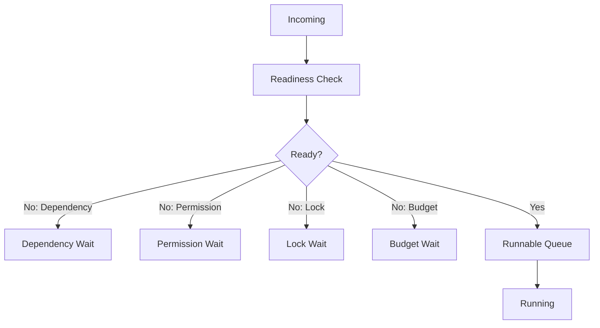

---
title: Scheduler Specification - Part 02
status: draft
version: 1.0
tags:
  - runtime
  - scheduler
  - queues
related:
  - "[[Scheduler-Part01]]"
  - "[[Task-Part02]]"
---

# Scheduler Specification (Part 02)

## Document Index

Part 01 - Purpose, Philosophy, and Core Responsibilities
Part 02 - Queues, Priorities, and Readiness
Part 03 - Dependencies, Parallelism, and Coordination
Part 04 - Budgets, Limits, and Fairness
Part 05 - Permissions, Locks, and Safety Gates
Part 06 - Failure Handling, Retries, and Cancellation
Part 07 - Events, Metrics, and Observability
Part 08 - Implementation Checklist, Examples, and Future Expansion

# Purpose

This part defines Scheduler queues, priority handling, readiness checks, and blocked-work explanations.

# Queue Types

The Scheduler SHOULD maintain multiple logical queues:

```text
incoming_queue
dependency_wait_queue
permission_wait_queue
approval_wait_queue
lock_wait_queue
budget_wait_queue
runnable_queue
running_set
retry_queue
cancelled_queue
completed_queue
failed_queue
```

# Queue Philosophy

Blocked work should not disappear.

Every blocked SchedulingUnit should have a clear reason.

The UI and Orchestrators should be able to ask:

```text
Why is this not running?
```

and receive a concrete answer.

# Priority Levels

```text
critical
high
normal
low
background
```

Priority affects ordering, not safety.

Critical priority MUST NOT bypass permissions, locks, approvals, or hard budgets.

# Readiness Object

```ts
type ReadinessResult = {
  unitId: string;
  ready: boolean;
  blockers: ReadinessBlocker[];
  checkedAt: string;
};
```

# Blocker Object

```ts
type ReadinessBlocker = {
  kind:
    | "dependency"
    | "permission"
    | "approval"
    | "lock"
    | "budget"
    | "runtime_state"
    | "resource"
    | "tool_unavailable"
    | "workspace_unavailable";
  message: string;
  blockingObjectId?: string;
  recoverable: boolean;
};
```

# Readiness Checks

The Scheduler SHOULD check:

- dependencies completed
- required input exists
- required permissions allowed or approved
- required locks available
- budget available
- Runtime state allows work
- required Tool available
- required Workspace active
- concurrency limit not exceeded
- retry policy allows another attempt

# Runnable Queue Ordering

Runnable units should be ordered by:

```text
1. safety requirements already satisfied
2. priority
3. dependency depth
4. age
5. fairness
6. resource fit
```

# Starvation Prevention

Low-priority work should not be blocked forever.

Scheduler SHOULD support priority aging:

```text
The longer a unit waits, the more scheduling weight it gains.
```

# Queue Events

Recommended events:

```text
scheduler.unit.queued
scheduler.unit.ready
scheduler.unit.blocked
scheduler.unit.scheduled
scheduler.unit.started
scheduler.unit.completed
scheduler.unit.failed
scheduler.unit.cancelled
```

# Mermaid Diagram



# AI Notes

Do not implement Scheduler as a single FIFO queue.

Eulinx needs explainable blocked queues because the user will watch many Workers and tasks moving at once.

# Related Documents

- [[Scheduler-Part03]]
- [[Task-Part02]]
- [[Permission-Part04]]
- [[LockManager-Part01]]

