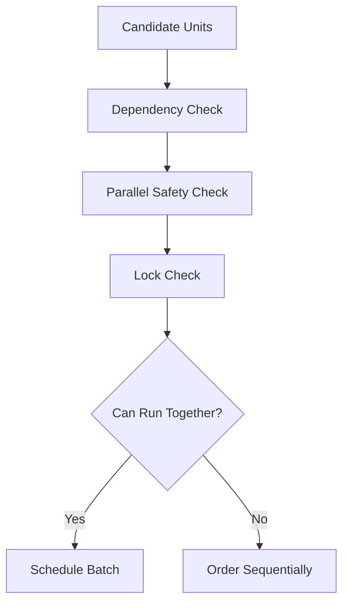

---
title: Scheduler Specification - Part 03
status: draft
version: 1.0
tags:
  - runtime
  - scheduler
  - dependencies
  - parallelism
related:
  - "[[Scheduler-Part02]]"
  - "[[Workflow-Part06]]"
  - "[[LockManager-Part01]]"
---

# Scheduler Specification (Part 03)

## Document Index

Part 01 - Purpose, Philosophy, and Core Responsibilities
Part 02 - Queues, Priorities, and Readiness
Part 03 - Dependencies, Parallelism, and Coordination
Part 04 - Budgets, Limits, and Fairness
Part 05 - Permissions, Locks, and Safety Gates
Part 06 - Failure Handling, Retries, and Cancellation
Part 07 - Events, Metrics, and Observability
Part 08 - Implementation Checklist, Examples, and Future Expansion

# Purpose

This part defines how the Scheduler handles dependencies and parallel execution.

# Dependency Model

A SchedulingUnit may depend on:

- another unit completing
- a Workflow node completing
- an Artifact existing
- an approval being granted
- a lock being released
- a Tool becoming available
- a budget being replenished
- a Session entering a required state

# Dependency Object

```ts
type SchedulingDependency = {
  id: string;
  unitId: string;
  dependencyType:
    | "unit_completed"
    | "artifact_available"
    | "approval_granted"
    | "lock_released"
    | "tool_available"
    | "budget_available"
    | "event_received";
  targetId: string;
  required: boolean;
};
```

# Dependency Resolution

Dependencies should be resolved by current runtime state, not by trusting stale node status.

Example:

```text
Artifact node says completed.
ArtifactManager must confirm artifact exists.
```

# Parallel Execution Principle

Parallel execution is allowed only when it is safe.

The Scheduler SHOULD check:

- dependency independence
- write target overlap
- lock conflicts
- terminal ownership
- resource budgets
- provider rate limits
- memory pressure
- CPU usage
- approval state

# Parallel Work Categories

Good candidates:

- independent research Workers
- independent read-only reviewers
- independent test suites
- artifact summarization
- memory indexing

Risky candidates:

- multiple file writers
- multiple dependency installers
- simultaneous package manager commands
- multiple Git mutations
- overlapping patch merges

# Coordination With LockManager

Before scheduling file-mutating or merge-related work, Scheduler MUST ask LockManager.

If locks cannot be acquired, the unit goes to `lock_wait_queue`.

# Coordination With Workflow

Workflow edges define dependency shape.

Scheduler converts graph dependencies into executable readiness checks.

# Mermaid Diagram



# AI Notes

Parallelism is not automatically good.

Eulinx should use parallel Workers for speed, but project mutations must remain controlled through locks, artifacts, verification, and merge sequencing.

# Related Documents

- [[Scheduler-Part04]]
- [[Workflow-Part06]]
- [[LockManager-Part01]]
- [[MergeManager-Part01]]

