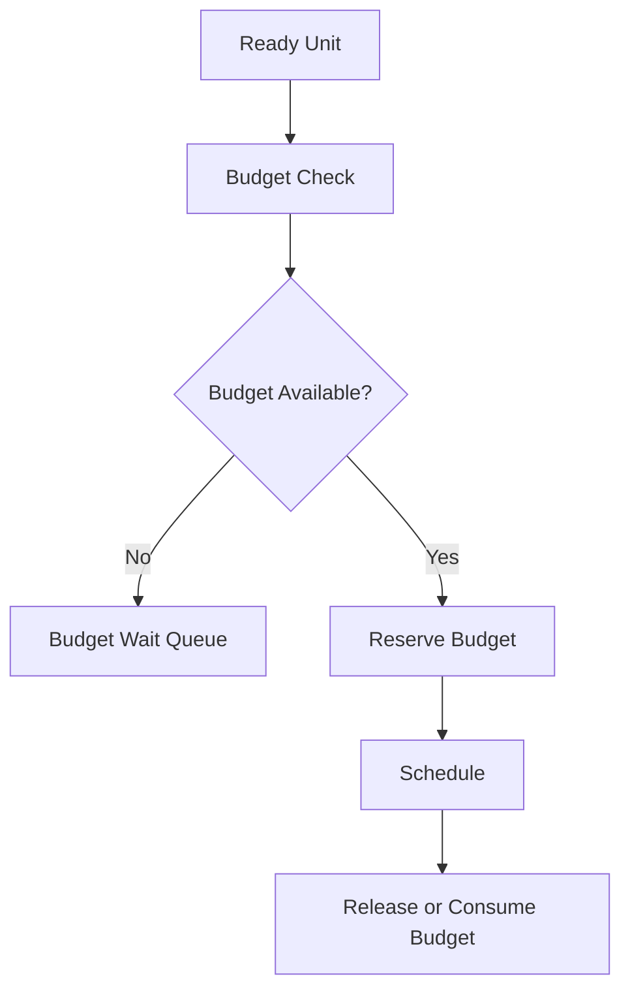

---
title: Scheduler Specification - Part 04
status: draft
version: 1.0
tags:
  - runtime
  - scheduler
  - budgets
  - limits
related:
  - "[[Scheduler-Part03]]"
  - "[[Model-Part01]]"
  - "[[Provider-Part01]]"
---

# Scheduler Specification (Part 04)

## Document Index

Part 01 - Purpose, Philosophy, and Core Responsibilities
Part 02 - Queues, Priorities, and Readiness
Part 03 - Dependencies, Parallelism, and Coordination
Part 04 - Budgets, Limits, and Fairness
Part 05 - Permissions, Locks, and Safety Gates
Part 06 - Failure Handling, Retries, and Cancellation
Part 07 - Events, Metrics, and Observability
Part 08 - Implementation Checklist, Examples, and Future Expansion

# Purpose

This part defines how the Scheduler respects resource limits and budgets.

Eulinx may run cheap or free models, local models, CLI processes, terminals, and tools. Even if the model is free, local machine resources are not unlimited.

# Budget Types

The Scheduler SHOULD understand:

```text
time budget
token budget
cost budget
worker count budget
terminal count budget
tool invocation budget
network request budget
file write budget
retry budget
CPU budget
memory budget
```

# Budget Scope

Budgets may exist at:

- Workspace
- Session
- Execution
- Workflow
- Orchestrator
- Task
- Worker
- Tool
- Invocation

Lower scopes MUST NOT exceed higher-scope hard budgets.

# Budget Estimate

```ts
type BudgetEstimate = {
  estimatedRuntimeMs?: number;
  estimatedTokens?: number;
  estimatedCostUsd?: number;
  estimatedWorkers?: number;
  estimatedToolInvocations?: number;
  estimatedFileWrites?: number;
  confidence: "low" | "medium" | "high";
};
```

# Budget Reservation

For expensive work, Scheduler SHOULD reserve budget before starting.

Example:

```text
Reserve 1 Worker slot.
Reserve 30 minutes.
Reserve 100,000 tokens.
Reserve 25 file writes.
```

If the unit completes early, unused reservation may be released.

# Fairness

Scheduler SHOULD avoid letting one Orchestrator consume all resources.

Fairness rules may include:

- max active Workers per Orchestrator
- max active Workers per Task
- max active Tool invocations per Workflow
- max parallel Workflows per Workspace
- round-robin between phases

# Backpressure

Backpressure prevents overloading the system.

If queues grow too large, Scheduler may:

- slow Worker spawning
- pause low-priority work
- ask Orchestrators to summarize
- reject new dynamic graph mutations
- require user approval for more resources

# Mermaid Diagram



# AI Notes

Do not assume free models make scheduling unlimited.

Workers consume memory, CPU, disk, process slots, terminal resources, and user attention.

Budgeting is about stability, not only money.

# Related Documents

- [[Scheduler-Part05]]
- [[Provider-Part01]]
- [[Model-Part01]]
- [[Worker-Part02]]

