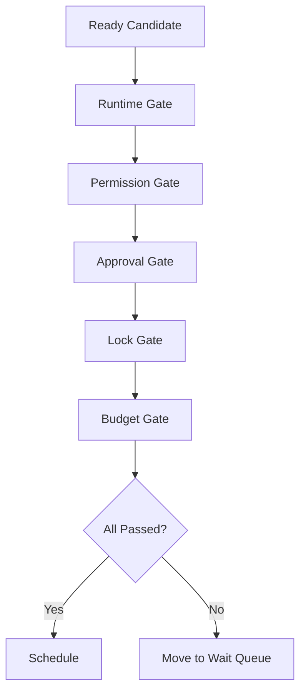

# Scheduler Specification (Part 05)

## Document Index

Part 01 - Purpose, Philosophy, and Core Responsibilities
Part 02 - Queues, Priorities, and Readiness
Part 03 - Dependencies, Parallelism, and Coordination
Part 04 - Budgets, Limits, and Fairness
Part 05 - Permissions, Locks, and Safety Gates
Part 06 - Failure Handling, Retries, and Cancellation
Part 07 - Events, Metrics, and Observability
Part 08 - Implementation Checklist, Examples, and Future Expansion

# Purpose

The Scheduler must coordinate with PermissionManager and LockManager before allowing unsafe work to run.

# Safety Gate Order

Recommended gate order:

```text
Runtime state gate
Dependency gate
Permission gate
Approval gate
Lock gate
Budget gate
Resource gate
```

# Permission Gate

The Scheduler SHOULD ask PermissionManager whether required permissions are currently satisfied.

If permission result is `ask`, the unit moves to approval wait.

If result is `deny`, the unit is blocked or failed depending on whether an alternate path exists.

# Approval Gate

Work waiting for human approval MUST NOT run.

Approval should be attached to the specific SchedulingUnit, requested action, and resource scope.

# Lock Gate

The Scheduler MUST coordinate with LockManager for:

- file writes
- patch merges
- symbol edits
- terminal ownership
- artifact mutation
- database migrations
- workflow graph mutations

# Safety Gate Object

```ts
type SafetyGateResult = {
  unitId: string;
  gate:
    | "runtime_state"
    | "dependency"
    | "permission"
    | "approval"
    | "lock"
    | "budget"
    | "resource";
  passed: boolean;
  blocker?: string;
  checkedAt: string;
};
```

# Gate Failure Behavior

Gate failure should not always mean task failure.

Examples:

```text
Waiting for approval -> pause
Waiting for lock -> queue
Permission denied -> block or replan
Budget exhausted -> pause or ask user
Runtime unsafe -> pause all
```

# Mermaid Diagram



# AI Notes

Never schedule first and check permissions later.

The Scheduler is not the PermissionManager, but it must require permission readiness before work starts.

# Related Documents

- [[Scheduler-Part06]]
- [[Permission-Part04]]
- [[LockManager-Part01]]

