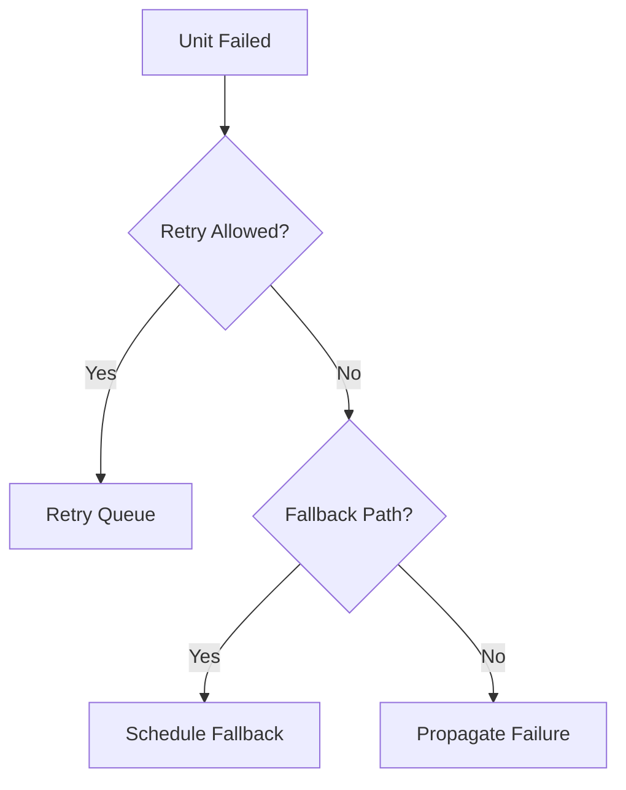

# Scheduler Specification (Part 06)

## Document Index

Part 01 - Purpose, Philosophy, and Core Responsibilities
Part 02 - Queues, Priorities, and Readiness
Part 03 - Dependencies, Parallelism, and Coordination
Part 04 - Budgets, Limits, and Fairness
Part 05 - Permissions, Locks, and Safety Gates
Part 06 - Failure Handling, Retries, and Cancellation
Part 07 - Events, Metrics, and Observability
Part 08 - Implementation Checklist, Examples, and Future Expansion

# Purpose

This part defines how Scheduler reacts to failed, retried, cancelled, skipped, and blocked work.

# Failure Categories

```text
dependency_failed
permission_denied
approval_rejected
lock_timeout
budget_exhausted
tool_unavailable
worker_failed
runtime_unsafe
timeout
unknown_error
```

# Retry Policy

```ts
type RetryPolicy = {
  maxAttempts: number;
  backoff: "none" | "fixed" | "exponential";
  delayMs?: number;
  retryOn: string[];
  requireRevalidation: boolean;
};
```

Retries MUST re-run safety gates.

Permissions, locks, and budgets may have changed since the first attempt.

# Retry Queue

The retry queue stores units that may run again.

Retry queue entries SHOULD include:

- original unit id
- attempt number
- last error
- next eligible time
- whether graph changed
- whether context must be refreshed

# Cancellation

Cancellation may be requested by:

- user
- RuntimeManager
- Orchestrator
- failed dependency
- policy change
- budget exhaustion
- emergency stop

Scheduler cancellation should:

- stop scheduling the unit
- ask ExecutionEngine to cancel running work
- release reservations
- release locks if owned
- update dependent units
- emit events

# Skipping

Skipping is not failure.

Nodes may be skipped due to:

- condition false
- branch not selected
- user override
- already satisfied result

Skipped units should still be recorded for replay.

# Failure Propagation

If a unit fails, dependent units may:

- fail
- skip
- wait
- retry
- replan
- use fallback branch

# Mermaid Diagram



# AI Notes

Do not retry blindly.

Every retry should re-check permissions, locks, budget, Runtime state, and whether the graph has changed.

# Related Documents

- [[Execution-Part06]]
- [[Task-Part05]]
- [[Scheduler-Part07]]

