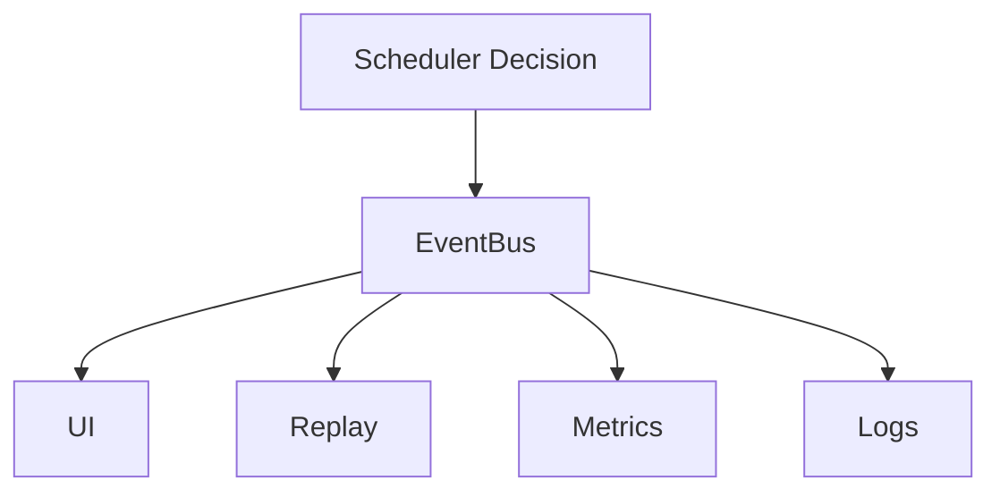

---
title: Scheduler Specification - Part 07
status: draft
version: 1.0
tags:
  - runtime
  - scheduler
  - events
  - metrics
related:
  - "[[EventBus-Part01]]"
  - "[[Execution-Part07]]"
---

# Scheduler Specification (Part 07)

## Document Index

Part 01 - Purpose, Philosophy, and Core Responsibilities
Part 02 - Queues, Priorities, and Readiness
Part 03 - Dependencies, Parallelism, and Coordination
Part 04 - Budgets, Limits, and Fairness
Part 05 - Permissions, Locks, and Safety Gates
Part 06 - Failure Handling, Retries, and Cancellation
Part 07 - Events, Metrics, and Observability
Part 08 - Implementation Checklist, Examples, and Future Expansion

# Purpose

The Scheduler must explain what it is doing.

When many Workers and Workflow nodes exist, the user needs visibility into why things are running, waiting, blocked, or paused.

# Scheduler Events

Recommended events:

```text
scheduler.started
scheduler.stopped
scheduler.paused
scheduler.resumed
scheduler.unit.created
scheduler.unit.queued
scheduler.unit.ready
scheduler.unit.blocked
scheduler.unit.unblocked
scheduler.unit.scheduled
scheduler.unit.running
scheduler.unit.completed
scheduler.unit.failed
scheduler.unit.cancelled
scheduler.unit.retry_scheduled
scheduler.budget.exhausted
scheduler.lock.waiting
scheduler.permission.waiting
```

# Metrics

Scheduler SHOULD track:

- queue length by queue
- average wait time
- average run time
- blocked unit count
- retry count
- cancellation count
- throughput
- active Worker count
- active Tool invocation count
- budget utilization
- lock wait time
- approval wait time

# Observability UI

The UI should show:

- runnable units
- blocked units
- why units are blocked
- active Workers
- queued Workers
- pending approvals
- resource pressure
- scheduling pauses

# Debug View

Eulinx should eventually include a Scheduler debug panel.

It may show:

```text
Unit ID
Type
Priority
State
Blockers
Dependencies
Required locks
Required permissions
Budget estimate
Last transition
```

# Replay Integration

Scheduler events should appear in Replay so users can understand:

- why execution paused
- why a Worker waited
- why a task was skipped
- why a retry happened
- why a branch did not run

# Mermaid Diagram



# AI Notes

Do not make scheduling invisible.

If a node is waiting, the user should be able to know why without reading logs.

# Related Documents

- [[EventBus-Part01]]
- [[Execution-Part07]]
- [[Scheduler-Part08]]

