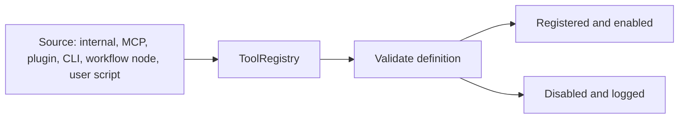
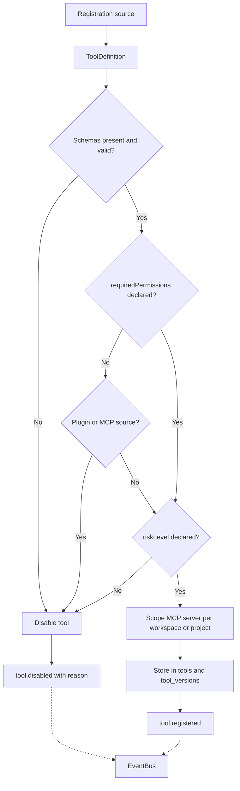
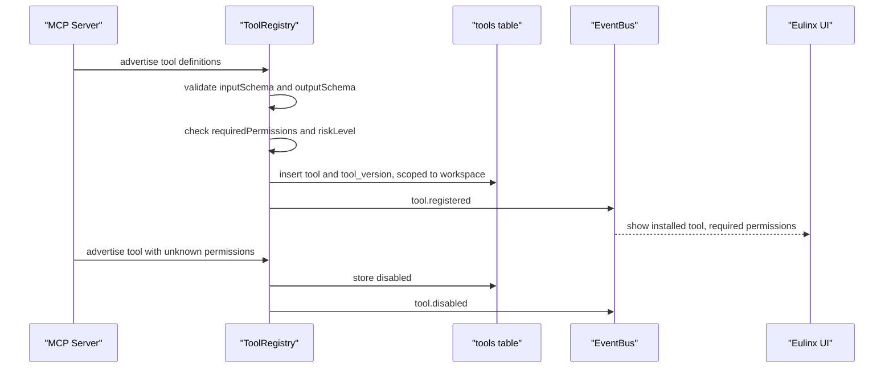
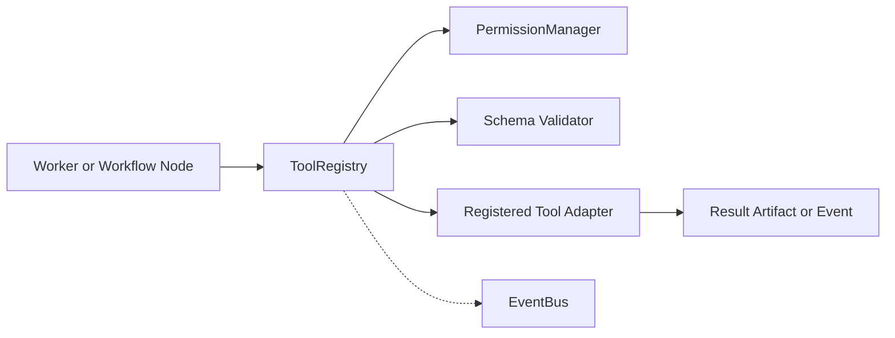
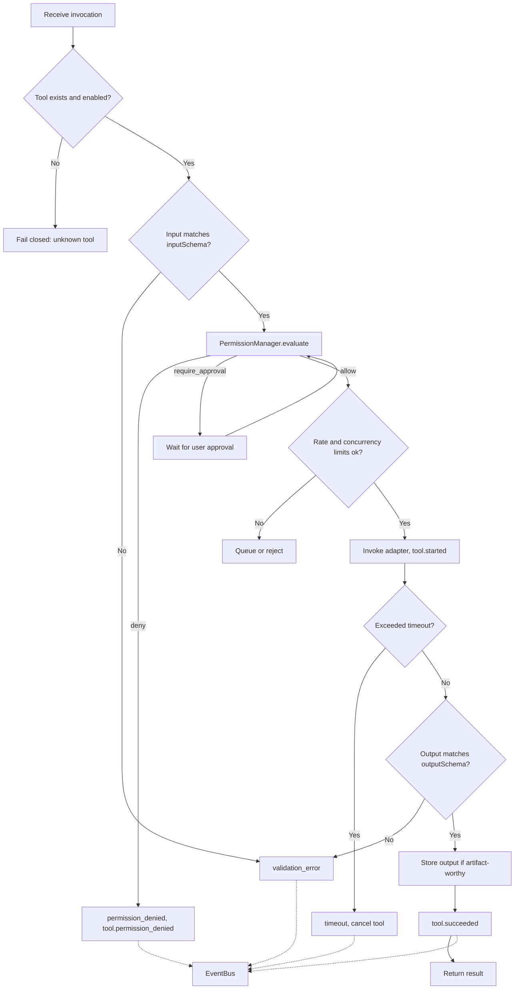
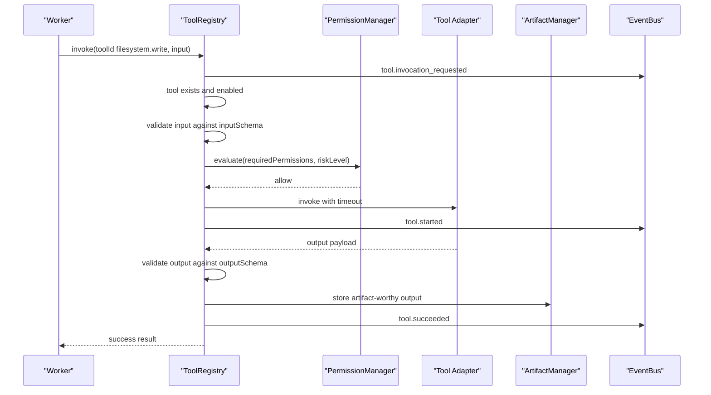
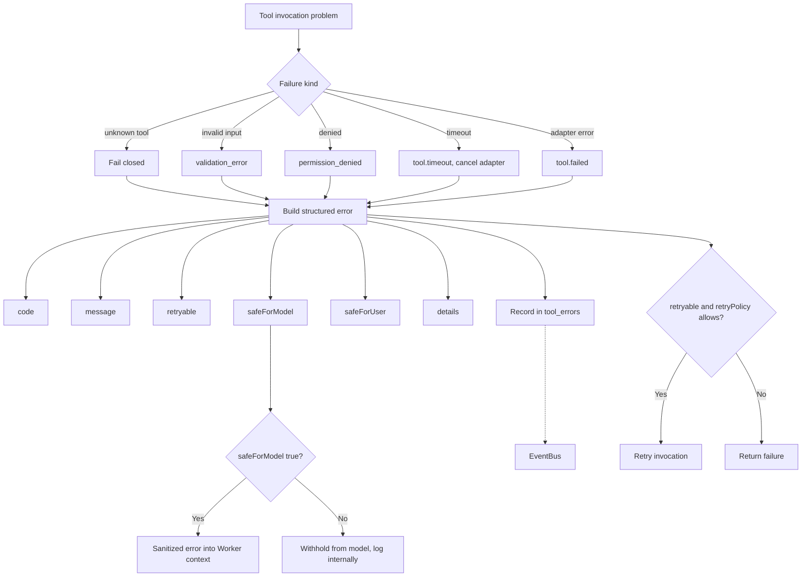
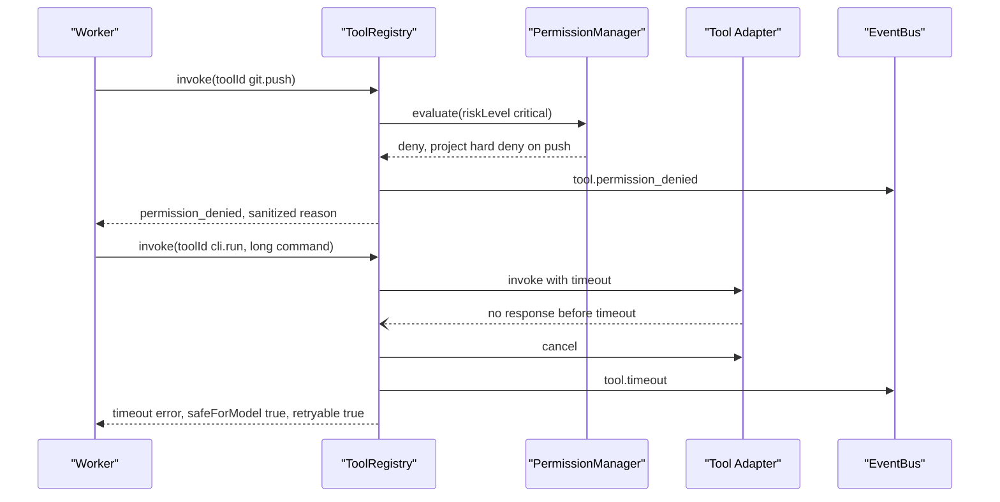

---
title: ToolRegistry Diagrams
status: draft
version: 1.0
tags:
  - runtime
  - tool-registry
  - tools
  - diagrams
related:
  - "[[02-runtime/README]]"
  - "[[ToolRegistry-Part01]]"
  - "[[Tool-Part01]]"
  - "[[PermissionManager-Part01]]"
  - "[[EventBus-Part01]]"
---

# ToolRegistry Diagrams

## Tool Registration

### High-Level Overview



### Detailed Mermaid



### ASCII

```text
ToolDefinition
  id | name | description | provider | version
  inputSchema | outputSchema | requiredPermissions
  riskLevel | timeout | retryPolicy | enabled

Registration sources:
  internal_runtime | mcp_server | plugin | cli_adapter
  workflow_node | user_script

Rules:
  Definitions MUST be validated before exposure.
  Invalid tools MUST be disabled and logged.
  Plugin tools MUST be disabled by default if permissions are unknown.
  MCP tools MUST declare schemas and permission requirements.
  CLI tools are high risk: strict permission and preview required.

A formatter and an SSH command are not the same kind of capability.
```

### Sequence



## Invocation Pipeline

### High-Level Overview



### Detailed Mermaid



### ASCII

```text
Pipeline:
  receive invocation
  validate tool exists
  validate input schema
  check permission
  check rate/concurrency limits
  invoke adapter
  validate output schema
  store output if artifact-worthy
  emit event
  return result

InvocationRequest:
  toolId | actorId | workspaceId | projectId | sessionId
  input | reason | timeout

Result types:
  success | failure | permission_denied | validation_error
  timeout | cancelled | partial

Always validate model-produced tool arguments.
The model is not the schema authority.
Tool output is untrusted: it becomes an Artifact, not trusted state.
```

### Sequence



## Failure and Security Handling

### High-Level Overview

```text
Unknown tool  -> fail closed
Bad input     -> validation_error, never reaches adapter
Denied        -> permission_denied, adapter never runs
Slow          -> timeout cancels the tool
Error         -> sanitize before it enters model context
```

### Detailed Mermaid



### ASCII

```text
Events:
  tool.registered | tool.disabled | tool.invocation_requested
  tool.permission_denied | tool.started | tool.succeeded
  tool.failed | tool.timeout

Security rules, ToolRegistry MUST:
  validate inputs | check permissions | enforce timeouts
  record invocations | isolate plugin tools
  hide secrets from logs | fail closed on unknown tools

Structured error:
  code | message | retryable | safeForModel | safeForUser | details

Never return raw secret-bearing errors to a Worker.
Sanitize tool errors before putting them into model context.

Tables: tools, tool_versions, tool_invocations, tool_permissions, tool_errors
```

### Sequence



## Related Documents

- [[ToolRegistry-Part01]]
- [[ToolRegistry-Part02]]
- [[ToolRegistry-Part03]]
- [[ToolRegistry-Part04]]
- [[ToolRegistry-Part05]]
- [[ToolRegistry-Part06]]
- [[Tool-Part01]]
- [[PermissionManager-Part01]]
- [[ArtifactManager-Part01]]
- [[EventBus-Part01]]
- [[02-runtime/README]]
