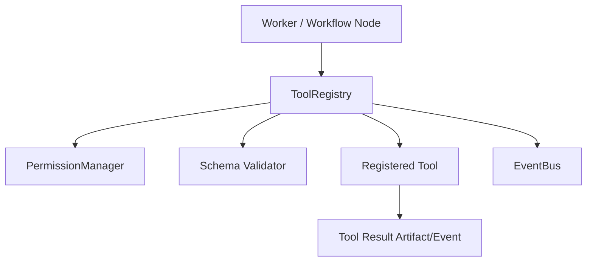

---
title: Tool Registry Part 01 - Purpose and Architecture
status: draft
version: 1.0
tags:
  - runtime
  - tool-registry
  - tools
related:
  - "[[Tool-Part01]]"
  - "[[PermissionManager-Part01]]"
  - "[[EventBus-Part01]]"
---

# Tool Registry Part 01 - Purpose and Architecture

## Document Index

```text
ToolRegistry-Part01 - Purpose and architecture
ToolRegistry-Part02 - Tool registration and metadata
ToolRegistry-Part03 - Invocation pipeline and parameters
ToolRegistry-Part04 - MCP, plugin, CLI, and internal tools
ToolRegistry-Part05 - Security, errors, events, observability
ToolRegistry-Part06 - Database, UI, tests, implementation checklist
```

## Purpose

ToolRegistry is the runtime catalog and invocation boundary for every callable capability in Eulinx.

Tools include filesystem actions, Git, terminal actions, browser actions, MCP tools, plugin tools, model calls, internal services, and custom workflow nodes.

## Core Rule

```text
Workers do not directly call arbitrary capabilities. They request registered tools through ToolRegistry.
```

## Architecture



## AI Notes

The ToolRegistry is what turns Eulinx from "terminals with prompts" into an actual operating environment.

