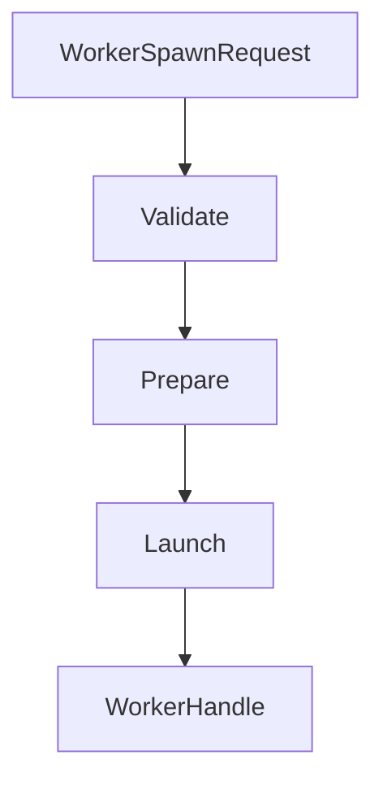
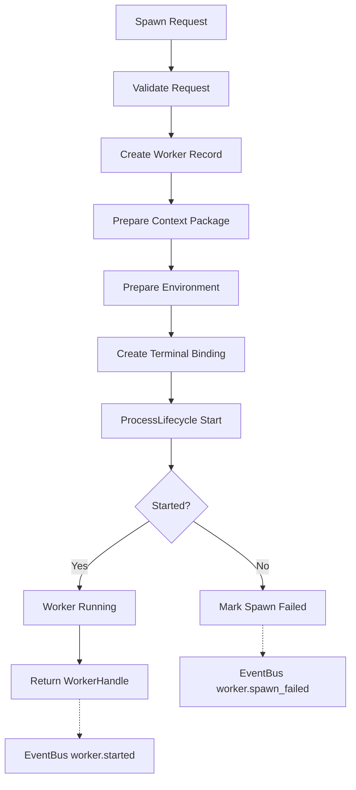
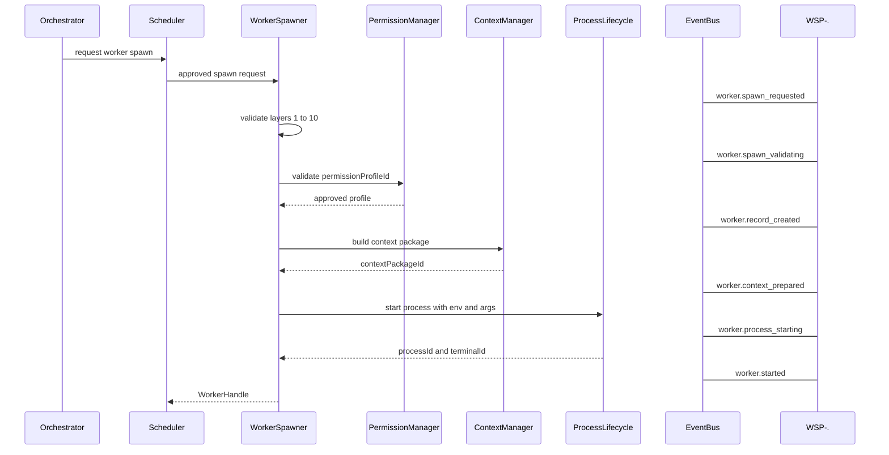
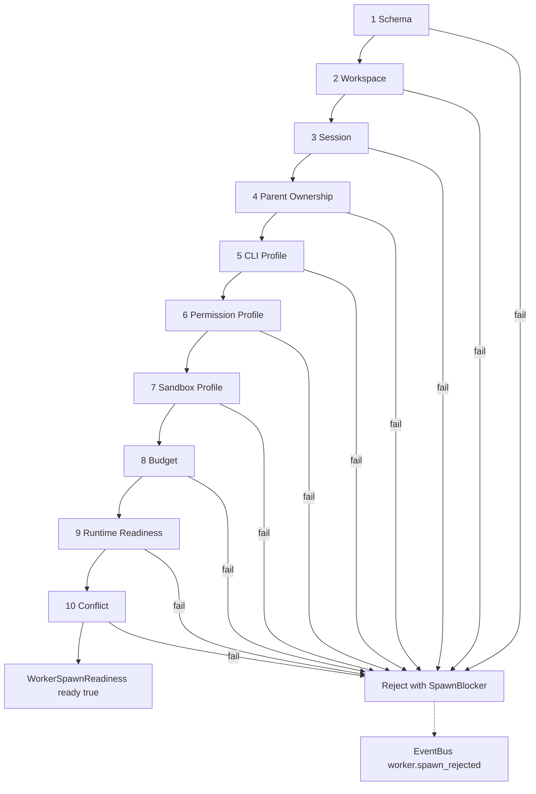
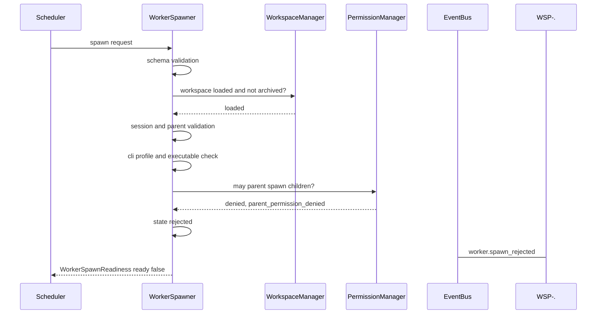
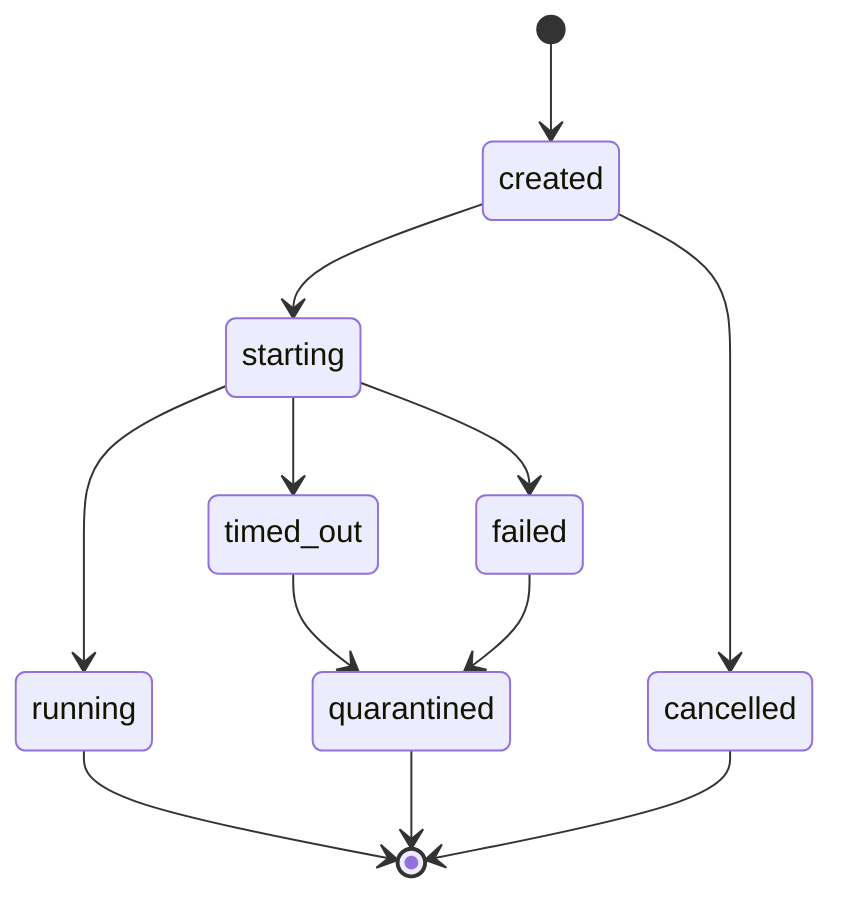
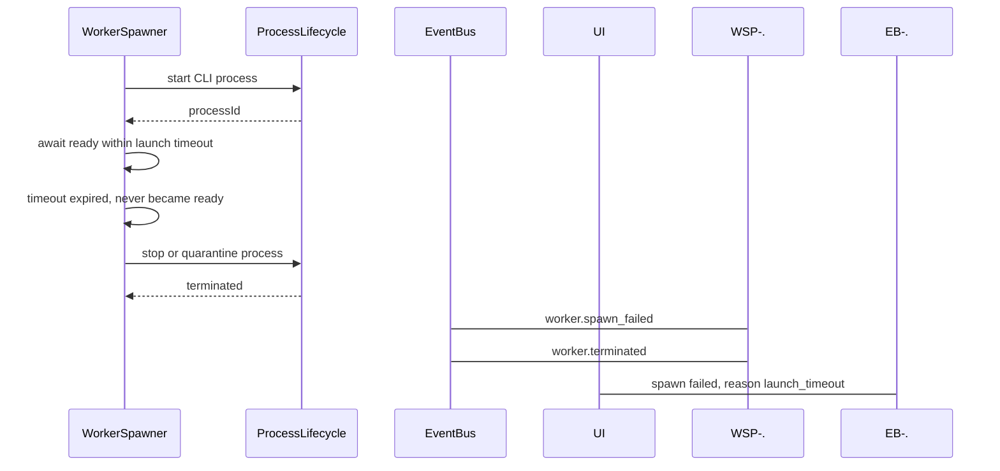

# WorkerSpawner Diagrams

Every flow below is rendered four ways: overview, detailed mermaid, ASCII, and sequence.

## Spawn Flow

### Overview



### Detailed



### ASCII

```text
Task or Orchestrator decides a Worker is needed.
Scheduler decides the spawn is allowed to run.
PermissionManager authorizes the requested powers.
WorkerSpawner creates the Worker runtime environment.
ProcessLifecycle starts the actual process.
EventBus announces the new Worker.

Spawn request lifecycle:
  created
    |
    v
  received_by_scheduler
    |
    v
  approved_for_spawn
    |
    v
  received_by_worker_spawner
    |
    v
  validated ----> rejected
    |
    v
  prepared
    |
    v
  launched
```

### Sequence



## Validation Flow

### Overview

```text
schema -> workspace -> session -> parent -> cli -> permission
-> sandbox -> budget -> runtime readiness -> conflict
```

### Detailed



### ASCII

```text
Failure reasons:
  workspace_not_loaded       session_closed
  parent_not_found           parent_permission_denied
  cli_profile_missing        cli_executable_missing
  permission_denied          sandbox_invalid
  budget_exceeded            runtime_not_ready

Hard rules:
  WorkerSpawner MUST fail closed.
  If any validation fails, the Worker MUST NOT be partially launched.
  A Worker MUST NOT be spawned into one Workspace using context
    from another Workspace.
  Arbitrary command strings from AI output MUST NOT become
    executable shell commands.
  WorkerSpawner MUST NOT grant more permissions than the request
    was approved for.
```

### Sequence



## Failure and Recovery Flow

### Overview

```text
launch window watched -> running, or failed and quarantined
```

### Detailed



### ASCII

```text
WorkerSpawner monitors the launch window only.
Long-term supervision belongs to ProcessLifecycle and
RuntimeManager health aggregation.

Launch window terminal states:
  running
  failed
  cancelled
  timed_out
  quarantined

If a process launches but registration fails, WorkerSpawner MUST
stop the process or quarantine the Worker. No orphan processes.
```

### Sequence



## Related Documents

- [[WorkerSpawner-Part01]]
- [[WorkerSpawner-Part02]]
- [[WorkerSpawner-Part03]]
- [[WorkerSpawner-Part04]]
- [[WorkerSpawner-Part05]]
- [[RuntimeManager-Part01]]
- [[Scheduler-Part01]]
- [[ProcessLifecycle-Part01]]
- [[02-runtime/README]]
