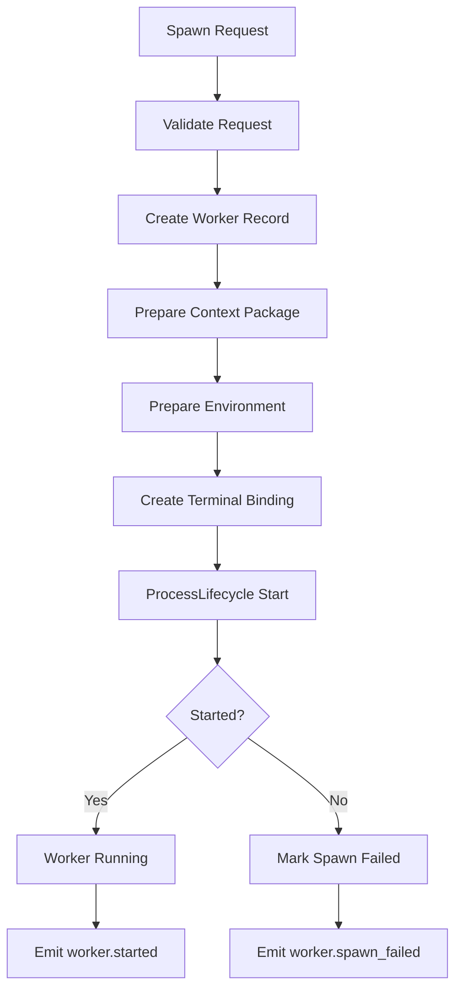

---
title: WorkerSpawner Specification - Part 01
status: draft
version: 1.0
tags:
  - runtime
  - worker-spawner
  - workers
related:
  - "[[02-runtime/README]]"
  - "[[Worker-Part01]]"
  - "[[RuntimeManager-Part01]]"
  - "[[ProcessLifecycle-Part01]]"
---

# WorkerSpawner Specification (Part 01)

## Document Index

Part 01 - Purpose, Philosophy, Scope, and Responsibilities
Part 02 - Spawn Requests, Validation, and Readiness
Part 03 - Context Packages, Prompts, and Environment Preparation
Part 04 - Terminal, PTY, CLI, and Process Binding
Part 05 - Events, Monitoring, Cancellation, and Recovery
Part 06 - Database, UI, Implementation Checklist, and Future Expansion

# Purpose

The WorkerSpawner creates and prepares Eulinx Workers.

In Eulinx, a Worker is usually a running AI CLI terminal session. It may be powered by Claude Code, Codex CLI, OpenCode, a local model CLI, a custom Eulinx CLI, or another command-line tool. The WorkerSpawner does not decide what the Worker should do. It receives a validated spawn request and turns it into a real runtime entity that the rest of Eulinx can observe, schedule, control, and stop.

The WorkerSpawner is the boundary between abstract work and concrete execution.

```text
Task or Orchestrator decides a Worker is needed.
Scheduler decides the spawn is allowed to run.
PermissionManager authorizes the requested powers.
WorkerSpawner creates the Worker runtime environment.
ProcessLifecycle starts the actual process.
EventBus announces the new Worker.
```

# Philosophy

The WorkerSpawner should be strict, repeatable, and boring.

Worker creation is one of the most dangerous actions in Eulinx because a Worker may receive tools, filesystem access, terminal access, model credentials, memory, context, and permission grants. If Worker creation is loose, everything above it becomes unsafe.

The WorkerSpawner MUST treat every Worker as a controlled runtime process, not as a casual chat window.

# Definition

The WorkerSpawner is a deterministic runtime service responsible for:

- validating spawn requests
- assigning Worker identity
- binding Workers to Workspace, Project, Session, Orchestrator, and Task
- preparing the Worker context package
- preparing environment variables
- preparing command arguments
- creating terminal or PTY bindings
- requesting OS process creation through [[ProcessLifecycle-Part01]]
- registering the Worker with runtime state
- emitting Worker lifecycle events
- cleaning up failed spawn attempts

# What WorkerSpawner Does Not Do

WorkerSpawner MUST NOT:

- decide project strategy
- create plans
- decompose Tasks
- invoke AI models directly
- bypass the Scheduler
- bypass PermissionManager
- write Project files directly
- merge Worker outputs
- decide whether a Worker result is correct
- hold long-term Worker memory

Those responsibilities belong to Orchestrators, Scheduler, PermissionManager, ArtifactManager, MergeManager, MemoryManager, and other services.

# Core Responsibilities

The WorkerSpawner MUST:

- accept only typed spawn requests
- validate workspace and project boundaries
- validate requested CLI type
- validate requested permissions
- validate budget limits
- validate concurrency constraints provided by Scheduler
- create unique Worker IDs
- create predictable runtime directories
- create safe environment variables
- bind the Worker to its parent Orchestrator or Worker
- create an initial Worker record before process launch
- mark failed launches clearly
- emit lifecycle events
- return a stable Worker handle

The WorkerSpawner SHOULD:

- support multiple CLI profiles
- support template-based prompt startup
- support dry-run spawn validation
- support simulation mode
- support replay reconstruction
- avoid leaking secrets into logs
- record enough metadata for debugging

# WorkerSpawner Inputs

The primary input is a `WorkerSpawnRequest`.

```ts
type WorkerSpawnRequest = {
  id: string;
  workspaceId: string;
  projectId: string;
  sessionId: string;
  parentWorkerId?: string;
  parentOrchestratorId?: string;
  taskId?: string;
  workflowId?: string;
  requestedBy: RuntimeActorRef;
  workerKind: WorkerKind;
  cliProfileId: string;
  promptPackageId: string;
  contextPackageId: string;
  permissionProfileId: string;
  sandboxProfileId: string;
  budgetProfileId?: string;
  spawnMode: "normal" | "simulation" | "replay" | "recovery";
  priority: "low" | "normal" | "high" | "critical";
  reason: string;
  createdAt: string;
};
```

# WorkerSpawner Outputs

The output is a `WorkerHandle`.

```ts
type WorkerHandle = {
  workerId: string;
  processId?: string;
  terminalId?: string;
  workspaceId: string;
  sessionId: string;
  state: "created" | "starting" | "running" | "failed";
  eventStreamId: string;
  createdAt: string;
};
```

# High-Level Spawn Flow



# ASCII Overview

```text
WorkerSpawner
  |
  +-- validates spawn request
  +-- prepares Worker record
  +-- prepares context and environment
  +-- asks ProcessLifecycle to start process
  +-- registers terminal binding
  +-- emits Worker lifecycle events
```

# Safety Rules

WorkerSpawner MUST fail closed.

If any required validation fails, the Worker MUST NOT be partially launched.

If a process launches but registration fails, WorkerSpawner MUST stop the process or quarantine the Worker.

If a Worker is created without a valid Workspace, that is a runtime bug.

# AI Notes

Do not implement Worker spawning by directly calling a shell command from random UI or Workflow code.

All Worker creation must pass through WorkerSpawner so permissions, context, sandboxing, runtime state, and events are consistent.

# Related Documents

- [[WorkerSpawner-Part02]]
- [[Worker-Part01]]
- [[RuntimeManager-Part01]]
- [[Scheduler-Part01]]
- [[ProcessLifecycle-Part01]]

