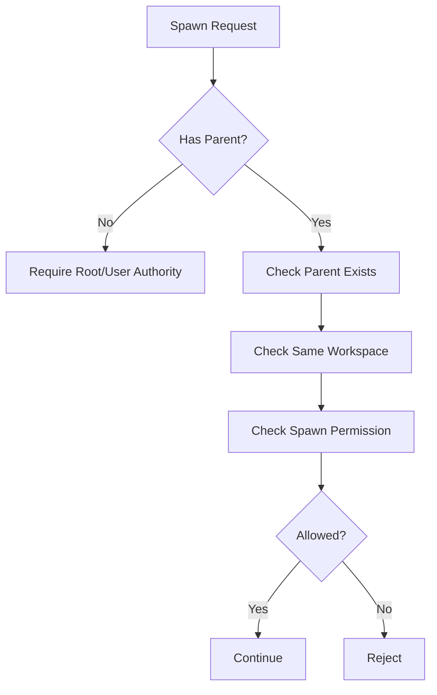

---
title: WorkerSpawner Specification - Part 02
status: draft
version: 1.0
tags:
  - runtime
  - worker-spawner
  - validation
related:
  - "[[WorkerSpawner-Part01]]"
  - "[[Scheduler-Part01]]"
  - "[[PermissionManager-Part01]]"
---

# WorkerSpawner Specification (Part 02)

## Document Index

Part 01 - Purpose, Philosophy, Scope, and Responsibilities
Part 02 - Spawn Requests, Validation, and Readiness
Part 03 - Context Packages, Prompts, and Environment Preparation
Part 04 - Terminal, PTY, CLI, and Process Binding
Part 05 - Events, Monitoring, Cancellation, and Recovery
Part 06 - Database, UI, Implementation Checklist, and Future Expansion

# Purpose

This part defines how Worker spawn requests are validated before Eulinx creates a Worker.

Spawn validation is intentionally strict. A Worker is not just a UI object. It can become a running terminal process with access to tools, models, memory, files, and user credentials. Validation prevents accidental unsafe execution and makes failures understandable.

# Spawn Request Lifecycle

```text
created
  |
  v
received_by_scheduler
  |
  v
approved_for_spawn
  |
  v
received_by_worker_spawner
  |
  v
validated
  |
  +-- rejected
  |
  v
prepared
  |
  v
launched
```

# Validation Layers

WorkerSpawner MUST validate spawn requests in layers:

1. Schema validation
2. Workspace validation
3. Session validation
4. Parent ownership validation
5. CLI profile validation
6. Permission profile validation
7. Sandbox profile validation
8. Budget validation
9. Runtime readiness validation
10. Conflict validation

Each failed validation MUST produce a specific failure reason.

# Schema Validation

The spawn request MUST be structurally valid before any runtime service acts on it.

WorkerSpawner MUST reject requests that:

- lack `workspaceId`
- lack `sessionId`
- lack `cliProfileId`
- lack `promptPackageId`
- lack `contextPackageId`
- lack `permissionProfileId`
- contain unknown spawn mode
- contain invalid parent references
- contain invalid identifiers

# Workspace Validation

WorkerSpawner MUST confirm:

- the Workspace exists
- the Workspace is loaded
- the Workspace is not archived
- the Workspace is not locked for shutdown
- the Workspace allows Worker execution
- the requested Project belongs to the Workspace

WorkerSpawner MUST NOT allow a Worker to be spawned into one Workspace using context from another Workspace.

# Session Validation

The Session defines the user-facing runtime activity.

WorkerSpawner MUST confirm:

- the Session exists
- the Session belongs to the Workspace
- the Session is active or resumable
- the Session has not been cancelled
- the Session allows the requested spawn mode

# Parent Validation

A Worker may be spawned by:

- Root Orchestrator
- Phase Orchestrator
- Task Orchestrator
- another Worker
- Workflow node
- user action

WorkerSpawner MUST verify that the parent actor is allowed to create children.



# CLI Profile Validation

The `cliProfileId` defines what command is launched and how it behaves.

WorkerSpawner MUST validate:

- CLI profile exists
- CLI executable is available
- CLI is permitted in the Workspace
- CLI supports requested mode
- CLI does not require unavailable credentials
- CLI arguments are template-approved
- CLI startup prompt can be injected safely

WorkerSpawner MUST NOT allow arbitrary command strings from AI output to become executable shell commands.

# Permission Profile Validation

WorkerSpawner MUST ask [[PermissionManager-Part01]] to validate requested permissions.

Examples:

```text
Can this Worker read files?
Can this Worker write files?
Can this Worker delete files?
Can this Worker spawn children?
Can this Worker use browser tools?
Can this Worker access network?
Can this Worker enter YOLO mode?
```

WorkerSpawner MUST NOT grant more permissions than the request was approved for.

# Sandbox Profile Validation

The sandbox profile defines where the Worker may operate.

WorkerSpawner MUST validate:

- sandbox root exists or can be created
- sandbox root is inside allowed Workspace runtime area
- sandbox root is not the project root unless explicitly allowed
- sandbox strategy matches Workspace policy
- cleanup policy is defined

# Budget Validation

WorkerSpawner MUST respect budget limits:

- max active Workers
- max child Workers
- max process runtime
- max token budget
- max tool call budget
- max cost budget
- max retry count

Budget validation MAY be delegated to Scheduler, but WorkerSpawner MUST still enforce the final approved limits.

# Readiness Result

```ts
type WorkerSpawnReadiness = {
  requestId: string;
  ready: boolean;
  blockedBy: SpawnBlocker[];
  warnings: SpawnWarning[];
  approvedPermissionProfileId?: string;
  approvedSandboxProfileId?: string;
  approvedBudgetProfileId?: string;
};
```

# Failure Reasons

Common failure reasons:

```text
workspace_not_loaded
session_closed
parent_not_found
parent_permission_denied
cli_profile_missing
cli_executable_missing
permission_denied
sandbox_invalid
budget_exceeded
runtime_not_ready
```

# AI Notes

Validation should produce clear error objects, not vague strings.

Lower-intelligence coding models often skip validation and go directly to launching processes. Do not do that in Eulinx. Spawning is a controlled pipeline.

# Related Documents

- [[WorkerSpawner-Part01]]
- [[Permission-Part01]]
- [[Scheduler-Part05]]
- [[RuntimeRules-Part01]]

