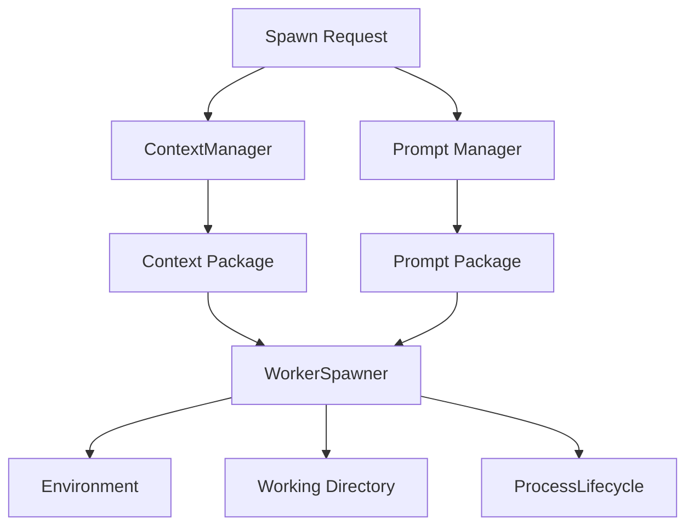

---
title: WorkerSpawner Specification - Part 03
status: draft
version: 1.0
tags:
  - runtime
  - worker-spawner
  - context
related:
  - "[[WorkerSpawner-Part02]]"
  - "[[ContextManager-Part01]]"
  - "[[Prompt-Part01]]"
---

# WorkerSpawner Specification (Part 03)

## Document Index

Part 01 - Purpose, Philosophy, Scope, and Responsibilities
Part 02 - Spawn Requests, Validation, and Readiness
Part 03 - Context Packages, Prompts, and Environment Preparation
Part 04 - Terminal, PTY, CLI, and Process Binding
Part 05 - Events, Monitoring, Cancellation, and Recovery
Part 06 - Database, UI, Implementation Checklist, and Future Expansion

# Purpose

This part defines how WorkerSpawner prepares the context, prompt, working directory, environment variables, and runtime metadata that a Worker receives at startup.

The WorkerSpawner does not invent context. It asks [[ContextManager-Part01]] and [[MemoryManager-Part01]] for approved context packages, then binds those packages to the Worker launch.

# Context Package Principle

Workers SHOULD receive the smallest useful context.

A Worker should not receive the entire project, entire conversation, entire memory store, and all previous logs unless the Task truly requires it. Context must be scoped to reduce cost, confusion, leakage, and accidental cross-project contamination.

# Context Package Object

```ts
type WorkerContextPackage = {
  id: string;
  workspaceId: string;
  projectId: string;
  sessionId: string;
  taskId?: string;
  workerId?: string;
  purpose: string;
  includedFiles: ContextFileRef[];
  includedArtifacts: string[];
  includedMemories: string[];
  includedInstructions: string[];
  excludedPaths: string[];
  tokenEstimate?: number;
  createdAt: string;
};
```

# Prompt Package Object

```ts
type WorkerPromptPackage = {
  id: string;
  systemPrompt: string;
  taskPrompt: string;
  startupInstructions: string[];
  outputContract?: ArtifactOutputContract;
  forbiddenActions: string[];
  requiredReports: string[];
  createdAt: string;
};
```

# Startup Prompt Requirements

Every Worker startup prompt MUST include:

- Worker identity
- assigned Task
- Workspace boundary
- permission summary
- sandbox rules
- output expectations
- Artifact rules
- report-back rules
- forbidden actions
- how to request help or spawn children

Every Worker startup prompt SHOULD include:

- concise project summary
- relevant files
- relevant Artifacts
- current plan step
- expected completion signal
- examples of acceptable output

# Environment Preparation

WorkerSpawner may prepare environment variables such as:

```text
EULINX_WORKER_ID
EULINX_WORKSPACE_ID
EULINX_PROJECT_ID
EULINX_SESSION_ID
EULINX_TASK_ID
EULINX_SANDBOX_ROOT
EULINX_CONTEXT_PACKAGE
EULINX_PERMISSION_PROFILE
EULINX_EVENT_STREAM
```

Environment variables MUST NOT include plaintext secrets unless the CLI absolutely requires them and the secret handling policy allows it.

Prefer secret handles over raw secrets.

# Working Directory Selection

WorkerSpawner MUST choose a working directory according to sandbox policy.

Common strategies:

```text
project_readonly
  Worker starts in a read-only project view.

worker_sandbox
  Worker starts in an isolated sandbox where changes become patch artifacts.

branch_workspace
  Worker starts in a temporary branch or worktree.

simulation_workspace
  Worker starts in a no-write simulation environment.
```

# Context Flow Diagram



# Prompt Injection Safety

WorkerSpawner MUST NOT blindly concatenate user text, AI text, memory text, and tool output into startup commands.

Startup content MUST be passed through a safe prompt/package mechanism. Command-line arguments must remain controlled by CLI profiles, not generated text.

# Output Contracts

When possible, WorkerSpawner SHOULD include an output contract.

Example:

```text
When finished, produce:
1. Summary Artifact
2. Patch Artifact or explanation
3. Test Result Artifact if tests were run
4. Blocker report if unfinished
```

# AI Notes

The Worker should not be started with vague instructions like "do the task".

Always provide enough context for the Worker to understand its boundary, but not so much that it becomes confused or expensive.

# Related Documents

- [[ContextManager-Part01]]
- [[Prompt-Part01]]
- [[Memory-Part01]]
- [[Artifact-Part01]]

