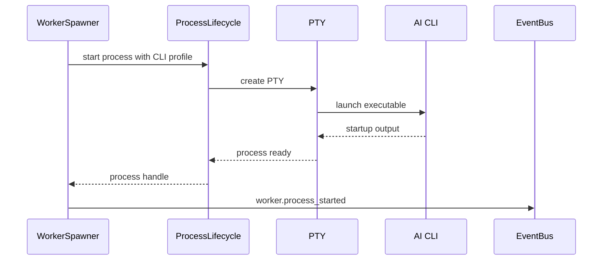

---
title: WorkerSpawner Specification - Part 04
status: draft
version: 1.0
tags:
  - runtime
  - worker-spawner
  - terminal
  - pty
related:
  - "[[WorkerSpawner-Part03]]"
  - "[[ProcessLifecycle-Part01]]"
  - "[[Worker-Part01]]"
---

# WorkerSpawner Specification (Part 04)

## Document Index

Part 01 - Purpose, Philosophy, Scope, and Responsibilities
Part 02 - Spawn Requests, Validation, and Readiness
Part 03 - Context Packages, Prompts, and Environment Preparation
Part 04 - Terminal, PTY, CLI, and Process Binding
Part 05 - Events, Monitoring, Cancellation, and Recovery
Part 06 - Database, UI, Implementation Checklist, and Future Expansion

# Purpose

This part defines how WorkerSpawner binds Workers to terminals, PTYs, CLIs, and OS processes.

In Eulinx, the terminal is not just a decorative UI panel. It is the visible shell of a Worker process.

# Terminal Binding

Each Worker MAY have a terminal binding.

Some Workers may run as background services without a visible terminal, but the first version of Eulinx should treat most AI CLI Workers as terminal-backed.

```ts
type WorkerTerminalBinding = {
  terminalId: string;
  workerId: string;
  processId?: string;
  ptyId?: string;
  title: string;
  displayMode: "full" | "compact" | "chip" | "hidden";
  scrollbackPolicy: "keep" | "summarize" | "discard_after_archive";
  createdAt: string;
};
```

# CLI Profile

A CLI profile defines how to start an external AI CLI safely.

```ts
type CliProfile = {
  id: string;
  name: string;
  executable: string;
  argsTemplate: string[];
  startupInputMode: "stdin" | "arg" | "file" | "manual";
  supportsStreaming: boolean;
  supportsInteractiveApproval: boolean;
  supportsMcp: boolean;
  defaultWorkingDirectoryMode: string;
  allowedEnvironmentKeys: string[];
};
```

# Important CLI Rule

WorkerSpawner MUST NOT launch arbitrary AI-generated commands.

It may launch only commands defined by approved CLI profiles.

AI may request:

```text
Spawn a coding Worker using claude-code profile.
```

AI MUST NOT provide:

```text
powershell -Command "some arbitrary generated command"
```

# PTY Binding

For interactive terminal Workers, WorkerSpawner asks [[ProcessLifecycle-Part01]] to create a PTY-backed process.

PTY responsibilities include:

- terminal input
- terminal output
- resize events
- process exit tracking
- stream capture
- scrollback management
- terminal replay support

# Startup Sequence



# Terminal Display Modes

Eulinx should support:

```text
full
  Complete terminal view.

compact
  Card with status, current task, cost, progress, recent output.

chip
  Tiny node indicator for large graphs.

hidden
  Background Worker with no active terminal UI.
```

# Input Routing

User input to a Worker terminal MUST go through a controlled terminal input API.

Runtime services may inject startup input, but arbitrary services MUST NOT type into Worker terminals.

# Output Capture

Worker output SHOULD be captured into:

- terminal scrollback
- runtime event stream
- summarized logs
- replay timeline
- Artifact extraction pipeline when applicable

Sensitive output MUST be redacted before broad display or indexing.

# AI Notes

Do not treat terminal text as structured truth.

Terminal output can contain AI mistakes, shell noise, secrets, stack traces, and partial results. Structured Artifacts are the trustworthy exchange layer.

# Related Documents

- [[ProcessLifecycle-Part01]]
- [[TerminalView]]
- [[Worker-Part01]]
- [[Artifact-Part01]]

