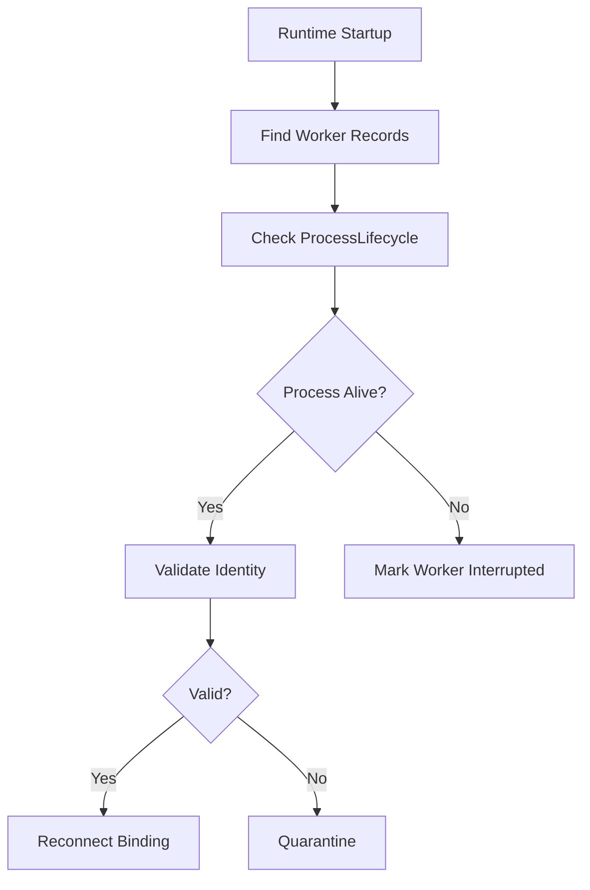

---
title: WorkerSpawner Specification - Part 05
status: draft
version: 1.0
tags:
  - runtime
  - worker-spawner
  - events
  - recovery
related:
  - "[[WorkerSpawner-Part04]]"
  - "[[EventBus-Part01]]"
  - "[[ProcessLifecycle-Part03]]"
---

# WorkerSpawner Specification (Part 05)

## Document Index

Part 01 - Purpose, Philosophy, Scope, and Responsibilities
Part 02 - Spawn Requests, Validation, and Readiness
Part 03 - Context Packages, Prompts, and Environment Preparation
Part 04 - Terminal, PTY, CLI, and Process Binding
Part 05 - Events, Monitoring, Cancellation, and Recovery
Part 06 - Database, UI, Implementation Checklist, and Future Expansion

# Purpose

This part defines the events, monitoring behavior, cancellation rules, and recovery behavior for spawned Workers.

# Worker Spawn Events

WorkerSpawner MUST emit events for significant lifecycle moments.

```text
worker.spawn_requested
worker.spawn_validating
worker.spawn_rejected
worker.record_created
worker.context_prepared
worker.process_starting
worker.process_started
worker.started
worker.spawn_failed
worker.cancel_requested
worker.terminated
worker.recovered
```

# Event Object

```ts
type WorkerSpawnEvent = {
  id: string;
  type: string;
  workspaceId: string;
  sessionId: string;
  workerId?: string;
  spawnRequestId: string;
  actor: RuntimeActorRef;
  reason?: string;
  metadata?: Record<string, unknown>;
  createdAt: string;
};
```

# Monitoring

WorkerSpawner does not supervise every process forever. Long-term process supervision belongs to [[ProcessLifecycle-Part01]] and RuntimeManager health aggregation.

WorkerSpawner SHOULD monitor the launch window until the Worker reaches one of these states:

```text
running
failed
cancelled
timed_out
quarantined
```

# Launch Timeout

WorkerSpawner MUST enforce a launch timeout.

If a CLI process starts but never becomes ready, WorkerSpawner MUST mark the Worker as failed or degraded and ask ProcessLifecycle to stop or quarantine it.

# Cancellation

A spawn request may be cancelled before process launch.

If cancellation happens:

```text
Before validation:
  mark request cancelled.

During validation:
  finish safe cleanup and mark cancelled.

After process start:
  ask ProcessLifecycle to terminate process.

After Worker running:
  cancellation becomes Worker termination.
```

# Recovery

Recovery mode may be used when:

- Eulinx restarts while Workers were active
- a terminal process exists but Worker record is missing
- Worker record exists but process disappeared
- Worker was running during application crash

WorkerSpawner MUST NOT blindly reconnect to unknown processes.

Recovery MUST validate:

- process identity
- workspace ownership
- terminal binding
- command profile
- runtime metadata
- permission profile

# Recovery Flow



# Quarantine

Quarantine is a safety state for suspicious or partially failed Workers.

Quarantined Workers:

- cannot receive new input
- cannot invoke tools
- cannot write artifacts except diagnostic artifacts
- cannot spawn children
- must be reviewed or terminated

# Failure Modes

Common Worker spawn failures:

```text
missing_cli
invalid_profile
permission_denied
workspace_unavailable
sandbox_creation_failed
process_start_failed
pty_creation_failed
startup_timeout
unexpected_exit
runtime_shutdown
```

# AI Notes

Do not hide failed spawn attempts.

A failed Worker spawn is useful information for the user, the Orchestrator, Scheduler, and Replay system.

# Related Documents

- [[EventBus-Part01]]
- [[ProcessLifecycle-Part03]]
- [[RuntimeManager-Part05]]
- [[Worker-Part01]]

