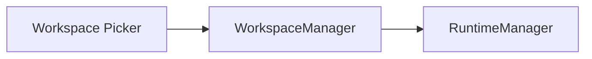
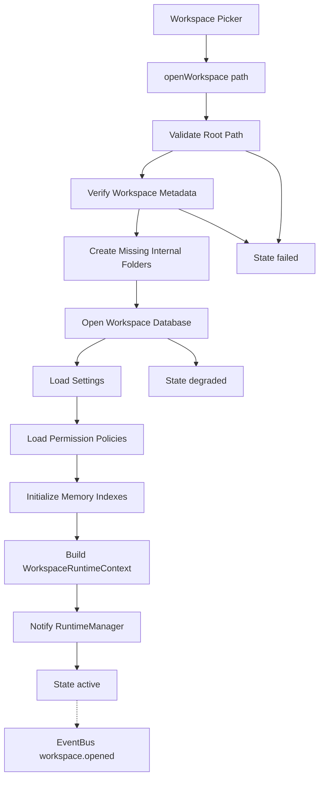
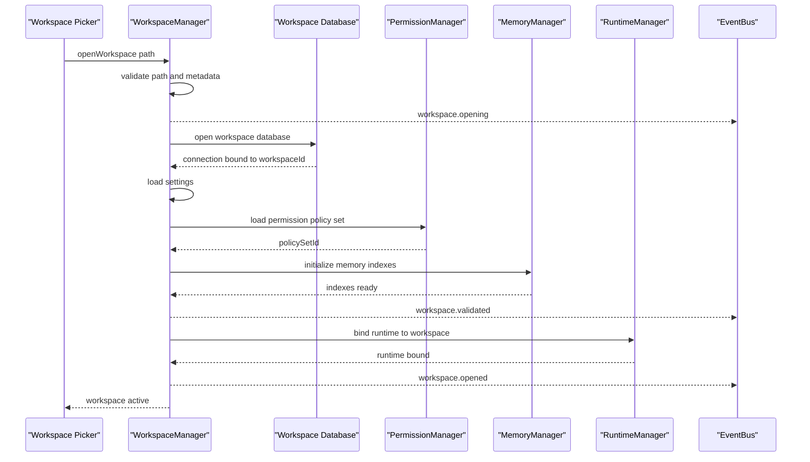
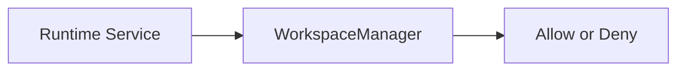
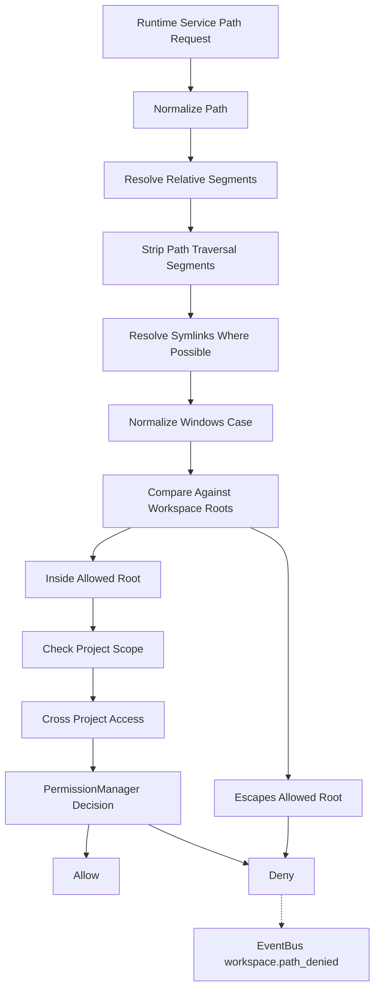
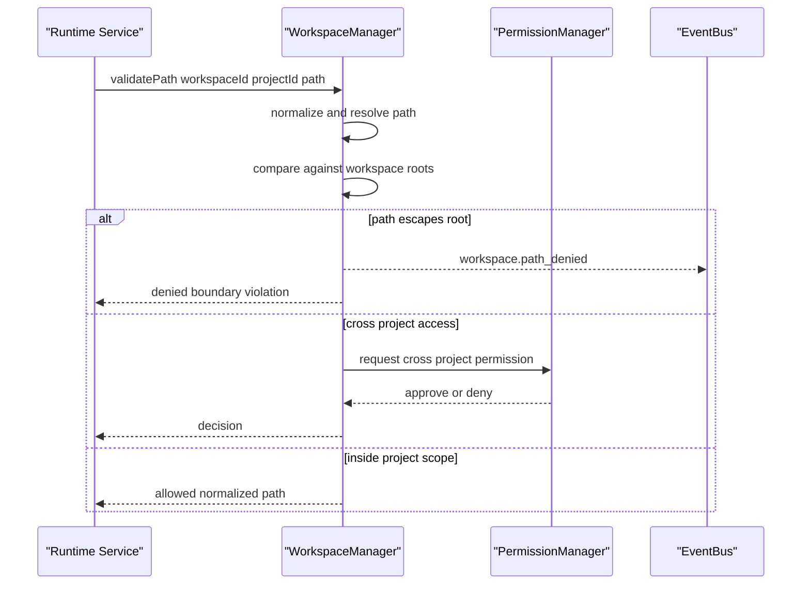
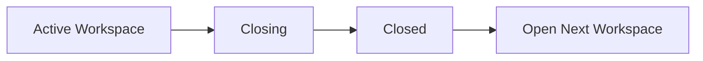
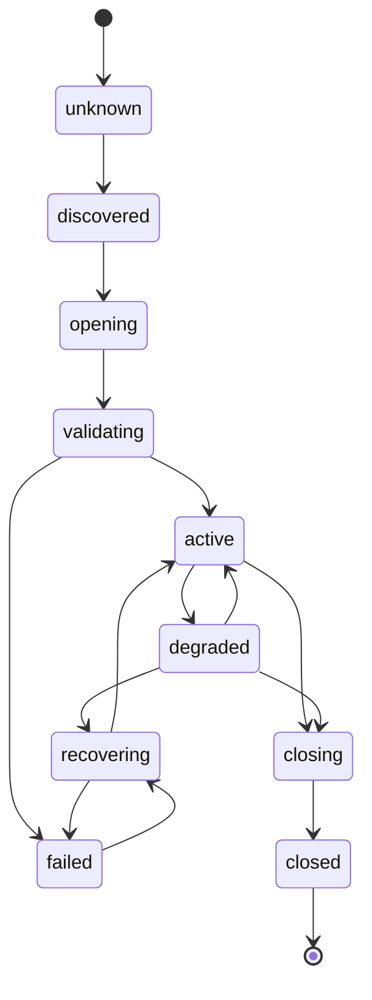
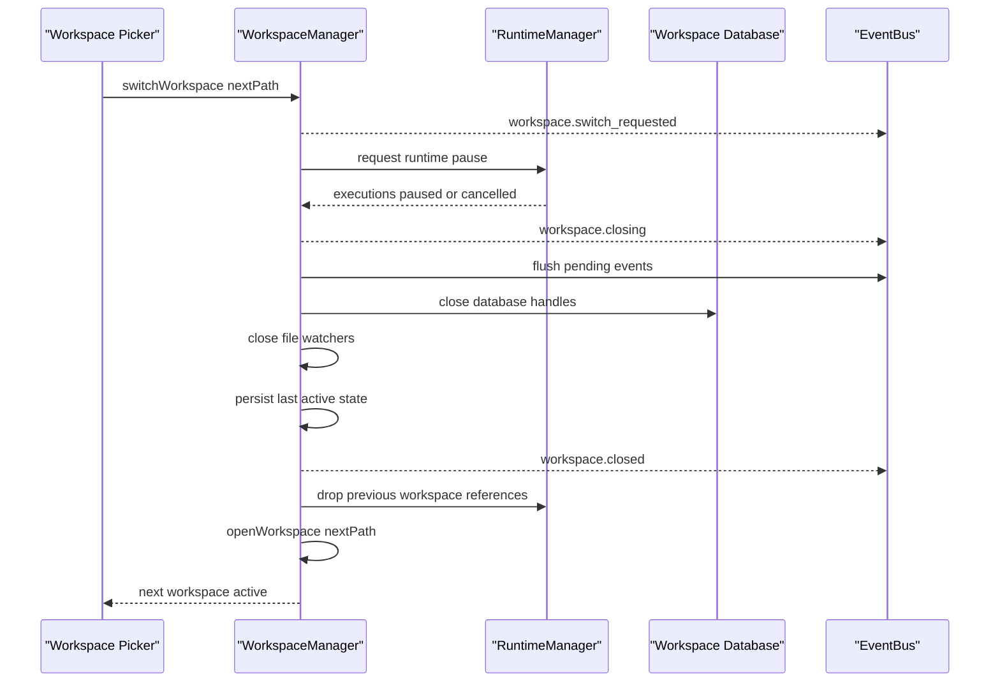

# WorkspaceManager Diagrams

Each flow below is rendered four ways: high-level overview, detailed Mermaid, ASCII, and sequence.

## Workspace Open Flow

### High-Level Overview



### Detailed Mermaid



### ASCII

```text
openWorkspace(path)
  |
  v
validate root path -------- invalid --> failed
  |
  v
verify workspace metadata - invalid --> failed
  |
  v
open workspace database --- error ----> degraded
  |
  v
load settings
  |
  v
load permission policies
  |
  v
initialize memory indexes
  |
  v
build WorkspaceRuntimeContext
  |
  v
notify RuntimeManager
  |
  v
active  -.->  EventBus: workspace.opened
```

### Sequence



## Path Boundary Check Flow

### High-Level Overview



### Detailed Mermaid



### ASCII

```text
path request from runtime service
  |
  v
normalize: relative, absolute, symlinks, case, traversal
  |
  v
compare against Workspace file roots
  |
  +-- escapes root ------------------> DENY -.-> workspace.path_denied
  |
  +-- inside root
        |
        v
      same project?
        |
        +-- yes --------------------> ALLOW
        |
        +-- no (cross project)
              |
              v
            PermissionManager (fail closed)
              |
              +-- approved --------> ALLOW
              +-- denied ----------> DENY -.-> workspace.path_denied
```

### Sequence



## Workspace Close and Switch Flow

### High-Level Overview



### Detailed Mermaid



### ASCII

```text
switch request = close current, then open next

closing
  |
  v
request runtime pause (RuntimeManager)
  |
  v
wait for safe shutdown or cancellation
  |
  v
flush pending events (EventBus)
  |
  v
close database handles
  |
  v
close file watchers
  |
  v
persist last active state
  |
  v
closed  -.->  EventBus: workspace.closed
  |
  v
drop all references to previous WorkspaceRuntimeContext
  |
  v
open next workspace (see Workspace Open Flow)
```

### Sequence



## Related Documents

- [[WorkspaceManager-Part01]]
- [[WorkspaceManager-Part02]]
- [[WorkspaceManager-Part03]]
- [[WorkspaceManager-Part04]]
- [[RuntimeManager-Part01]]
- [[PermissionManager-Part01]]
- [[EventBus-Part01]]
