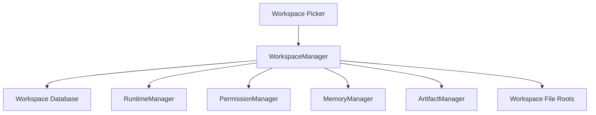

---
title: WorkspaceManager Specification - Part 01
status: draft
version: 1.0
tags:
  - runtime
  - workspace-manager
  - workspace
related:
  - "[[Workspace-Part01]]"
  - "[[Project-Part01]]"
  - "[[RuntimeManager-Part01]]"
---

# WorkspaceManager Specification (Part 01)

## Document Index

Part 01 - Purpose, Philosophy, and Responsibilities
Part 02 - Workspace Binding, Opening, Closing, and Switching
Part 03 - Project Isolation, File Boundaries, and Runtime Scope
Part 04 - Workspace State, Services, Events, and Persistence
Part 05 - Safety, Recovery, Snapshots, and Migration
Part 06 - UI, Examples, AI Notes, and Implementation Checklist

# Purpose

The WorkspaceManager is the runtime service that binds Eulinx's runtime to the user's selected Workspace.

A Workspace is the top-level isolation boundary for projects, Workers, memory, execution history, artifacts, permissions, settings, and runtime state.

The WorkspaceManager ensures that all runtime activity happens inside the correct Workspace and that no Worker, Tool, or Workflow accidentally crosses into another Workspace.

# Philosophy

Workspace isolation is not a cosmetic feature. It is a safety rule.

The user may have many projects. One AI terminal should never damage another project because context leaked, a path was wrong, or a Worker reused old state.

The WorkspaceManager exists to make the selected Workspace explicit, durable, and enforceable.

# Definition

The WorkspaceManager owns:

- active Workspace identity
- Workspace open and close lifecycle
- Workspace file roots
- Workspace database connection
- Workspace runtime binding
- Workspace settings
- Workspace health
- Workspace isolation checks
- Workspace-level events
- Workspace recovery metadata

# Responsibilities

The WorkspaceManager MUST:

- open a Workspace safely
- close a Workspace safely
- expose active Workspace state
- prevent runtime services from running without an active Workspace
- validate paths against Workspace roots
- bind database connections to Workspace identity
- provide Workspace settings to runtime services
- emit Workspace lifecycle events
- coordinate with RuntimeManager during startup and shutdown

The WorkspaceManager MUST NOT:

- execute tasks
- spawn Workers
- decide scheduling order
- merge code changes
- store unscoped global project data

# Runtime Position

# AI Notes

Any feature that touches project data should ask: "which Workspace owns this?"

If the answer is unclear, the feature is not safe enough to implement.

