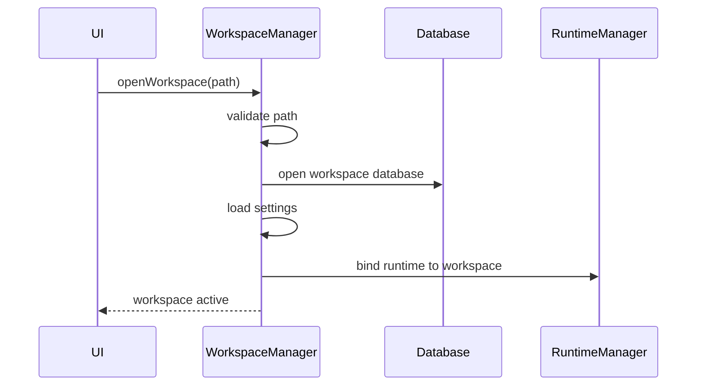

# WorkspaceManager Specification (Part 02)

## Workspace Binding, Opening, Closing, and Switching

The WorkspaceManager controls when a Workspace becomes active and when runtime services may use it.

## Workspace Lifecycle

```text
unknown
discovered
opening
validating
active
degraded
closing
closed
failed
recovering
```

## Open Flow



## Opening Requirements

When opening a Workspace, WorkspaceManager MUST:

- validate root path
- verify Workspace metadata
- create missing internal folders if policy allows
- open Workspace database
- load settings
- load permission policies
- initialize Workspace memory indexes
- notify RuntimeManager
- emit `workspace.opened`

## Closing Requirements

When closing a Workspace, WorkspaceManager MUST:

- request runtime pause
- wait for safe shutdown or cancellation
- flush pending events
- close database handles
- close file watchers
- persist last active state
- emit `workspace.closed`

## Workspace Switching

Workspace switching MUST be treated as closing one Workspace and opening another.

Runtime services MUST NOT keep references to the previous Workspace after switching.

Long-running executions SHOULD be cancelled, paused, or explicitly migrated based on policy.

## AI Notes

Do not implement "current workspace" as a loose global variable.

Use a WorkspaceRuntimeContext object passed through service boundaries or exposed by WorkspaceManager.

