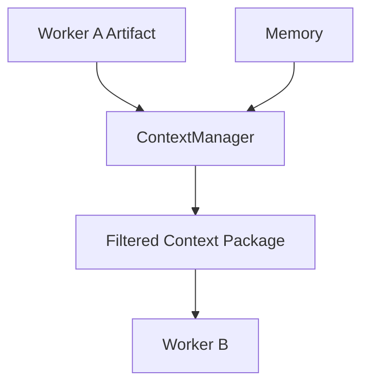

# ContextSharing Diagrams


```mermaid
flowchart TD
  A["Worker A Artifact"] --> B["ContextManager"]
  C["Memory"] --> B
  B --> D["Filtered Context Package"]
  D --> E["Worker B"]
```

```text
Artifact
  -> filter
  -> summarize
  -> redact
  -> deliver
```

# Related Documents

- [[ContextSharing-Part01]]
- [[ContextSharing-Part06]]

