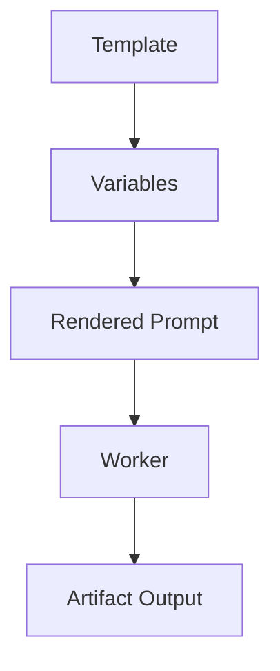

# PromptTemplates Diagrams



```text
Template
  -> bind variables
  -> inject constraints
  -> require output contract
```

# Related Documents

- [[PromptTemplates-Part01]]
- [[PromptTemplates-Part05]]

